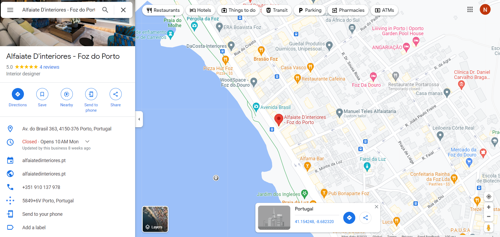
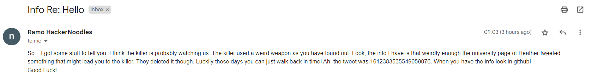
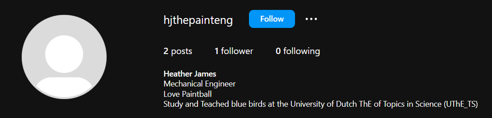
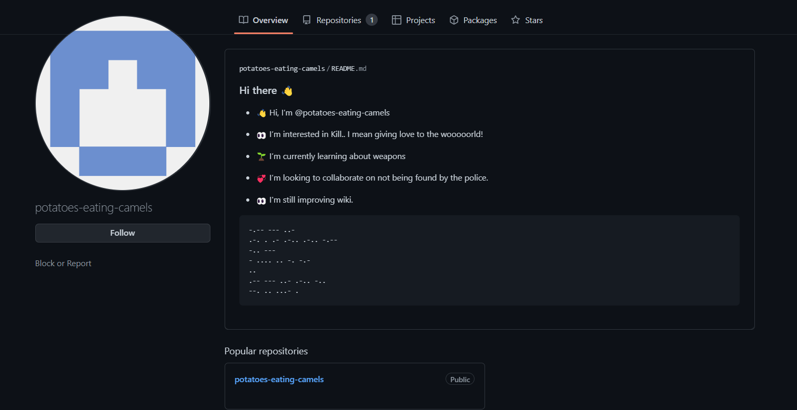
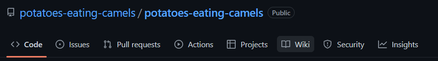



## Introduction

**Given image:** [Get it here!](https://drive.google.com/file/d/1sYKHJvmFAB0yjWCTEdp_ZL9g1Eh0G56x/view?usp=share_link)

**Description:** I feel the killer might be dangerous so I have some info to give you but I don't want to disclose my email just like that. So find my review from the image below and send me an email asking for info. Be creative with the signature so I know its you. It is time to find Who is the killer.

**Category:** OSINT

## Finding the location
 
From the given image, I managed to have found the location on **Google Maps** at **41.154248, -8.682320**. 

Then in the comment section of the location, I got the mentioned secret email, labeled **noodlesareramhackers@gmail.com**.

## Getting further informations

I then sent an email to the email above, and got the next instructions.

## Finding the deleted tweet

In the first challenge of the **Osint Crime Confusion set (W is for Where)**, I found the instagram of a person named [Heather James](https://www.instagram.com/hjthepainteng/).

Then from this person's informations, I found the twitter account of [University of Dutch ThE of Topics in Science](https://twitter.com/UThE_TS).

I then immediately knew we have to bring the account to the [Wayback Machine](https://web.archive.org) to gain access to the deleted tweet. The email did mention about the tweet's id **(1612383535549059076)**, so we can paste this **URL** into the **Wayback Machine**: **https://twitter.com/UThE_TS/status/1612383535549059076**

We successfully gained access to the deleted tweet!

## Exploring the killer's GitHub

From the email, we also know that we should continue searching in **GitHub**. Frankly enough, when I tried to search for **"potatoes eating camels"** in GitHub, this showed up:

The descriptions imply that the person is **"still improving wiki"**. We then head into the **wiki** of this repository to find out the end of our journey.

Concatenate the first letters of the last **7 sentences** of the poem, we have our flag for the challenge: **idek{JULIANA_APOSIDM723489}**.

## Conclusion

A good OSINT challenge overall, consist of several general skills in the field of OSINT, such as **using Wayback Machine** or **finding locations on Google Maps**.

