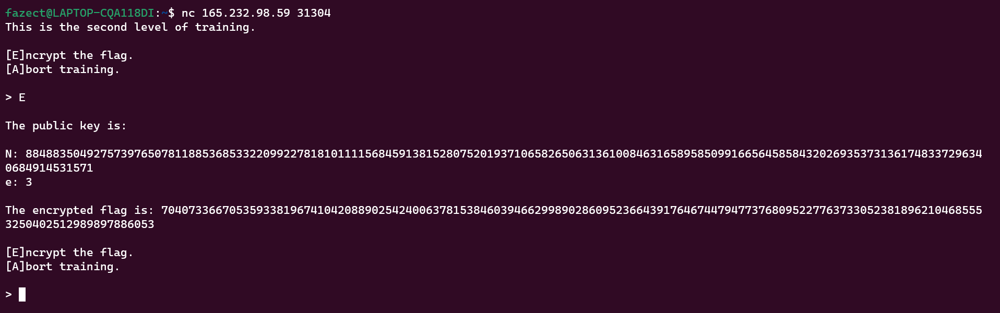
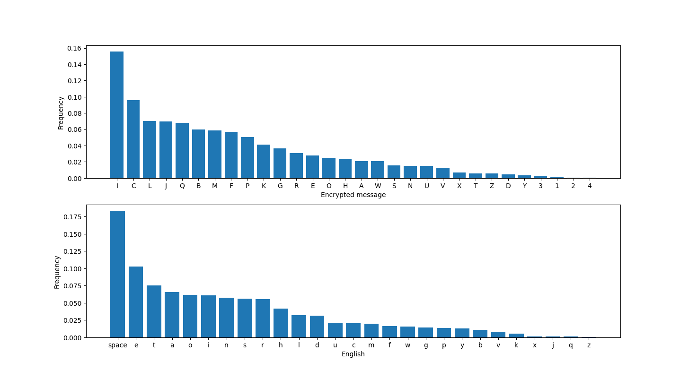
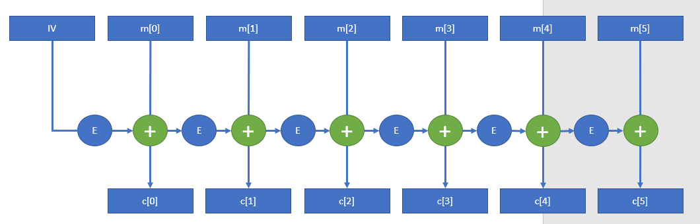
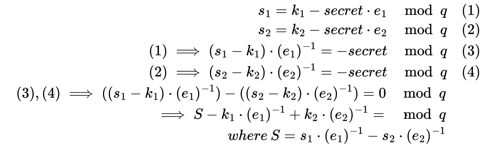
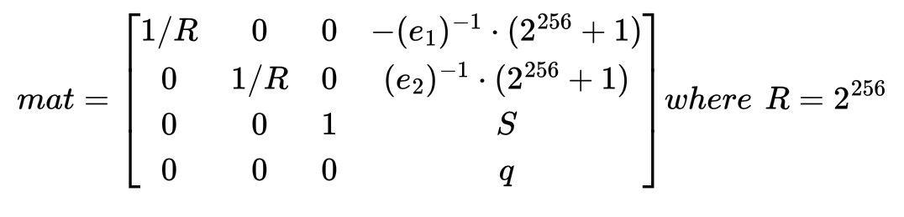



## Ancient Encodings

* **Given file:** [Get it here!](https://drive.google.com/file/d/1eDi7M0cVA9-y2EPYMWehni7YQpq-3QN4/view?usp=sharing)

* **Description:** Your initialization sequence requires loading various programs to gain the necessary knowledge and skills for your journey. Your first task is to learn the ancient encodings used by the aliens in their communication.

* **Category:** Cryptography

* **Difficulty:** Very Easy

We are given a Python script and a text file. Analyze the script, we get to know how the string is being encoded, which is `Base 64 encode > Conversion to long from bytes > Hex`.

To get the original string, we simply reverse the process, using [CyberChef](https://gchq.github.io/CyberChef) with the hex given in the text file.


Flag is: **HTB{1n_y0ur_j0urn3y_y0u_wi1l_se3_th15_enc0d1ngs_ev3rywher3}**

## Small StEps

* **Given file:** [Get it here!](https://drive.google.com/file/d/1UWVtdIr8GX9C6to-uuyEJe0v3Zg_baDf/view?usp=sharing)

* **Description:** As you continue your journey, you must learn about the encryption method the aliens used to secure their communication from eavesdroppers. The engineering team has designed a challenge that emulates the exact parameters of the aliens' encryption system, complete with instructions and a code snippet to connect to a mock alien server. Your task is to break it.

* **Note:** This challenge had a docker but it might be closed at the time you are reading this. All needed files will be given in the write-ups.

* **Category:** Cryptography

* **Difficulty:** Very Easy

We are given two Python script. The server.py is to setup a server for `RSA encryption`. It will output `n, e, ct` upon connecting to the netcat server/run the Python script locally.



Since `e` is always `3`, we can use [Low public exponent RSA attack](https://crypto.stackexchange.com/questions/6713/low-public-exponent-attack-for-rsa) to recover the initial message. In general, we only have to calculate `cube root` of ciphertext to get the plaintext. 

Below is the implementation of the attack in Python.

```python
from Crypto.Util.number import long_to_bytes
import gmpy2

n = 884883504927573976507811885368533220992278181011115684591381528075201937106582650631361008463165895850991665645858432026935373136174833729634068491453157
e = 3
ct = 70407336670535933819674104208890254240063781538460394662998902860952366439176467447947737680952277637330523818962104685553250402512989897886053

pt = gmpy2.iroot(ct, 3)[0]  # Get cube root of ct
print(long_to_bytes(pt))
```

Flag is: **HTB{5ma1l_E-xp0n3nt}**

## Perfect Synchronization

* **Given file:** [Get it here!](https://drive.google.com/drive/folders/1vm-yF-YzL-l18Rf83RwPo2ar0ZjLEehg?usp=sharing)

* **Description:** The final stage of your initialization sequence is mastering cutting-edge technology tools that can be life-changing. One of these tools is quipqiup, an automated tool for frequency analysis and breaking substitution ciphers. This is the ultimate challenge, simulating the use of AES encryption to protect a message. Can you break it?

* **Category:** Cryptography

* **Difficulty:** Easy

The encryption is shown below:

```python
from os import urandom
from Crypto.Cipher import AES
from secret import MESSAGE

assert all([x.isupper() or x in '{_} ' for x in MESSAGE])


class Cipher:

    def __init__(self):
        self.salt = urandom(15)
        key = urandom(16)
        self.cipher = AES.new(key, AES.MODE_ECB)

    def encrypt(self, message):
        return [self.cipher.encrypt(c.encode() + self.salt) for c in message]


def main():
    cipher = Cipher()
    encrypted = cipher.encrypt(MESSAGE)
    encrypted = "\n".join([c.hex() for c in encrypted])

    with open("output.txt", 'w+') as f:
        f.write(encrypted)


if __name__ == "__main__":
    main()
```
### Problem statement

The Python script defines a `Cipher` class that generates a random salt and key, then encrypts a message using AES in ECB mode. The encrypted message is written to a file in hexadecimal format. The `MESSAGE` variable is imported from a separate file. Our mission is to recover the encrypted message and find the flag in it. 

### Initial Analysis

#### The randomness

The author adds some randomnesses including `key` and `salt` to make the encryption more unpredictable. But if you look more closely into it, you will realize that the `salt` is just initialized once, and be padded for all characters in the message. It means the `salt` is not too much useful, it just shifts all characters by a constant value.

#### The AES encryption mode

The author uses EBC mode - the weakest mode, to encrypt all `shifted` characters of the message. 

For anyone who doesn't know about `ECB`: `ECB (Electronic Codebook)` is one of the simplest modes of `AES encryption`, where each block of plaintext is encrypted separately using the same key.
 
In this mode, identical plaintext blocks will be encrypted to identical ciphertext blocks, making it vulnerable to attacks that exploit patterns in the plaintext. Therefore, ECB mode is not recommended for secure communication, and other modes like CBC, CTR, or GCM are preferred. A visualized example is illustrated in [this wiki](https://en.wikipedia.org/wiki/Block_cipher_mode_of_operation) to show that AES-ECB mode is not semantically secure.

#### Conclusion

By the above analysis, we can prove that: 

For every $c_A, c_B \in \text{message}$: $c_A = c_B \Leftrightarrow ECB(c_A + \text{salt}) = ECB(c_B + \text{salt})$

This means the encryption is just a substitution cipher. 

### Solution method

For simplicity in frequency analyzing, I map every different hex strings in the output file to a character (A-Z, 1-4), noted that identical strings would produce identical characters. By comparing to English Letter Frequency (including space character) table, we may recover some common letters like e, t, i, a, o confidentally. Then, by the reduncancy and meaning of English words, I can recover the entire content and find the flag.

### Results

After the mapping, here is the encrypted message:

`ABCDECFGHIJFJKHLMLIMLINJLCOIPFIQRCIAJGQIQRJQIMFIJFHISMTCFILQBCQGRIPAIVBMQQCFIKJFSEJSCIGCBQJMFIKCQQCBLIJFOIGPUNMFJQMPFLIPAIKCQQCBLIPGGEBIVMQRITJBHMFSIABCDECFGMCLIUPBCPTCBIQRCBCIMLIJIGRJBJGQCBMLQMGIOMLQBMNEQMPFIPAIKCQQCBLIQRJQIMLIBPESRKHIQRCILJUCIAPBIJKUPLQIJKKILJUWKCLIPAIQRJQIKJFSEJSCIMFIGBHWQJFJKHLMLIABCDECFGHIJFJKHLMLIJKLPIXFPVFIJLIGPEFQMFSIKCQQCBLIMLIQRCILQEOHIPAIQRCIABCDECFGHIPAIKCQQCBLIPBISBPEWLIPAIKCQQCBLIMFIJIGMWRCBQCYQIQRCIUCQRPOIMLIELCOIJLIJFIJMOIQPINBCJXMFSIGKJLLMGJKIGMWRCBLIABCDECFGHIJFJKHLMLIBCDEMBCLIPFKHIJINJLMGIEFOCBLQJFOMFSIPAIQRCILQJQMLQMGLIPAIQRCIWKJMFQCYQIKJFSEJSCIJFOILPUCIWBPNKCUILPKTMFSILXMKKLIJFOIMAIWCBAPBUCOINHIRJFOIQPKCBJFGCIAPBICYQCFLMTCIKCQQCBINPPXXCCWMFSIOEBMFSIVPBKOIVJBIMMINPQRIQRCINBMQMLRIJFOIQRCIJUCBMGJFLIBCGBEMQCOIGPOCNBCJXCBLINHIWKJGMFSIGBPLLVPBOIWEZZKCLIMFIUJ1PBIFCVLWJWCBLIJFOIBEFFMFSIGPFQCLQLIAPBIVRPIGPEKOILPKTCIQRCUIQRCIAJLQCLQILCTCBJKIPAIQRCIGMWRCBLIELCOINHIQRCIJYMLIWPVCBLIVCBCINBCJXJNKCIELMFSIABCDECFGHIJFJKHLMLIAPBICYJUWKCILPUCIPAIQRCIGPFLEKJBIGMWRCBLIELCOINHIQRCI1JWJFCLCIUCGRJFMGJKIUCQRPOLIPAIKCQQCBIGPEFQMFSIJFOILQJQMLQMGJKIJFJKHLMLISCFCBJKKHIRQN2J3LMUWKC3LENLQMQEQMPF3ML3VCJX4IGJBOIQHWCIUJGRMFCBHIVCBCIAMBLQIELCOIMFIVPBKOIVJBIMMIWPLLMNKHINHIQRCIELIJBUHLILMLIQPOJHIQRCIRJBOIVPBXIPAIKCQQCBIGPEFQMFSIJFOIJFJKHLMLIRJLINCCFIBCWKJGCOINHIGPUWEQCBILPAQVJBCIVRMGRIGJFIGJBBHIPEQILEGRIJFJKHLMLIMFILCGPFOLIVMQRIUPOCBFIGPUWEQMFSIWPVCBIGKJLLMGJKIGMWRCBLIJBCIEFKMXCKHIQPIWBPTMOCIJFHIBCJKIWBPQCGQMPFIAPBIGPFAMOCFQMJKIOJQJIWEZZKCIWEZZKCIWEZZKC`

Plotting the histogram of this encrypted message, comparing with the expected frequency, we get:



Here is the script, if you're interested in:

```python
import matplotlib.pyplot as plt

def plot_histogram(text):
    english_freq = {'space': 0.18316895740067898, 'e': 0.10266650309881365, 't': 0.07516918822929543, 'a': 0.0653211522431101, 'o': 0.06165021261170107, 'i': 0.06109938076429621, 'n': 0.05748993391266301, 's': 0.0558094607431706, 'r': 0.05501226388301501, 'h': 0.0418265243918537, 'l': 0.03203162615518401, 'd': 0.03123691335535358, 'u': 0.02074798285524714, 'c': 0.020576050425919314, 'm': 0.019830666456506605, 'f': 0.016535714836861396, 'w': 0.015818636195592536, 'g': 0.014126275726274115, 'p': 0.01318902368984632, 'y': 0.012614330285168858, 'b': 0.010748157780246267, 'v': 0.007961080746834234, 'k': 0.005609987561400249, 'x': 0.0012367402118007968, 'j': 0.0010975645567653538, 'q': 0.0010065039671926798, 'z': 0.0005273232293542625}
    char_dict = {}
    for char in text:
        if char in char_dict:
            char_dict[char] += 1
        else:
            char_dict[char] = 1
    for key in char_dict:
        char_dict[key] /= len(text)
        # char_dict[key] *= 100
    char_dict = dict(sorted(char_dict.items(), key=lambda x: x[1], reverse=True))
    # plt.bar(char_dict.keys(), char_dict.values())
    fig, (ax1, ax2) = plt.subplots(nrows=2, ncols=1)

    # Plot the first subplot
    ax1.bar(char_dict.keys(), char_dict.values())
    ax1.set_xlabel('Encrypted message')
    ax1.set_ylabel('Frequency (%)')

    # Plot the second subplot
    ax2.bar(english_freq.keys(), english_freq.values())
    ax2.set_xlabel('English')
    ax2.set_ylabel('Frequency (%)')
    plt.show()
```

Based on the charts, we can easily find that letter `I`, `C` in encrypted message must be `space` and `e` in English, respectively. I guess there must be one and only one pair `{}` in the message for the flag `HTB{...}`. In the above chart, letter `2` and `4` share the smallest frequency, so they must be `{` and `}`. Moreover, the 3 characters immediately preceding `{` must be `htb`. After that, we got:

`ABeDEeFGH JFJKHLML ML bJLeO PF the AJGt thJt MF JFH SMTeF LtBetGh PA VBMtteF KJFSEJSe GeBtJMF KetteBL JFO GPUbMFJtMPFL PA KetteBL PGGEB VMth TJBHMFS ABeDEeFGMeL UPBePTeB theBe ML J GhJBJGteBMLtMG OMLtBMbEtMPF PA KetteBL thJt ML BPEShKH the LJUe APB JKUPLt JKK LJUWKeL PA thJt KJFSEJSe MF GBHWtJFJKHLML ABeDEeFGH JFJKHLML JKLP XFPVF JL GPEFtMFS KetteBL ML the LtEOH PA the ABeDEeFGH PA KetteBL PB SBPEWL PA KetteBL MF J GMWheBteYt the UethPO ML ELeO JL JF JMO tP bBeJXMFS GKJLLMGJK GMWheBL ABeDEeFGH JFJKHLML BeDEMBeL PFKH J bJLMG EFOeBLtJFOMFS PA the LtJtMLtMGL PA the WKJMFteYt KJFSEJSe JFO LPUe WBPbKeU LPKTMFS LXMKKL JFO MA WeBAPBUeO bH hJFO tPKeBJFGe APB eYteFLMTe KetteB bPPXXeeWMFS OEBMFS VPBKO VJB MM bPth the bBMtMLh JFO the JUeBMGJFL BeGBEMteO GPOebBeJXeBL bH WKJGMFS GBPLLVPBO WEZZKeL MF UJ1PB FeVLWJWeBL JFO BEFFMFS GPFteLtL APB VhP GPEKO LPKTe theU the AJLteLt LeTeBJK PA the GMWheBL ELeO bH the JYML WPVeBL VeBe bBeJXJbKe ELMFS ABeDEeFGH JFJKHLML APB eYJUWKe LPUe PA the GPFLEKJB GMWheBL ELeO bH the 1JWJFeLe UeGhJFMGJK UethPOL PA KetteB GPEFtMFS JFO LtJtMLtMGJK JFJKHLML SeFeBJKKH htb{J3LMUWKe3LEbLtMtEtMPF3ML3VeJX} GJBO tHWe UJGhMFeBH VeBe AMBLt ELeO MF VPBKO VJB MM WPLLMbKH bH the EL JBUHL LML tPOJH the hJBO VPBX PA KetteB GPEFtMFS JFO JFJKHLML hJL beeF BeWKJGeO bH GPUWEteB LPAtVJBe VhMGh GJF GJBBH PEt LEGh JFJKHLML MF LeGPFOL VMth UPOeBF GPUWEtMFS WPVeB GKJLLMGJK GMWheBL JBe EFKMXeKH tP WBPTMOe JFH BeJK WBPteGtMPF APB GPFAMOeFtMJK OJtJ WEZZKe WEZZKe WEZZKe`

The remaining task is to guess the words based on their meanings. Here is the result:

`frequency analysis is based on the fact that in any giTen stretch of written language certain letters and combinations of letters occur with Tarying frequencies moreoTer there is a characteristic distribution of letters that is roughly the same for almost all samples of that language in cryptanalysis frequency analysis also tnown as counting letters is the study of the frequency of letters or groups of letters in a cipherteYt the method is used as an aid to breating classical ciphers frequency analysis requires only a basic understanding of the statistics of the plainteYt language and some problem solTing stills and if performed by hand tolerance for eYtensiTe letter bootteeping during world war ii both the british and the americans recruited codebreaters by placing crossword puZZles in ma1or newspapers and running contests for who could solTe them the fastest seTeral of the ciphers used by the aYis powers were breatable using frequency analysis for eYample some of the consular ciphers used by the 1apanese mechanical methods of letter counting and statistical analysis generally htb{a_simple_substitution_is_weat} card type machinery were first used in world war ii possibly by the us armys sis today the hard wort of letter counting and analysis has been replaced by computer software which can carry out such analysis in seconds with modern computing power classical ciphers are unlitely to proTide any real protection for confidential data puZZle puZZle puZZle`     

Flag is: **HTB{a_simple_substitution_is_weat}**

### Conclusion

This challenge is just a substitution cipher, which is totally insecure against frequency analysis. The `random key`, `salt`, `AES-ECB` is just to make colors :D.

## Multipage Recyclings

* **Given file:** [Get it here!](https://drive.google.com/file/d/1w-n16tVbL_eG-8XOvoMPJcfAEWQwxq-5/view?usp=sharing)

* **Description:** As your investigation progressed, a clue led you to a local bar where you met an undercover agent with valuable information. He spoke of a famous astronomy scientist who lived in the area and extensively studied the relic. The scientist wrote a book containing valuable insights on the relic's location, but encrypted it before he disappeared to keep it safe from malicious intent. The old man disclosed that the book was hidden in the scientist's house and revealed two phrases that the scientist rambled about before vanishing.

* **Category:** Cryptography

* **Difficulty:** Easy

The server script is shown below:

```python
from Crypto.Cipher import AES
from Crypto.Util.Padding import pad
import random, os

FLAG = b'HTB{??????????????????????}'

class CAES:

    def __init__(self):
        self.key = os.urandom(16)
        self.cipher = AES.new(self.key, AES.MODE_ECB)

    def blockify(self, message, size):
        return [message[i:i + size] for i in range(0, len(message), size)]

    def xor(self, a, b):
        return b''.join([bytes([_a ^ _b]) for _a, _b in zip(a, b)])

    def encrypt(self, message):
        iv = os.urandom(16)

        ciphertext = b''
        plaintext = iv

        blocks = self.blockify(message, 16)
        for block in blocks:
            ct = self.cipher.encrypt(plaintext)
            encrypted_block = self.xor(block, ct)
            ciphertext += encrypted_block
            plaintext = encrypted_block

        return ciphertext

    def leak(self, blocks):
        r = random.randint(0, len(blocks) - 2)
        leak = [self.cipher.encrypt(blocks[i]).hex() for i in [r, r + 1]]
        return r, leak


def main():
    aes = CAES()
    message = pad(FLAG * 4, 16)

    ciphertext = aes.encrypt(message)
    ciphertext_blocks = aes.blockify(ciphertext, 16)

    r, leak = aes.leak(ciphertext_blocks)

    with open('output.txt', 'w') as f:
        f.write(f'ct = {ciphertext.hex()}\nr = {r}\nphrases = {leak}\n')


if __name__ == "__main__":
    main()
```

We also have an output file:

```python
ct = bc9bc77a809b7f618522d36ef7765e1cad359eef39f0eaa5dc5d85f3ab249e788c9bc36e11d72eee281d1a645027bd96a363c0e24efc6b5caa552b2df4979a5ad41e405576d415a5272ba730e27c593eb2c725031a52b7aa92df4c4e26f116c631630b5d23f11775804a688e5e4d5624
r = 3
phrases = ['8b6973611d8b62941043f85cd1483244', 'cf8f71416111f1e8cdee791151c222ad']
```

### Problem Statement

This code defines a class called `CAES` that implements the AES encryption algorithm in ECB mode. The `CAES` class has methods to `blockify` a message into 16-byte blocks, `xor` two byte arrays, and `encrypt` a message using AES in ECB mode. Additionally, it has a method called `leak` that generates a random integer `r` and returns the encryption of two randomly chosen adjacent 16-byte blocks. The `main` function of this code creates an instance of the CAES class, generates a message by padded `FLAG*4`, encrypts the message, and generates a leak using the `leak` method of the `CAES` class. Finally, the main function writes the `ciphertext`, the randomly chosen integer `r`, and the `leak` to a file called `output.txt`.

### Initial Analysis

#### The encryption method

The `encrypt()` method is not in ECB mode, it's similar to CBC, which can be visualized by this graph:



#### The Leaked Data

The `leak` method extracts 2 consecutives blocks of `ciphertext` and encrypted them using ECB mode. Our leaked data is of ciphertext block 3th and 4th. By using the graph above, we can easily see where the leak data comes from and how to use it to break the system, here is the new graph:


### Solution Method

The work is simple, just to `xor` the `c[4]` with `Leak[0]` and xor `c[5]` with `Leak[1]`, then we can recover the plaintext `m[4]` and `m[5]`, respectively. They must be parts of, or entire flag (in any order).

Here is the script:
```python
def xor(a, b):
    return b''.join([bytes([_a ^ _b]) for _a, _b in zip(a, b)])

def blockify(message, size):
    return [message[i:i + size] for i in range(0, len(message), size)]
ct = 'bc9bc77a809b7f618522d36ef7765e1cad359eef39f0eaa5dc5d85f3ab249e788c9bc36e11d72eee281d1a645027bd96a363c0e24efc6b5caa552b2df4979a5ad41e405576d415a5272ba730e27c593eb2c725031a52b7aa92df4c4e26f116c631630b5d23f11775804a688e5e4d5624'
r = 3
Leak = ['8b6973611d8b62941043f85cd1483244', 'cf8f71416111f1e8cdee791151c222ad']
Leak = [bytes.fromhex(x) for x in Leak]
c = blockify(ct, 32)

c = [bytes.fromhex(x) for x in c]
print(xor(c[4], Leak[0]) + xor(c[5], Leak[1]))
```

### Results

Here is the result: `b'_w34k_w17h_l34kz}HTB{CFB_15_w34k'`

Flag is: **HTB{CFB_15_w34k_w34k_w17h_l34kz}**

## Inside the Matrix

* **Given file:** [Get it here!](https://drive.google.com/file/d/1w3gAAQ9VKg6HucPePcDwvUqzlKTWaRbk/view?usp=sharing)

* **Description:** As you deciphered the Matrix, you discovered that the astronomy scientist had observed that certain stars were not real. He had created two 5x5 matrices with values based on the time the stars were bright, but after some time, the stars stopped emitting light. Nonetheless, he had managed to capture every matrix until then and created an algorithm that simulated their generation. However, he could not understand what was hidden behind them as he was missing something. He believed that if he could understand the stars, he would be able to locate the secret tombs where the relic was hidden.

* **Category:** Cryptography

* **Difficulty:** Easy

The server script is shown below:

```python
from sage.all_cmdline import *
# from utils import ascii_print
import os

FLAG = b"HTB{????????????????????}"
assert len(FLAG) == 25


class Book:

    def __init__(self):
        self.size = 5
        self.prime = None

    def parse(self, pt: bytes):
        pt = [b for b in pt]
        return matrix(GF(self.prime), self.size, self.size, pt)

    def generate(self):
        key = os.urandom(self.size**2)
        return self.parse(key)

    def rotate(self):
        self.prime = random_prime(2**6, False, 2**4)

    def encrypt(self, message: bytes):
        self.rotate()
        key = self.generate()
        message = self.parse(message)
        ciphertext = message * key
        return ciphertext, key


def menu():
    print("Options:\n")
    print("[L]ook at page")
    print("[T]urn page")
    print("[C]heat\n")
    option = input("> ")
    return option


def main():
    book = Book()
    ciphertext, key = book.encrypt(FLAG)
    page_number = 1

    while True:
        option = menu()
        if option == "L":
            # ascii_print(ciphertext, key, page_number)
            print(ciphertext, key, page_number)
        elif option == "T":
            ciphertext, key = book.encrypt(FLAG)
            page_number += 2
            print()
        elif option == "C":
            print(f"\n{list(ciphertext)}\n{list(key)}\n")
        else:
            print("\nInvalid option!\n")


if __name__ == "__main__":
    try:
        main()
    except Exception as e:
        print(f"An error occurred: {e}")
```

### Problem Statement

The code defines a class `Book` that is used to generate a key matrix and encrypt a message using matrix multiplication. The matrix is generated randomly each time a message is encrypted, and its size is fixed at $5\times 5$. The program encrypts a flag, stored in `FLAG`, using the `Book` class and presents a menu to the user to interact with the encrypted flag.

The main function of the code presents a menu to the user with three options:

- `[L]ook at page`: displays the ciphertext and key matrix for the current page number. Here is an example output when you choose this option:

```
Options:

[L]ook at page
[T]urn page
[C]heat

> L

          _________   _________
   ______/        5\ /       6 \_______
 /| --------------- |  --------------- |\
|| Ciphertext:--- - | Key:------------ |||
|| ---------------- | ------  -------- |||
|| ---------- ----- | ---------------- |||
|| [3,12,21,20,8]-- | [18,18,21,26,24] |||
|| [1,1,9,7,1]----- | [21,7,10,9,2]--- |||
|| [10,3,8,6,13]--- | [22,1,24,22,12]- |||
|| [0,19,24,15,12]- | [7,21,7,20,2]--- |||
|| [10,4,6,2,4]---- | [26,25,17,3,25]- |||
|| ---------------- | ------ ----- --- |||
|| --- - ---------- | ---------------- |||
||______________ _  |  ________________|||
L/______/---------\\_//W--------\_______\J
``` 

- `[T]urn page`: generates a new key matrix and ciphertext for the next page number.

- `[C]heat`: displays the ciphertext and key matrix in list type. The Cheat output of above example page is:
```
[(3, 12, 21, 20, 8), (1, 1, 9, 7, 1), (10, 3, 8, 6, 13), (0, 19, 24, 15, 12), (10, 4, 6, 2, 4)]
[(18, 18, 21, 26, 24), (21, 7, 10, 9, 2), (22, 1, 24, 22, 12), (7, 21, 7, 20, 2), (26, 25, 17, 3, 25)]
```

### Initial Analysis

#### Primes

Prime $p$ is changed whenever `Turn page` option is chosen. Though we don't know what $p$ is, we know that it would be from 16 to 64. There are 12 primes in this range, which are $17, 19, 23, 29, 31, 37, 41, 43, 47, 53, 59, 61$.

#### The Encryption

It's just a multiplication between two $5 \times 5$ matrixs over the field of integers modulo $p$: 

$$C \equiv M\times K (\text{mod } p)$$

$$\Leftrightarrow M \equiv C\times K^{-1}  (\text{mod } p)$$

#### Conclusion

We already have key $K$ and ciphertext $C$ by using `Cheat option`. Then if we know $p$, we can easily recover message $M$ in modulus $p$. Because $p$ is changeable, we can gather several pairs $(M_i, p_i)$ where $i \geq 2$.

### Solution Method

Suppose there are some entries in a key $K_1$ which are larger than 59, then $p_1$ must be 61. 

Suppose all entries in a key $K_2$ are smaller than 17, then it's likely that $p_2$ is 17.

If we have $K_1$ and $K_2$, then we can recover $M_1$, $M_2$. By applying CRT (Chinese Remainder Theorem) for 2 pairs $(M_1, 61)$ and $(M_2, 17)$, we can get $M$ in modulus $61\times 17 = 1037$. Because every entries of the actual message's matrix are bytes, they would be smaller than 128 (which is much smaller than 1037). This means our $M$ is actually the message itself.

So our mission is just to find $C_1, C_2$ by using `Turn page` many times. Here is the script after we gather enough materials (I used $p_1=61$ and $p_2=19$):

```python
M_1 = [11, 23, 5, 1, 47, 48, 48, 46, 34, 3, 55, 34, 55, 43, 51, 34, 54, 55, 52, 53, 54, 33, 33, 33, 3]
M_2 = [15, 8, 9, 9, 13, 10, 10, 12, 0, 7,2, 0, 17, 9, 13,0, 1, 2, 14, 0,1, 14, 14, 14, 11]
res = []
from sympy.ntheory.modular import crt
for i in range(len(M_1)):  
    m = [61, 19]
    v = [M_1[i], M_2[i]]
# Use crt() method 
    crt_m_v = crt(m, v)[0]
    res.append(crt_m_v)
print(''.join([chr(x) for x in res]))
```

### Results

Flag is: **HTB{l00k_@t_7h3_st4rs!!!}**

## Colliding Heritage

* **Description:** As you arrive at the location of the relic, you discover an ancient tomb that appears to have no visible entrance. However, a scan of the area reveals the presence of unusual RF signals coming from a specific location. With the help of your team, you manage to create an interface to communicate with the signal-emitting device. Unfortunately, the device only grants access to descendants of the pharaoh’s left hand. Can you find a way to enter the tomb?

* **Category:** Cryptography

* **Difficulty:** Medium

We were given a file below:

```python
#!/usr/bin/env python3

import signal
from secrets import randbelow
from hashlib import md5
from Crypto.Util.number import isPrime, getPrime, long_to_bytes, bytes_to_long

FLAG = "HTB{???????????????????????????}"

class MD5chnorr:

    def __init__(self):
        # while True:
        #     self.q = getPrime(128)
        #     self.p = 2*self.q + 1
        #     if isPrime(self.p):
        #         break
        self.p = 0x16dd987483c08aefa88f28147702e51eb
        self.q = (self.p - 1) // 2
        self.g = 3
        self.x = randbelow(self.q)
        self.y = pow(self.g, self.x, self.p)

    def H(self, msg):
        return bytes_to_long(md5(msg).digest()) % self.q

    def sign(self, msg):
        k = self.H(msg + long_to_bytes(self.x))
        print(f'{k = }')
        r = pow(self.g, k, self.p) % self.q
        e = self.H(long_to_bytes(r) + msg)
        s = (k - self.x * e) % self.q
        return (s, e)

    def verify(self, msg, sig):
        s, e = sig
        if not (0 < s < self.q):
            return False
        if not (0 < e < self.q):
            return False
        rv = pow(self.g, s, self.p) * pow(self.y, e, self.p) % self.p % self.q
        ev = self.H(long_to_bytes(rv) + msg)
        return ev == e

def menu():
    print('[S]ign a message')
    print('[V]erify a signature')
    return input('> ').upper()[0]

def main():
    md5chnorr = MD5chnorr()
    print('g:', md5chnorr.g)
    print('y:', md5chnorr.y)
    print('p:', md5chnorr.p)

    for _ in range(3):
        choice = menu()

        if choice == 'S':
            msg = bytes.fromhex(input('Enter message> '))
            if b'I am the left hand' in msg:
                print('No!')
            else:
                sig = md5chnorr.sign(msg)
                print('Signature:', sig)

        elif choice == 'V':
            msg = bytes.fromhex(input('Enter message> '))
            s = int(input('Enter s> '))
            e = int(input('Enter e> '))
            if md5chnorr.verify(msg, (s, e)):
                if msg == b'I am the left hand':
                    print(FLAG)
                else:
                    print('Valid signature!')
            else:
                print('Invalid signature!')

        else:
            print('Invalid choice...')

if __name__ == '__main__':
    signal.alarm(30)
    main()
```

### Initial Analysis

This challenge implements the [Schnorr signature](https://en.wikipedia.org/wiki/Schnorr_signature). We were given 4 parameters including the generator $g$, prime $q,p=2*q+1$ and $y=g^{x} [pq]$. To get the flag, we have to submit to `verify` function a message with its signature such that there is a string `I am the left hand` in the message. However we can not create signature for any message that has this string via function `sign`. To solved this challenge, i create a signature by hand by retriving the private key $x$ in `sign` function.

### Solution
After reading on wiki, i noticed a vulnerability section `Key leakage from nonce reuse`. If we create two signatures with the same nonce $k$, then we have:

$$s_1= k-xe_1 [q]$$ 

$$s_2= k-xe_2 [q]$$ 

Now we can easily get the private key $x$:

$$x = (s_2 - s_1)(e_1e_2)^{-1}[q]$$ 

But how can we create two signatures with the same $k$? From the source we know that $k$ is actually `md5(msg|x)`. We can submit any $msg$ we want, so i immediately think of creating the md5 identical-prefix collision using [Hashclash](https://github.com/cr-marcstevens/hashclash). Hashclash will help us to find 2 messages of length 64 that has the same md5 hash, therefore `md5(msg|x)` or $k$ of these messages will be the same. 

After getting $x$, with any message that has the required string we can easily compute $k$ and then $r$, create our own signature $e$ and submit to server to get the flag. 

Flag is: **HTB{w3ll_y3s_bu7_4c7ual1y_n0…}**

## Elliptic Labyrinth

* **Given file:** [Get it here!](https://drive.google.com/file/d/1w4QyL7cKzhcZJ_qqakudh6fXLtj8mk6p/view?usp=sharing)

* **Description:** As you navigate through the labyrinth inside the tomb, you encounter GPS inaccuracies that make it difficult to determine the correct path to the exit. Can you overcome the technical issues and use your instincts to find your way out of the maze?

* **Note:** This challenge had a docker but it might be closed at the time you are reading this. All needed files will be given in the write-ups.

* **Category:** Cryptography

* **Difficulty:** Medium

The server script is shown below:

```python
import os, json
from hashlib import sha256
from random import randint
from Crypto.Util.number import getPrime, long_to_bytes
from Crypto.Cipher import AES
from Crypto.Util.Padding import pad
from sage.all_cmdline import *
from secret import FLAG


class ECC:

    def __init__(self, bits):
        self.p = getPrime(bits)
        self.a = randint(1, self.p)
        self.b = randint(1, self.p)

    def gen_random_point(self):
        return EllipticCurve(GF(self.p), [self.a, self.b]).random_point()


def menu():
    print("1. Get parameters of path")
    print("2. Get point in path")
    print("3. Try to exit the labyrinth")
    option = input("> ")
    return option


def main():
    ec = ECC(512)

    while True:
        choice = menu()
        if choice == '1':
            r = randint(ec.p.bit_length() // 3, 2 * ec.p.bit_length() // 3)
            print(
                json.dumps({
                    'p': hex(ec.p),
                    'a': hex(ec.a >> r),
                    'b': hex(ec.b >> r)
                }))
        elif choice == '2':
            A = ec.gen_random_point()
            print(json.dumps({'x': hex(A[0]), 'y': hex(A[1])}))
        elif choice == '3':
            iv = os.urandom(16)
            key = sha256(long_to_bytes(pow(ec.a, ec.b, ec.p))).digest()[:16]
            cipher = AES.new(key, AES.MODE_CBC, iv)
            flag = pad(FLAG, 16)
            print(
                json.dumps({
                    'iv': iv.hex(),
                    'enc': cipher.encrypt(flag).hex()
                }))
        else:
            print('Bye.')
            exit()

if __name__ == '__main__':
    main()
```

### Problem Statement

The program generates random secret elliptic curve parameters and allows the user to:

  - Option 1: Obtain the modulus `p` and a few MSB bits of ECC parameters.

  - Option 2: Obtain a random point on the curve.

  - Option 3: Provide the encrypted FLAG.

Our mission is to decrypt the flag.

### Initial analysis

#### What we need to decrypt the flag?

Obviously, we cannot break the AES to find the flag without the `key`. To recover the `key`, we need to know all elliptic curve's parameters, which are `a`, `b` and `p`. We already known `p`, so what we do is trying to retrieve `a` and `b` from the information provided by the server.

#### Having many points on the curve

Every point $P(x, y)$ belonging to this elliptic curve must satisfy the equation: $y^2 \equiv x^3 + ax + b (\text{mod } p)$. To find `a` and `b` in `p`, we must at least have a system of 2 equations like this. Fortunately, the server allows user to generate many points.

### Solution Method

Suppose we have two different points $M(x_m, y_m)$, $N(x_n, y_n)$ in the curve. We recover $a,b$ by below formulas:

$a \equiv (y^2_m - y^2_n - (x^3_m - x^3_n))(x_m - x_n)^{-1} (\text{mod } p)$

$b \equiv y^2_m - x^3_m - ax_m (\text{mod } p)$

The script:

```python
def recover(p, M, N):
    x1, y1 = M
    x2, y2 = N
    a = pow(x1 - x2, -1, p) * (pow(y1, 2, p) - pow(y2, 2, p) - (pow(x1, 3, p) - pow(x2, 3, p))) % p
    b = (pow(y1, 2, p) - pow(x1, 3, p) - a * x1) % p
    return a, b
```

That's all! By having `a` and `b`, we can easily recover the `key` and therefore decrypt the FLAG.

```python
from hashlib import sha256
from random import randint
from Crypto.Util.number import getPrime, long_to_bytes
from Crypto.Cipher import AES
from Crypto.Util.Padding import pad

iv = bytes.fromhex(iv)
key = sha256(long_to_bytes(pow(a, b, p))).digest()[:16]
cipher = AES.new(key, AES.MODE_CBC, iv)
enc = bytes.fromhex(enc)
print(cipher.decrypt(enc))
```

### Results

Flag is: **HTB{d3fund_s4v3s_th3_d4y!}**

## Biased Heritage

* **Given file:** [Get it here!](https://github.com/sudo-rainman/ctf_script/tree/main/htb_cyberapocalypse2023/crypto_biased_heritage)

* **Description:** You emerge from the labyrinth to find a massive door blocking your path to the relic. It has the same authentication mechanism as the entrance, but it appears to be more sophisticated and challenging to crack. Can you devise a plan to breach the door and gain access to the relic?

* **Category:** Cryptography

* **Difficulty:** Hard

Compared to the last challenge (Colliding Heritage), `k` is now generated by `SHA256` insteads which is much more resilient against hash collision attacks than `MD5` or nearly impossible to do so. Because of that, our previous attack wouldn't work on this challenge.

After noticing the word `BIASED` in the challenge name, I had a hunch that this chall gonna need some LLL magic. Based on that, I kept looking for a small integer or atleast any repetitive parts of a number (or so called bias), and found one in the followng hashing function.

```python
def H(self, msg):
    return bytes_to_long(2 * sha256(msg).digest()) % self.q
```

You can easily see that `k = 2*SHA256( msg || secret )`. In other words, `k = (2^256+1)\*x` where x is unknown `256-bit` output from `SHA256` function while k is `512-bit`. Bingo, LLL time.

Well, the server allows us to query for 3 times, we should use the first 2 times to collect signatures which are just enough for our use and the last ones to trick the server into giving us the flag. So we got:



Since `S` is known `512-bit`, and `k` only has `256` unknown bits we can start constructing a lattice to solve the SVP problem with LLL now.



After LLL, we gonna get a short vector that look like this: 


Well, that was alot. Here comes the script in Sage (I parsed signature and submitted signatures all by hands):

```python
from hashlib import sha256
from Crypto.Util.number import *

##get 2 signature from server 
sig0 =  (2201384718072843790141885598870601009149158537568071358193592308444053168306421929467556420242693286691490522215468964110881851509880735493338991645390396, 2318623387388989624095214099569047825341708399431253151627450383635519224666598718188372928127571765685778247137818236688391434765968118358634695411837390)
sig1 =    (5643323405968098617359379045374815314162245377024975944768494215044558381083529231024356935255866448701807811319414715896126937899577482072265546826687923, 1027133811051642261997157563892411730891386064630632377323975878292520406108099727744365069912026927564457147136857066971987676141520708801237151093219205)
s_temp= [sig0[0], sig1[0]]
e_temp= [sig0[1], sig1[1]]
# q prime
q= [10183765261512984706477412009638081602843766654569849535936436797593873507566983996455981325952833624810053852919430991796953569087107929681393648627640673]
preal = 0x184e26a581fca2893b2096528eb6103ac03f60b023e1284ebda3ab24ad9a9fe0e37b33eeecc4b3c3b9e50832fd856e9889f6c9a10cde54ee798a7c383d0d8d2c3
g=3 
s0= s_temp[0]*inverse(e_temp[0],q[0]) % q[0]
s1= s_temp[1]*inverse(e_temp[1],q[0]) % q[0]
temp0 = (2**256+1)*inverse(e_temp[0],q[0]) % q[0]
temp1 = (2**256+1)*inverse(e_temp[1],q[0]) % q[0]
S = (s0-s1) % q[0]

m = Matrix([[1/2^256,0,0,-temp0],
            [0,1/2^256,0,temp1],
            [0,0,1,S],
            [0,0,0,q[0]]])


res = m.LLL()

def H(msg):
    return bytes_to_long(2 * sha256(msg).digest()) % q[0]

def sign(x, msg):
    print("q0 here", q[0])
    k = H(msg + long_to_bytes(x))
    r = int(pow(3,k,preal)) % q[0]
    e = H(long_to_bytes(r) + msg)
    s = (k - x * e) % q[0]
    return (s, e)

for row in res:
    if row[2] == 1 or row[2] == -1:
        k0 = row[0]
        if k0.numerator() < 0:
            k0 = -k0
        k0 = int(k0.numerator())
        k0 = k0*(2^256+1)
        secret = (k0 - s_temp[0]) % q[0]
        secret = int(secret*inverse(e_temp[0],q[0])) % q[0]
        temp = sign(secret,b"")
        assert s_temp[0] == temp[0]
        assert e_temp[0] == temp[1]

        print(b"right hand".hex())
        print(sign(secret,b"right hand"))
```

Flag is: **HTB{full_s1z3_n0nc3_l4cks_ful1_s1z3_3ntr0py}**

## Converging Visions

* **Description:** As you hold the relic in your hands, it prompts you to input a coordinate. The ancient scriptures you uncovered near the pharaoh's tomb reveal that the artifact is capable of transmitting the locations of vessels. The initial coordinate must be within proximity of the vessels, and an algorithm will then calculate their precise locations for transmission. However, you soon discover that the coordinates transmitted are not correct, and are encrypted using advanced alien techniques to prevent unauthorized access. It becomes clear that the true coordinates are hidden, serving only to authenticate those with knowledge of the artifact's secrets. Can you decipher this alien encryption and uncover the genuine coordinates to locate the vessels and destroy them?

* **Category:** Cryptography

* **Difficulty:** Hard

We are given a Python script.

```python
from secret import FLAG, p, a, b
from sage.all_cmdline import *

class PRNG:

    def __init__(self, p, mul1, mul2):
        self.mod = p * 6089788258325039501929073418355467714844813056959443481824909430411674443639248386564763122373451773381582660411059922334086996696436657009055324008041039
        self.exp = 2
        self.mul1 = mul1
        self.mul2 = mul2
        self.inc = int.from_bytes(b'Coordinates lost in space', 'big')
        self.seed = randint(2, self.mod - 1)

    def rotate(self):
        self.seed = (self.mul1 * pow(self.seed, 3) + self.mul2 * self.seed +
                     self.inc) % self.mod
        return self.seed, pow(self.seed, self.exp, self.mod)


class Relic:

    def __init__(self, p, a, b):
        self.E = EllipticCurve(GF(p), [a, b])
        self.P = None
        self.EP = None
        self.p = p
        self.prng = PRNG(p, a, b)

    def setupPoints(self, x):
        if x >= self.p:
            return 'Coordinate greater than curve modulus'

        try:
            self.P = self.E.lift_x(Integer(x))
            self.EP = self.P
        except:
            return 'Point not on curve'

        return ('Point confirmed on curve', self.P[0], self.P[1])

    def nextPoints(self):
        seed, enc_seed = self.prng.rotate()
        self.P *= seed
        self.EP *= enc_seed
        return ('New Points', self.EP[0], self.EP[1], self.P[0], self.P[1])


def menu():
    print('Options:\n')
    print('1. Setup Point')
    print('2. Receive new point')
    print('3. Find true point')
    option = input('> ')
    return option


def main():
    artifact = Relic(p, a, b)
    setup = False
    while True:
        try:
            option = menu()
            if option == '1':
                print('Enter x coordinate')
                x = int(input('x: '))
                response = artifact.setupPoints(x)
                if response[0] == 'Point confirmed on curve':
                    setup = True
                print(response)
            elif option == '2':
                if setup:
                    response = artifact.nextPoints()
                    print('Response')
                    print((response[0], response[1], response[2]))
                else:
                    print('Configure origin point first')
            elif option == '3':
                if setup:
                    print('Input x,y')
                    Px = int(input('x: '))
                    Py = int(input('y: '))
                    response = artifact.nextPoints()
                    if response[3] == Px and response[4] == Py:
                        print(
                            'You have confirmed the location. It\'s dangerous however to go alone. Take this: ',
                            FLAG)
                    else:
                        print('The vessels will never be found...')
                    exit()
                else:
                    print('Configure origin point first')
            else:
                print("Invalid option, sutting down")
                exit()
        except Exception as e:
            response = f'An error occured: {e}'
            print(response)
            exit()


if __name__ == '__main__':
    assert p.bit_length() == 256
    main()
```

So, for any \\(i\neq j\\), $$a \equiv \dfrac{Y_i^2-Y_j^2-X_i^3+X_j^3}{X_i-X_j} \pmod{p}$$

Which means for any distinct \\(i,j,k,l\\), $$(Y_i^2-Y_j^2-X_i^3+X_j^3)(X_k-X_l)-(Y_k^2-Y_l^2-X_k^3+X_l^3)(X_i-X_j) \equiv 0 \pmod{p}$$

So by playing with several $i,j,k,l$ and take GCD stuff, we obtain $$p=91720173941422125335466921700213991383508377854521057423162397714341988797837$$.

Also, we can find \\(a\\) and \\(b\\) by consider the equation system $$Y_i^2-X_i^3=aX_i+b \text{ for }i=1,2$$.

We get that $$a=57186237363769678415558546920636910250184560730836527033755705455333464722170$$, $$b=47572366756434660406002599832623767973471965640106574131304711893212728437629$$

Now the important thing is to note that: \\(|E/\mathbb{F}_p|=p\\), thus we can easily solve the discrete log problem on \\(E\\) using `Smart's attack`. In addition, we only need to consider the RNG in modulo \\(p\\).

Back to the challenge, we see the challenge is almost equivalent: Given \\(P,x^2\times P\\), find \\((ax^3+bx+C)\times P\\). To do this, we need to find \\(x\\) .Fortunately, because the DL problem is easy, we can easily find \\(x\\). The attack is described as follow:

1. Let \\(P\\) be any point on the curve.

2. Let the current round be \\(i\\), we can use `Option 2` to get the value \\(r[i]^2\times P\\). At this time, \\(state.P=r[i]\times P\\).

3. Use Smart's attack to restore \\(r[i]^2\\), then restore \\(r[i]\\) with probability \\(\dfrac{1}{2}\\).

4. Calculate \\(predict=ar[i]^3+br[i]+C \pmod{p}\\).

5. Use `Option 1` and enter the coordinate of \\(P[1]\\). This will set \\(state.P=P\\) and the next point will be equal to \\(r[i+1]\times P\\).

6. Enter `Option 3` and enter the coordinates of \\(predict\times P[1]\\).

The attack has \\(\dfrac{1}{2}\\) probability of success because we have  \\(\dfrac{1}{2}\\) probability of getting the right \\(r[i]\\). So by doing this multiple times, we get the flag.

Flag is: **HTB{0Racl3_AS_a_f3A7Ur3_0n_W3aK_CURV3_aND_PRN9??_7H3_s3cur17Y_0F_0uR_CRyP70Sys73M_w1LL_c0LLAp53!!!}**

## Blokechain

* **Given file:** [Get it here!](https://github.com/sudo-rainman/ctf_script/tree/main/htb_cyberapocalypse2023/crypto_blokechain)

* **Description:** After successfully locating the vessels and obtaining the relic, you and your team begin to strategize on how to destroy them. However, upon further examination, it becomes clear that the vessels are connected with advanced alien technology that simulates a blockchain. In order to destroy the pods, you realize that you need to possess the wealth of the entire galaxy. The fate of the Earth rests on your ability to find a solution to this seemingly impossible problem. Can you devise a plan to destroy the vessels and save humanity from their destructive power? Note: This challenge is not intended for beginners. It is an insane level of difficulty. Good luck and have fun!

* **Category:** Cryptography

* **Difficulty:** Insane

This challenge has an unintended solution where you can just resubmit the hash, lmao. R.I.P overthinkers.

Here is the script:

```python
from pwn import * 

r = remote("178.62.9.10",30794)
total = 0
while total < 100000000:
    r.recvuntil("vessels\n")
    r.sendline("1")

    r.recvuntil("vessels\n")
    r.sendline("2")

    for i in range(60):
        r.recvuntil(": ")
        r.sendline("1")

    ans = []
    while True:
        temp = r.recvline()
        if b"Balance" in temp:
            break
        else:
            temp = temp[len("expected hash "):len("expected hash ")+25].decode()
            ans.append(int(temp,16))
    r.recvuntil("vessels\n")
    r.sendline("2")
    ans1 = [1]*(60-len(ans))
    ans1 = ans1 + ans
    for i in range(60):
        r.recvuntil(": ")
        r.sendline(str(ans1[i]))
    while True:
        temp = r.recvline()
        if b"Balance" in temp:
            total = int(temp.strip().decode()[len("Balance: "):])
            print(total)
            break


r.recvuntil("vessels\n")
r.sendline("3")
print(r.recvline())
```

Flag is: **HTB{7h3_vess3ls_4r3_des7r0yed_g0od_j0b}**

## Original Post

- [From FazeCT](https://fazect.github.io/htb2023/)

- [From Onirique](https://junvalentine.github.io/posts/htb-wu-2023/#colliding-heritage)

- [From dasHaus](https://haopham23.github.io/dashaus165blog/)
