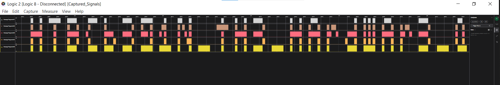
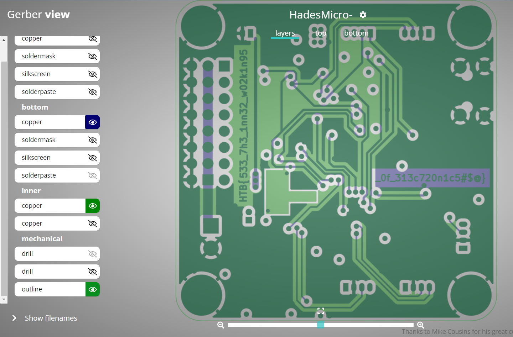
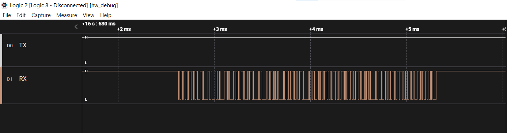
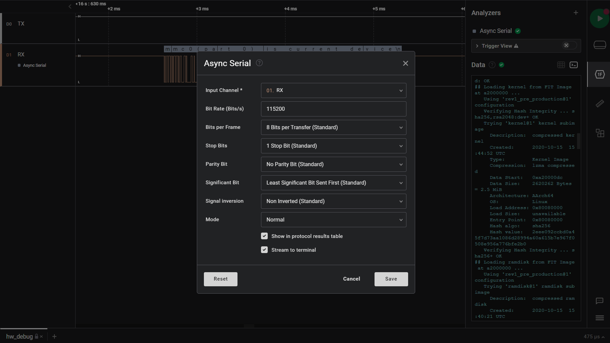
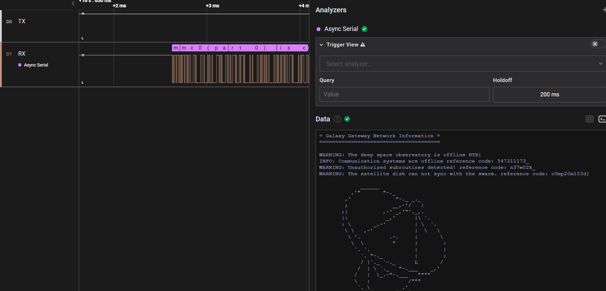
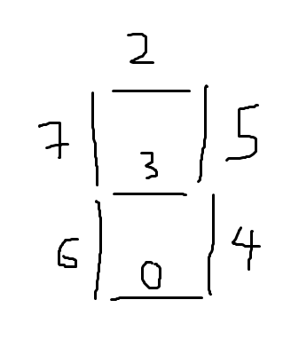
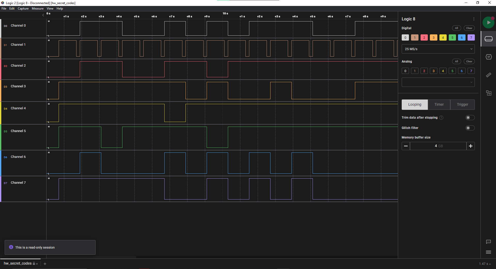





## Timed transmission

* **Given file:** [Get it here!](https://drive.google.com/file/d/1wMtr8Zv12tywaXRVWfli1s2YX6RREjdg/view?usp=sharing)

* **Description:** As part of your initialization sequence, your team loaded various tools into your system, but you still need to learn how to use them effectively. They have tasked you with the challenge of finding the appropriate tool to open a file containing strange serial signals. Can you rise to the challenge and find the right tool?

* **Category:** Hardware

* **Difficulty:** Very Easy

### Problem Statement and Results

What we have is a really strange file with .sal extension. I think the hardest part in this challenge is finding the app can open this file. After searching on Google (and Chatgpt), I found a suitable app called `Logic 2`. Open the file and enjoy it :D 



Flag is: **HTB{b391N_tH3_HArdWAr3_QU3St}**

## Critical Flight

* **Given file:** [Get it here!](https://drive.google.com/file/d/1wPLpM6tLlZzncKIVRhR4YkUFW9G8EQl9/view?usp=sharing)

* **Description:** Your team has assigned you to a mission to investigate the production files of Printed Circuit Boards for irregularities. This is in response to the deployment of nonfunctional DIY drones that keep falling out of the sky. The team had used a slightly modified version of an open-source flight controller in order to save time, but it appears that someone had sabotaged the design before production. Can you help identify any suspicious alterations made to the boards?

* **Category:** Hardware

* **Difficulty:** Very Easy

### Problem Statement

Given a lot of GBR file. Our mission is to somehow find the flag :D. 

### Results

These files are called `Gerber files` - a standard file format used in the manufacturing of printed circuit boards (PCBs) to describe the PCB's copper layers, solder mask, legend, and other features. To open this, reader can access this website: [https://www.pcbway.com/project/OnlineGerberViewer.html](https://www.pcbway.com/project/OnlineGerberViewer.html). We can easily find all parts of the flag in this board:



Flag is: **HTB{533_7h3_1nn32_w02k1n95_0f_313c720n1c5#$@}**

## Debug

* **Given file:** [Get it here!](https://drive.google.com/file/d/1wRpklHHBgr2vg_RjEyuSKXO9hFy5cbWn/view?usp=sharing)

* **Description:** Your team has recovered a satellite dish that was used for transmitting the location of the relic, but it seems to be malfunctioning. There seems to be some interference affecting its connection to the satellite system, but there are no indications of what it could be. Perhaps the debugging interface could provide some insight, but they are unable to decode the serial signal captured during the device’s booting sequence. Can you help to decode the signal and find the source of the interference?

* **Note:** This challenge had a docker but it might be closed at the time you are reading this. All needed files will be given in the write-ups.

* **Category:** Hardware

* **Difficulty:** Easy

### Problem Statement

We received file with .sal extension - which contains a signal capture of a device. Our mission is identify which device is captured and how to decode the signal to decrypt the communication.

### Solution Method

We use Logic 2 to open this file, then receive this:



There is only one channel with signals so probably we are talking about `UART protocol`. For doing that, first we have to calculate the `baud rate (bit/s)`. 

To calculate the baud rate in this signal we zoom into the very first signal and see the minimun period of the signal. We can see that the smallest period between two high values is `8.68us`. So, `1` bit needs at least `8.68us` to be transfered. The baud rate therefore must be around `115200 (bit/s)`. Let's configure the analyzer with this value:



### Results

The flag is showed at the terminal, after correctly analyze the signal:



Flag is: **HTB{547311173_n37w02k_c0mp20m153d}**

## Secret Code

* **Given zip:** [Get it here!](https://drive.google.com/file/d/134eMVlMGkxsiCsxOttzB9MtmhWOeFrZx/view?usp=share_link)

* **Description:** To gain access to the tomb containing the relic, you must find a way to open the door. While scanning the surrounding area for any unusual signals, you come across a device that appears to be a fusion of various alien technologies. However, the device is broken into two pieces and you are unable to see the secret code displayed on it. The device is transmitting a new character every second and you must decipher the transmitted signals in order to retrieve the code and gain entry to the tomb.

* **Category:** Hardware

* **Difficulty:** Easy

The challenge gave us a `.sal` file and a folder of `.gbr` files.

You can use any Gerber file viewer software to open the `.gbrjob` file but in my case I used [KiCad](https://www.kicad.org) and got the following circuit board.


We could clearly see that this was a typical 7-segment LED display. Tracing each channel connection to the LED itself, we got the channels corresponding to the segments on the display as follow, with channel 1 being the dot.



Next on line is the `.sal` file. For this I used [Logic 2](https://www.saleae.com/downloads/).



I extracted the bits from every channels one by one using channel 1 as the clock signal. I noticed that the machine was sending a hex string so I wrote a script to decode all of it.

```python
c = [
    [0,1,1,0,0,1,0,1,0,1,1,1,0,0,1,1,1,1,1,0,1,1,1,1,1,1,1,1,1,1,1,0,1,1,1,1,1,1,1,1,1,0,0,0,1,0,1,0,1,1,1,0,1,1,0,1,1,0,1,1,0,1],
    [1,1,1,1,1,1,1,1,1,1,1,1,1,1,1,1,1,1,1,1,1,1,1,1,1,1,1,1,1,1,1,1,1,1,1,1,1,1,1,1,1,1,1,1,1,1,1,1,1,1,1,1,1,1,1,1,1,1,1,1,1,1],
    [0,1,1,0,0,1,1,0,1,1,1,1,1,1,1,1,1,1,1,1,1,1,1,1,1,0,1,1,1,1,1,1,1,1,1,1,1,1,1,0,1,1,1,1,1,0,1,1,1,1,1,0,1,1,0,1,1,0,1,1,1,0],
    [1,1,1,1,1,1,0,1,0,0,1,0,0,0,1,1,1,1,1,1,1,1,1,0,1,1,1,1,1,1,1,1,1,1,1,1,1,0,1,1,1,1,0,0,1,0,1,0,1,1,1,0,1,1,1,0,1,0,1,1,0,1],
    [1,1,1,1,1,0,1,1,1,1,1,1,1,1,1,1,1,0,1,0,1,1,1,1,1,1,1,1,1,1,1,0,1,1,1,0,1,1,1,1,1,0,1,1,1,1,1,1,1,1,1,1,1,0,1,1,0,1,0,1,1,1],
    [1,1,0,1,1,1,1,0,1,1,1,1,1,1,1,1,1,1,0,0,0,1,1,1,0,1,1,1,1,0,0,0,0,0,1,1,1,1,0,1,0,0,1,1,1,1,1,1,0,1,1,1,0,0,1,1,1,1,1,1,1,1],
    [0,1,0,0,0,1,0,1,0,1,0,1,0,0,0,0,0,1,0,1,1,0,0,1,1,1,0,0,0,0,0,1,1,1,0,1,0,1,1,1,0,1,0,0,0,0,0,0,1,1,0,0,1,1,0,1,1,0,1,0,0,1],
    [1,1,1,1,1,0,0,1,0,1,0,1,0,0,0,0,0,0,1,1,1,0,0,1,1,0,0,0,0,1,1,1,1,1,0,0,0,1,1,0,1,1,0,0,0,0,0,0,1,1,0,0,1,1,1,1,0,0,0,0,0,0]
]

flag = ""
for i in range(len(c[0])):
    if c[0][i] == 0 and c[2][i] == 0 and c[3][i] == 0 and c[4][i] == 1 and c[5][i] == 1 and c[6][i] == 0 and c[7][i] == 0:
        flag += '1'
    elif c[0][i] == 1 and c[2][i] == 1 and c[3][i] == 1 and c[4][i] == 0 and c[5][i] == 1 and c[6][i] == 1 and c[7][i] == 0:
        flag += '2'
    elif c[0][i] == 1 and c[2][i] == 1 and c[3][i] == 1 and c[4][i] == 1 and c[5][i] == 1 and c[6][i] == 0 and c[7][i] == 0:
        flag += '3'
    elif c[0][i] == 0 and c[2][i] == 0 and c[3][i] == 1 and c[4][i] == 1 and c[5][i] == 1 and c[6][i] == 0 and c[7][i] == 1:
        flag += '4'
    elif c[0][i] == 1 and c[2][i] == 1 and c[3][i] == 1 and c[4][i] == 1 and c[5][i] == 0 and c[6][i] == 0 and c[7][i] == 1:
        flag += '5'
    elif c[0][i] == 1 and c[2][i] == 1 and c[3][i] == 1 and c[4][i] == 1 and c[5][i] == 0 and c[6][i] == 1 and c[7][i] == 1:
        flag += '6'
    elif c[0][i] == 0 and c[2][i] == 1 and c[3][i] == 0 and c[4][i] == 1 and c[5][i] == 1 and c[6][i] == 0 and c[7][i] == 0:
        flag += '7'
    elif c[0][i] == 1 and c[2][i] == 1 and c[3][i] == 1 and c[4][i] == 1 and c[5][i] == 1 and c[6][i] == 1 and c[7][i] == 1:
        flag += '8'
    elif c[0][i] == 0 and c[2][i] == 1 and c[3][i] == 1 and c[4][i] == 1 and c[5][i] == 1 and c[6][i] == 0 and c[7][i] == 1:
        flag += '9'
    elif c[0][i] == 1 and c[2][i] == 1 and c[3][i] == 0 and c[4][i] == 1 and c[5][i] == 1 and c[6][i] == 1 and c[7][i] == 1:
        flag += '0'
    elif c[0][i] == 1 and c[2][i] == 0 and c[3][i] == 1 and c[4][i] == 1 and c[5][i] == 0 and c[6][i] == 1 and c[7][i] == 1:
        flag += 'b'
    elif c[0][i] == 1 and c[2][i] == 0 and c[3][i] == 1 and c[4][i] == 1 and c[5][i] == 1 and c[6][i] == 1 and c[7][i] == 0:
        flag += 'd'
    elif c[0][i] == 1 and c[2][i] == 1 and c[3][i] == 1 and c[4][i] == 0 and c[5][i] == 0 and c[6][i] == 1 and c[7][i] == 1:
        flag += 'e'
    elif c[0][i] == 0 and c[2][i] == 1 and c[3][i] == 1 and c[4][i] == 0 and c[5][i] == 0 and c[6][i] == 1 and c[7][i] == 1:
        flag += 'f'
    else:
        print(c[0][i], c[2][i], c[3][i], c[4][i], c[5][i], c[6][i], c[7][i])

#print(flag)
print(bytes.fromhex(flag))
```

Flag is: **HTB{p0w32_c0m35_f20m_w17h1n@!#}**
