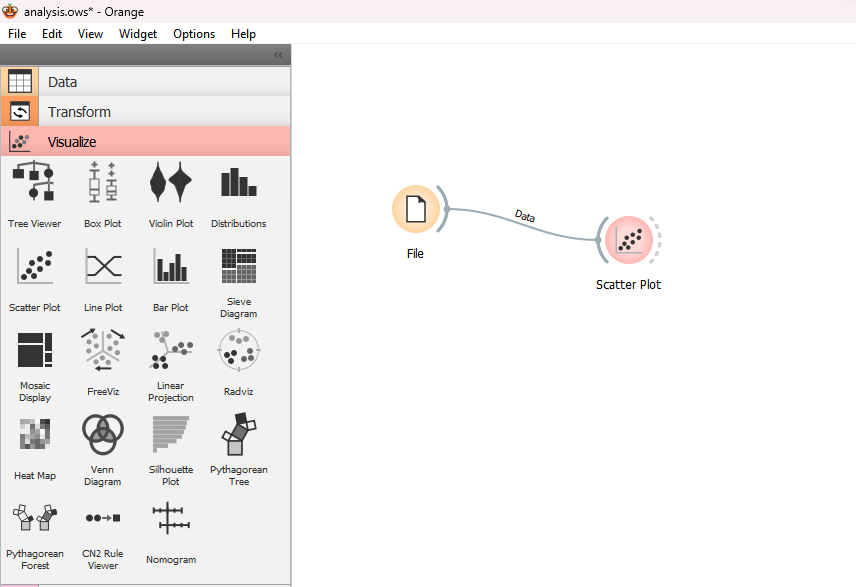
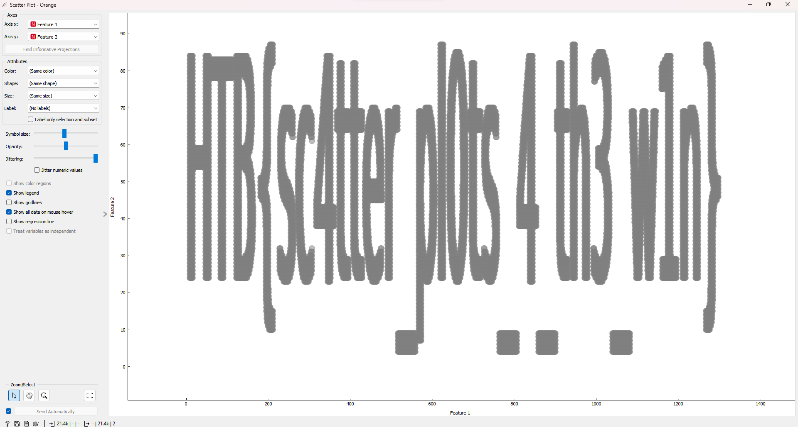





## Reconfiguration

* **Given zip:** [Get it here!](https://drive.google.com/drive/folders/1Pao4nTUNcvjCksDgyRCFPk_UCYpHeDqw?usp=sharing)

* **Description:** As Pandora set out on her quest to find the ancient alien relic, she knew that the journey would be treacherous. The desert was vast and unforgiving, and the harsh conditions would put her cyborg body to the test. Pandora started by collecting data about the temperature and humidity levels in the desert. She used a scatter plot in an Orange Workspace file to visualize this data and identified the areas where the temperature was highest and the humidity was lowest. Using this information, she reconfigured her sensors to better withstand the extreme heat and conserve water. But, a second look at the data revealed something otherwordly, it seems that the relic's presence beneath the surface has scarred the land in a very peculiar way, can you see it?

* **Category:** Machine Learning

In this challenge, we embarked on a quest to find an ancient alien relic hidden beneath the desert, following the footsteps of the cyborg Pandora. The task involved analyzing temperature and humidity data and uncovering peculiar patterns that hinted at the relic's presence.

To begin the analysis, we downloaded and installed the **Orange** data mining tool, which is an open-source data visualization and analysis tool for data scientists. You can download it here: https://orange.biolab.si/download/

After installing **Orange**, we opened the tool and loaded the **analysis.ows** file. We then imported the **point.csv** file into the Orange workspace by adding the "File" widget and selecting the **point.csv** file from our computer. Next, we created a scatter plot to visualize the data. We added the "Scatter Plot" widget from "Visualize" panel to the workspace and connected it to the "File" widget.



By viewing the "Scatter Plot", we got the flag:



Flag is: **HTB{sc4tter_pl0ts_4_th3_w1n}**

## Mysterious Learnings

* **Given zip:** [Get it here!](https://drive.google.com/drive/folders/15cjTqJqcDseU9niakqU64AqI09QlKFcU?usp=share_link)

* **Description:** One day the archeologist came across a strange metal plate covered in uncommon hieroglyphics. It looked like blueprints for some kind of alien technology. "What kind of magic is this?" He studied the plate more closely and was amazed by the advanced technology and incredible engineering they were using at a time like this. This could only lead him in him wanting to learn more...

* **Category:** Machine Learning

In this challenge, we were given an **H5** file containing a pre-trained machine learning model. Our task was to analyze the model and extract a hidden flag.

**H5** file format, also known as **Hierarchical Data Format (HDF5)**, is a versatile data model that can store large amounts of data efficiently. It is widely used in scientific research and engineering for storing and managing data. The format organizes data hierarchically and enables fast I/O operations.

To solve this challenge, we first needed to load the model from the H5 file and display its summary. We used **TensorFlow** and **Keras** libraries to achieve this. Here is the Python script:

```python
import tensorflow as tf
from tensorflow import keras

# Load the model from the HDF5 file
model = keras.models.load_model('alien.h5')

# Display the model's summary
model.summary()
```

We noticed a few strings in the layer names that seemed to be part of the flag. By combining these strings,decoded it from base64 we were able to construct the flag.

Flag is: **HTB{th3s3_4l13nS_4r3_s00000_b4s1c}**

## Last Hope

* **Given zip:** [Get it here!](https://drive.google.com/drive/folders/19s7BGJ3ixtv732sDWy6VUshNhLRGC3Yn?usp=share_link)

* **Description:** The quantum data came back and analyzed. DISASTER! Our best scientists all agree: Unfortunately our species and our whole culture are about to be eliminated. Due to abnormal behavior of the black hole's singularity our planet is about to get swallowed. Project "ONESHOT" is our last hope...

* **Category:** Machine Learning

In this challenge, we are given a file containing **OpenQASM 2.0** code, which represents a quantum circuit. Our goal is to execute the circuit and extract the flag, which is encoded in the most frequent bitstring resulting from the measurement of the quantum circuit.

Here's a brief write-up of the steps taken to solve this challenge:

1. We start by reading the **OpenQASM** code from the file named '**quantum_artifact.qasm**' and store it as a string.

2. Next, we use **Qiskit**, a **Python** library for quantum computing, to convert the **OpenQASM** code into a **QuantumCircuit** object.

3. We set up a quantum simulator using **Qiskit's Aer** module, which allows us to simulate quantum circuits on classical computers.

4. We transpile the circuit, optimizing it for the simulator.

5. We execute the transpiled circuit on the simulator with **1024** shots, meaning the circuit is run **1024** times, and store the result.

6. From the result, we extract the counts, which is a dictionary containing the frequency of each bitstring.

7. We iterate through the counts and find the most frequent bitstring, which is the binary representation of our flag.

8. We convert the most frequent bitstring to a text string by splitting it into groups of 8 bits (1 byte) and using the int() and chr() functions to convert each byte to its corresponding character.

9. Finally, we print the decoded flag.

The provided script follows these steps and successfully extracts the flag from the given quantum circuit.

```python
from qiskit import QuantumCircuit, Aer, transpile

# OpenQASM 2.0 code
with open('quantum_artifact.qasm', 'r') as f:
    openqasm_code = f.read()


# Load the OpenQASM code into a Qiskit QuantumCircuit object
qc = QuantumCircuit.from_qasm_str(openqasm_code)

# Set up a quantum simulator
simulator = Aer.get_backend('qasm_simulator')


# Transpile the circuit
transpiled_circuit = transpile(qc, simulator)

# Run the circuit on the simulator
result = simulator.run(transpiled_circuit, shots=1024).result()


# Get the counts from the result
counts = result.get_counts()

# Find the most frequent bitstring
max_count = 0
most_frequent_bitstring = ""

for bitstring, count in counts.items():
    if count > max_count:
        max_count = count
        most_frequent_bitstring = bitstring

binary_str=most_frequent_bitstring
byte_array = [binary_str[i:i+8] for i in range(0, len(binary_str), 8)]

# Convert each byte to its corresponding character using the int() and chr() functions
flag = ''.join([chr(int(byte, 2)) for byte in byte_array])

print("Flag:", flag)
```

Flag is: **HTB{a_gl1mps3_0f_h0p3}**

## On The Rescue

* **Given zip:** [Get it here!](https://drive.google.com/drive/folders/13cI2b3Slewv9u7y8ZCIi4Vjfb-HL4_Ye?usp=share_link)

* **Description:** The archeologist finally found the ancient vessel. Utilizing the alien technology he managed to breach in the central computational unit and learn the reason behind their visit on Earth millions of years ago. A message appeared. It was all a desperate plan for the survival of their kind.

* **Category:** Machine Learning

The challenge presented a simple **Bigram Language Model**, which is a basic character-level language model that predicts the next character based on the current character. We were given the model's architecture **architecture.py** and a pre-trained model file **bigram_model.pt**. The objective was to generate a text that could help us understand the aliens' message.The solve script is provided below:

```python
import torch
from architecture import BigramLanguageModel, vocab

def text_to_idx(text):
    return torch.tensor([vocab.index(c) for c in text])

def idx_to_text(idx):
    return ''.join([vocab[i] for i in idx])

def generate_text(model, initial_text, length):
    generated_text = initial_text
    for _ in range(length):
        input_idx = text_to_idx(generated_text[-1])
        input_idx = input_idx.unsqueeze(0).to(model.device)
        logits = model(input_idx)
        next_token_idx = torch.argmax(logits, dim=-1).item()
        generated_text += vocab[next_token_idx]
    return generated_text

# Load the pretrained model
model_path = "bigram_model.pt"
model = BigramLanguageModel(len(vocab))
model.load_state_dict(torch.load(model_path))
model.eval()
model.device = torch.device("cuda" if torch.cuda.is_available() else "cpu")
model.to(model.device)

# Generate text
initial_text = "A"
length = 100
generated_text = generate_text(model, initial_text, length)
print(generated_text)
```

To solve the challenge, we first created utility functions to convert text to index and index to text. Then, we wrote a function generate_text that takes the model, an initial text, and the desired length of the generated text. The function generates text by iteratively feeding the last character of the generated text to the model and appending the predicted character to the generated text. 

We loaded the pre-trained model and moved it to the appropriate device (GPU or CPU). Finally, we generated text using the generate_text function with an initial text and a specified length, and printed the resulting text. 

Flag is: **HTB{Pr0t3c7_L1fe}**
