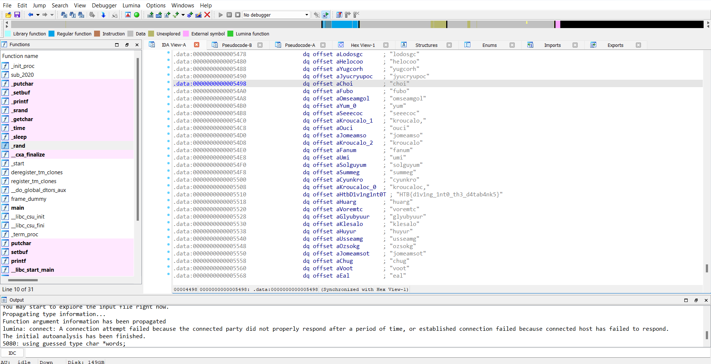
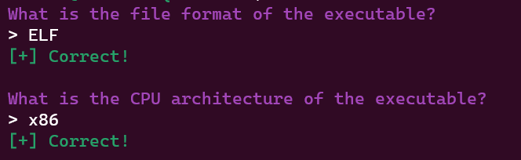
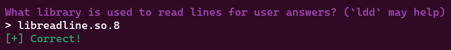
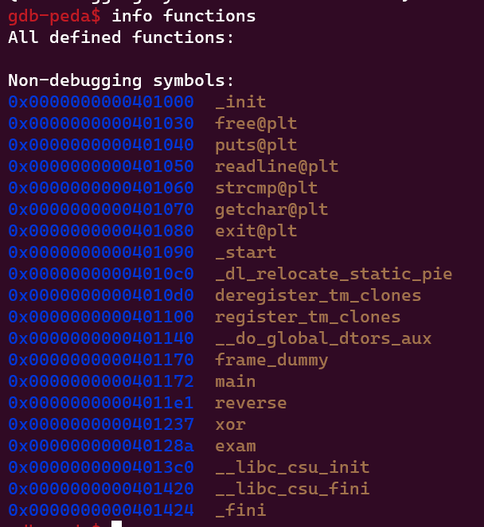
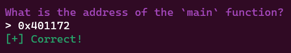
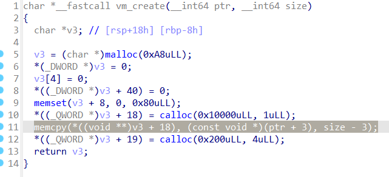



## Shattered Tablet

**Given file:** [Get it here!](https://drive.google.com/file/d/1KbW9wdpO7sfwq1nUaqMTmmriVMkXzpdq/view?usp=sharing)

**Description:** Deep in an ancient tomb, you've discovered a stone tablet with secret information on the locations of other relics. However, while dodging a poison dart, it slipped from your hands and shattered into hundreds of pieces. Can you reassemble it and read the clues?

**Category:** Reverse Engineering

**Difficulty:** Very Easy

Reverse Engineering category greets us with a binary. I used [IDA Pro](https://hex-rays.com/ida-pro/) to decompile the binary.

In the main function, the input is being checked through an if clause.

I used [angr](https://angr.io/) to get the input (you can refer to [this](https://docs.angr.io/examples) and [this, too](https://s0uthwood.github.io/post/angr-ctf-writeup/) to get the hang of angr).

Here is the Python script.

```python
import angr

p = angr.Project('E:/Downloads/tablet')
simgr = p.factory.simulation_manager(p.factory.entry_state())

simgr.explore(find=0x401359, avoid=0x401367)
for i in range(3):
    print(simgr.found[0].posix.dumps(i))
```

We have to find the address of **puts("Yes! That's right!");** and avoid the address of **puts("No... not that");**. Also, we have to increase each of the address by **0x400000** due to the fact that this binary is [PIE-enabled](https://ir0nstone.gitbook.io/notes/types/stack/pie).

Flag is: **HTB{br0k3n_4p4rt,n3ver_t0_b3_r3p41r3d}**

## Needle in a Haystack

**Given file:** [Get it here!](https://drive.google.com/file/d/1f9daRLUAowb2GXMbgTaZWzu8v7aEqkWz/view?usp=sharing)

**Description:** You've obtained an ancient alien Datasphere, containing categorized and sorted recordings of every word in the forgotten intergalactic common language. Hidden within it is the password to a tomb, but the sphere has been worn with age and the search function no longer works, only playing random recordings. You don't have time to search through every recording - can you crack it open and extract the answer?

**Category:** Reverse Engineering

**Difficulty:** Very Easy

We are given an another binary. Again, load the binary using [IDA Pro](https://hex-rays.com/ida-pro/).

This time, the main algorithm of the binary is to print out a random element from the given list, and guess what, the flag is also there!



Flag is: **HTB{d1v1ng_1nt0_th3_d4tab4nk5}**

## She Shells C Shells

**Given file:** [Get it here!](https://drive.google.com/file/d/1oYAAIEwVZ2zmv7vTyZVhfCMPLxoinSKK/view?usp=sharing)

**Description:** You've arrived in the Galactic Archive, sure that a critical clue is hidden here. You wait anxiously for a terminal to boot up, hiding in the shadows from the guards hunting for you. Unfortunately, it looks like you'll need a password to get what you need without setting off the alarms...

**Category:** Reverse Engineering

**Difficulty:** Very Easy

We get another binary, and it's time to use [IDA Pro](https://hex-rays.com/ida-pro/) to decompile it.

Load the binary, we notice the function **func_flag**. Let's check that out!

```c
fgets(s, 256, stdin);
for ( i = 0; i <= 0x4C; ++i )
  s[i] ^= m1[i];
if ( memcmp(s, &t, 0x4DuLL) )
  return 0xFFFFFFFFLL;
for ( j = 0; j <= 0x4C; ++j )
  s[j] ^= m2[j];
printf("Flag: %s\n", s);
return 0LL;
```

This is the main part of the function. Our input string s will be used to **XOR** with two lists, **m1** and **m2**. We can use **export data** in IDA to dump out the contents of **m1** and **m2**, as shown below (do the same for **m2**).


We also know that after the first **XOR**, **s** needs to be equal to **t** (which we can get from the memory, too). Then we can reverse **XOR** to find **s**, and the algorithm looks like this.

```python
t[i] ^ m1[i] = s[i % 8]
```

Since after the check, we continue to **XOR** **m2** with the modified **s** (which should be equal to **t** after the memcmp), we get the algorithm to print out our flag.

```python
t[i] ^ m2[i] = flag[i]
```

We can use this Python script to get the flag.

```python
m2 = [ 0x64, 0x1E, 0xF5, 0xE2, 0xC0, 0x97, 0x44, 0x1B, 0xF8, 0x5F,
  0xF9, 0xBE, 0x18, 0x5D, 0x48, 0x8E, 0x91, 0xE4, 0xF6, 0xF1,
  0x5C, 0x8D, 0x26, 0x9E, 0x2B, 0xA1, 0x02, 0xF7, 0xC6, 0xF7,
  0xE4, 0xB3, 0x98, 0xFE, 0x57, 0xED, 0x4A, 0x4B, 0xD1, 0xF6,
  0xA1, 0xEB, 0x09, 0xC6, 0x99, 0xF2, 0x58, 0xFA, 0xCB, 0x6F,
  0x6F, 0x5E, 0x1F, 0xBE, 0x2B, 0x13, 0x8E, 0xA5, 0xA9, 0x99,
  0x93, 0xAB, 0x8F, 0x70, 0x1C, 0xC0, 0xC4, 0x3E, 0xA6, 0xFE,
  0x93, 0x35, 0x90, 0xC3, 0xC9, 0x10, 0xE9]

t = [0x2C,0x4A,0x0B7,0x99,0x0A3,0x0E5,0x70,0x78,0x93,0x6E,0x97,0x0D9,0x47,0x6D,0x38,0x0BD,0x0FF,0x0BB,0x85,0x99,0x6F,0xE1,0x4A,0x0AB,0x74,0x0C3,0x7B,0x0A8,0x0B2,0x9F,0x0D7,0x0EC,0x0EB,0x0CD,0x63,0x0B2,0x39,0x23,0x0E1,0x84,0x92,0x96,0x09,0x0C6,0x99,0x0F2,0x58,0x0FA,0x0CB,0x6F,0x6F,0x5E,0x1F,0x0BE,0x2B,0x13,0x8E,0x0A5,0x0A9,0x99,0x93,0x0AB,0x8F,0x70,0x1C,0x0C0,0x0C4,0x3E,0x0A6,0x0FE,0x93,0x35,0x90,0x0C3,0x0C9,0x10,0x0E9]

for i in range(len(t)):
    print(end=chr(t[i] ^ m2[i]))
```

Flag is: **HTB{cr4ck1ng_0p3n_sh3ll5_by_th3_s34_sh0r3}**

## Hunting License

**Given file:** [Get it here!](https://drive.google.com/file/d/1xResSHQcRL1wdSw3t3u-TuzGj839Gh0m/view?usp=sharing)

**Description:** STOP! Adventurer, have you got an up to date relic hunting license? If you don't, you'll need to take the exam again before you'll be allowed passage into the spacelanes!

**Note:** This challenge had a docker but it might be closed at the time you are reading this. All needed files will be given in the write-ups.

**Category:** Reverse Engineering

**Difficulty:** Easy

We are given a binary file, together with a netcat server.

By analyzing the binary file using [file](https://www.geeksforgeeks.org/file-command-in-linux-with-examples/), we can answer some first questions.



For the next question, we can use ***ldd license*** to get info about libraries of the binary.



For the upcoming question, I used [gdb](https://manpages.ubuntu.com/manpages/trusty/man1/gdb.1.html) together with its **info function** command to get the address of the **main** function.





Using [IDA Pro](https://hex-rays.com/ida-pro/), we can answer some more questions correctly.

There will be 3 passwords for us to find, the first one is too obvious, the second one is reversed, and the last one is generated using **XOR** with the key **19**.

Here is the script for the last password.

```python
data = [0x47,0x7B,0x7A,0x61,0x77,0x52,0x7D,0x77,0x55,0x7A,0x7D,0x72,0x7F,0x32,0x32,0x32]
key = 19

print("".join(chr(i ^ key) for i in data))
```


Flag is: **HTB{l1c3ns3_4cquir3d-hunt1ng_t1m3!}**

## Cave System

**Given file:** [Get it here!](https://drive.google.com/file/d/10IGptbNTTSxzx-Mv0Elgt2Vx4bVKjHCZ/view?usp=sharing)
**Description:** Deep inside a cave system, 500 feet below the surface, you find yourself stranded with supplies running low. Ahead of you sprawls a network of tunnels, branching off and looping back on themselves. You don't have time to explore them all - you'll need to program your cave-crawling robot to find the way out...
**Category:** Reverse Engineering
**Difficulty:** Easy

We are given a binary once again. Using [IDA Pro](https://hex-rays.com/ida-pro/), for this type of challenge, we should consider using [angr](https://angr.io/) or [z3 solver](https://pypi.org/project/z3-solver/). Here I choose to use [angr](https://angr.io/)

Here is the Python script.

```python
import angr

p = angr.Project('E:/Downloads/cave')
simgr = p.factory.simulation_manager(p.factory.entry_state())

simgr.explore(find=0x401ABA, avoid=0x401AC8)
for i in range(3):
    print(simgr.found[0].posix.dumps(i))
```

We have to find the address of **puts("Freedom at last!");** and avoid the address of **puts("Lost in the darkness, you'll wander for eternity...");**. Also, we have to increase each of the address by **0x400000** due to the fact that this binary is [PIE-enabled](https://ir0nstone.gitbook.io/notes/types/stack/pie).

Flag is: **HTB{H0p3_u_d1dn't_g3t_th15_by_h4nd,1t5_4_pr3tty_l0ng_fl4g!!!}**

## Alien Saboteur

**Given file:** [Get it here!](https://drive.google.com/file/d/1LFinP3KsutSSt46WExL_TekEBFv_GOmR/view?usp=sharing)

**Description:** You finally manage to make it into the main computer of the vessel, it's time to get this over with. You try to shutdown the vessel, however a couple of access codes unknown to you are needed. You try to figure them out, but the computer start speaking some weird language, it seems like gibberish...

**Category:** Reverse Engineering

**Difficulty:** Medium

We get a binary with a text file with no format. Analyze the binary using [IDA Pro](https://hex-rays.com/ida-pro/), from the function "vm_create", the text file is contained in ***(v3 + 18)** and being executed like a normal binary. 



Each instructions appear to be at every **6th** index from 0. From that, I wrote an interpreter for the text file (that runs through the binary).

```python
from malduck import xor

ls = ['vm_add', 'vm_addi','vm_sub','vm_subi','vm_mul','vm_muli', 'vm_div', 'vm_cmp','vm_jmp','vm_inv', 'vm_push', 'vm_pop','vm_mov','vm_nop','vm_exit', 'vm_print', 'vm_putc','vm_je','vm_jne','vm_jle', 'vm_jge', 'vm_xor','vm_store', 'vm_load','vm_input']

def disass(code):
    i = 0
    while i < len(code):
        try:
            op = code[i]
            opr = ls[op]

            if opr == 'vm_add':
                print("{:03d}: ADD [{}] <- [{}] + [{}]".format(i, ls1[i + 1], ls1[i + 2], ls1[i + 3]))
                i += 6
            elif opr == 'vm_addi':
                print("{:03d}: ADDI [{}] <- [{}] + {}".format(i, ls1[i + 1], ls1[i + 2], ls1[i + 3]))
                i += 6
            elif opr == 'vm_sub':
                print("{:03d}: SUB [{}] <- [{}] - [{}]".format(i, ls1[i + 1], ls1[i + 2], ls1[i + 3]))
                i += 6
            elif opr == 'vm_subi':
                print("{:03d}: SUBI [{}] <- [{}] - {}".format(i, ls1[i + 1], ls1[i + 2], ls1[i + 3]))
                i += 6
            elif opr == 'vm_mul':
                print("{:03d}: MUL [{}] <- [{}] * [{}]".format(i, ls1[i + 1], ls1[i + 2], ls1[i + 3]))
                i += 6
            elif opr == 'vm_muli':
                print("{:03d}: MULI [{}] <- [{}] * {}".format(i, ls1[i + 1], ls1[i + 2], ls1[i + 3]))
                i += 6
            elif opr == 'vm_div':
                print("{:03d}: DIV [{}] <- [{}] / [{}]".format(i, ls1[i + 1], ls1[i + 2], ls1[i + 3]))
                i += 6
            elif opr == 'vm_cmp':
                print("{:03d}: CMP flag <- [{}] == [{}]".format(i, ls1[i + 2], ls1[i + 3]))
                i += 6
            elif opr == 'vm_jmp':
                print("{:03d}: JMP pc <- pc + [{}]".format(i, chr(ls1[i + 2])))
                i += 6
            elif opr == 'vm_inv':
                print("{:03d}: INV [31] <- syscall({}, {})".format(i, ls1[i + 1], ls1[i + 2]))
                i += 6
            elif opr == 'vm_push':
                print("{:03d}: PUSH [{}]".format(i, ls1[i + 1]))
                i += 6
            elif opr == 'vm_pop':
                print("{:03d}: POP [{}]".format(i, ls1[i + 1]))
                i += 6
            elif opr == 'vm_mov':
                print("{:03d}: MOV [{}] <- {}".format(i, ls1[i + 1], ls1[i + 2]))
                i += 6
            elif opr == 'vm_nop':
                print("{:03d}: NOP".format(i))
                i += 6
            elif opr == 'vm_exit':
                print("{:03d}: EXIT".format(i))
                i += 6
            elif opr == 'vm_print':
                print("{:03d}: PRINT [{}]".format(i, ls1[i + 1]))
                i += 6
            elif opr == 'vm_putc':
                print("{:03d}: PUTC {}".format(i, ascii(chr(ls1[i + 1]))))
                i += 6
            elif opr == 'vm_je':
                print("{:03d}: JE pc <- {} if [{}] == [{}]".format(i, ls1[i + 3]*6, ls1[i + 1], ls1[i + 2]))
                i += 6
            elif opr == 'vm_jne':
                print("{:03d}: JNE pc <- {} if [{}] != [{}]".format(i, ls1[i + 3]*6, ls1[i + 1], ls1[i + 2]))
                i += 6
            elif opr == 'vm_jle':
                print("{:03d}: JLE pc <- {} if [{}] <= [{}]".format(i, ls1[i + 3]*6, ls1[i + 1], ls1[i + 2]))
                i += 6
            elif opr == 'vm_jge':
                print("{:03d}: JGE pc <- {} if [{}] >= [{}]".format(i, ls1[i + 3]*6, ls1[i + 1], ls1[i + 2]))
                i += 6
            elif opr == 'vm_xor':
                print("{:03d}: XOR [{}] <- [{}] ^ [{}]".format(i, ls1[i + 1], ls1[i + 2], ls1[i + 3]))
                i += 6
            elif opr == 'vm_store':
                print("{:03d}: STORE MEM[[{}]] <- [{}]".format(i, ls1[i + 1], ls1[i + 2]))
                i += 6
            elif opr == 'vm_load':
                print("{:03d}: LOAD [{}] <- MEM[[{}]]".format(i, ls1[i + 1], ls1[i + 2]))
                i += 6
            elif opr == 'vm_input':
                print("{:03d}: INPUT [{}]".format(i, ls1[i + 1]))
                i += 6
            else:
                print("{:03d}: UNKNOWN".format(i))

        except:
            print("{:03d}: UNKNOWN {}".format(i, op))
            break

with open('./bin','rb') as f:
    f = f.read()
    ls1 = []
    ls2 = []
    for i in f[3:]:
        ls1.append(i)

    for i in range(714, 714 + 220*6):
        ls1[i] = ls1[i] ^ 69
    
    disass(ls1)
```

Which gives the below output.

```Output
000: PUTC '['
006: PUTC 'M'
012: PUTC 'a'
018: PUTC 'i'
024: PUTC 'n'
030: PUTC ' '
036: PUTC 'V'
042: PUTC 'e'
048: PUTC 's'
054: PUTC 's'
060: PUTC 'e'
066: PUTC 'l'
072: PUTC ' '
078: PUTC 'T'
084: PUTC 'e'
090: PUTC 'r'
096: PUTC 'm'
102: PUTC 'i'
108: PUTC 'n'
114: PUTC 'a'
120: PUTC 'l'
126: PUTC ']'
132: PUTC '\n'
138: PUTC '<'
144: PUTC ' '
150: PUTC 'E'
156: PUTC 'n'
162: PUTC 't'
168: PUTC 'e'
174: PUTC 'r'
180: PUTC ' '
186: PUTC 'k'
192: PUTC 'e'
198: PUTC 'y'
204: PUTC 'c'
210: PUTC 'o'
216: PUTC 'd'
222: PUTC 'e'
228: PUTC ' '
234: PUTC '\n'
240: PUTC '>'
246: PUTC ' '
252: MOV [30] <- 160
258: MOV [28] <- 0
264: MOV [29] <- 17
270: INPUT [25]
276: STORE MEM[[30]] <- [25]
282: ADDI [30] <- [30] + 1
288: ADDI [28] <- [28] + 1
294: JLE pc <- 270 if [28] <= [29]
300: MOV [30] <- 4
306: MOV [31] <- 160
312: MOV [28] <- 0
318: MOV [29] <- 10
324: MOV [27] <- 169
330: MOV [23] <- 0
336: LOAD [25] <- MEM[[30]]
342: LOAD [24] <- MEM[[31]]
348: XOR [25] <- [25] ^ [27]
354: JE pc <- 468 if [25] == [24]
360: PUTC 'U'
366: PUTC 'n'
372: PUTC 'k'
378: PUTC 'n'
384: PUTC 'o'
390: PUTC 'w'
396: PUTC 'n'
402: PUTC ' '
408: PUTC 'k'
414: PUTC 'e'
420: PUTC 'y'
426: PUTC 'c'
432: PUTC 'o'
438: PUTC 'd'
444: PUTC 'e'
450: PUTC '!'
456: PUTC '\n'
462: EXIT
468: ADDI [30] <- [30] + 1
474: ADDI [31] <- [31] + 1
480: ADDI [28] <- [28] + 1
486: JLE pc <- 336 if [28] <= [29]
492: MOV [15] <- 0
498: PUSH [15]
504: PUSH [15]
510: PUSH [15]
516: INV [31] <- syscall(101, 3)
522: MOV [16] <- 0
528: JE pc <- 648 if [31] == [16]
534: PUTC 'T'
540: PUTC 'e'
546: PUTC 'r'
552: PUTC 'm'
558: PUTC 'i'
564: PUTC 'n'
570: PUTC 'a'
576: PUTC 'l'
582: PUTC ' '
588: PUTC 'b'
594: PUTC 'l'
600: PUTC 'o'
606: PUTC 'c'
612: PUTC 'k'
618: PUTC 'e'
624: PUTC 'd'
630: PUTC '!'
636: PUTC '\n'
642: EXIT
648: MOV [30] <- 119
654: MULI [30] <- [30] * 6
660: MOV [28] <- 0
666: MOV [29] <- 220
672: MOV [27] <- 69
678: LOAD [25] <- MEM[[30]]
684: XOR [25] <- [25] ^ [27]
690: STORE MEM[[30]] <- [25]
696: ADDI [30] <- [30] + 1
702: ADDI [28] <- [28] + 1
708: JLE pc <- 678 if [28] <= [29]
714: PUTC '<'
720: PUTC ' '
726: PUTC 'E'
732: PUTC 'n'
738: PUTC 't'
744: PUTC 'e'
750: PUTC 'r'
756: PUTC ' '
762: PUTC 's'
768: PUTC 'e'
774: PUTC 'c'
780: PUTC 'r'
786: PUTC 'e'
792: PUTC 't'
798: PUTC ' '
804: PUTC 'p'
810: PUTC 'h'
816: PUTC 'r'
822: PUTC 'a'
828: PUTC 's'
834: PUTC 'e'
840: PUTC '\n'
846: PUTC '>'
852: PUTC ' '
858: MOV [30] <- 48
864: MOV [28] <- 0
870: MOV [29] <- 36
876: INPUT [25]
882: STORE MEM[[30]] <- [25]
888: ADDI [30] <- [30] + 1
894: ADDI [28] <- [28] + 1
900: JLE pc <- 876 if [28] <= [29]
906: MOV [28] <- 0
912: MOV [29] <- 35
918: MOV [30] <- 48
924: MOV [31] <- 148
930: MOV [26] <- 0
936: MOV [27] <- 35
942: LOAD [20] <- MEM[[30]]
948: LOAD [21] <- MEM[[31]]
954: PUSH [20]
960: POP [19]
966: MOV [18] <- 48
972: ADD [18] <- [18] + [21]
978: LOAD [17] <- MEM[[18]]
984: STORE MEM[[30]] <- [17]
990: STORE MEM[[18]] <- [19]
996: ADDI [26] <- [26] + 1
1002: ADDI [30] <- [30] + 1
1008: ADDI [31] <- [31] + 1
1014: JLE pc <- 942 if [26] <= [27]
1020: MOV [30] <- 48
1026: MOV [31] <- 248
1032: MOV [26] <- 0
1038: MOV [27] <- 35
1044: LOAD [20] <- MEM[[30]]
1050: PUSH [31]
1056: POP [15]
1062: ADD [15] <- [15] + [28]
1068: LOAD [16] <- MEM[[15]]
1074: XOR [20] <- [20] ^ [16]
1080: STORE MEM[[30]] <- [20]
1086: ADDI [26] <- [26] + 1
1092: ADDI [30] <- [30] + 1
1098: JLE pc <- 1044 if [26] <= [27]
1104: ADDI [28] <- [28] + 1
1110: JLE pc <- 918 if [28] <= [29]
1116: MOV [30] <- 48
1122: MOV [31] <- 92
1128: MOV [26] <- 0
1134: MOV [27] <- 35
1140: LOAD [15] <- MEM[[30]]
1146: LOAD [16] <- MEM[[31]]
1152: JE pc <- 1206 if [15] == [16]
1158: PUTC 'W'
1164: PUTC 'r'
1170: PUTC 'o'
1176: PUTC 'n'
1182: PUTC 'g'
1188: PUTC '!'
1194: PUTC '\n'
1200: EXIT
1206: ADDI [26] <- [26] + 1
1212: ADDI [30] <- [30] + 1
1218: ADDI [31] <- [31] + 1
1224: JLE pc <- 1140 if [26] <= [27]
1230: PUTC 'A'
1236: PUTC 'c'
1242: PUTC 'c'
1248: PUTC 'e'
1254: PUTC 's'
1260: PUTC 's'
1266: PUTC ' '
1272: PUTC 'g'
1278: PUTC 'r'
1284: PUTC 'a'
1290: PUTC 'n'
1296: PUTC 't'
1302: PUTC 'e'
1308: PUTC 'd'
1314: PUTC ','
1320: PUTC ' '
1326: PUTC 's'
1332: PUTC 'h'
1338: PUTC 'u'
1344: PUTC 't'
1350: PUTC 't'
1356: PUTC 'i'
1362: PUTC 'n'
1368: PUTC 'g'
1374: PUTC ' '
1380: PUTC 'd'
1386: PUTC 'o'
1392: PUTC 'w'
1398: PUTC 'n'
1404: PUTC '!'
1410: PUTC '\n'
1416: EXIT
1422: UNKNOWN 69
```

For the part from **714** onwards, the text is being **XOR-ed** with key **0x69**.

Use debuggers to read the memory at **[30]** then **XOR** with key **169**, we get the first input, which is **c0d3_r3d_5hutd0wn**.


Then we reach the part that it prints out **Enter secret phrase**. For this part, the algorithm is **shuffle and XOR**, which can be solved by using debuggers to read the memory at **[92]**, **[148]** and **[248]**, then by the Python script below, we get the flag.

```python
from malduck import unhex

key1 = unhex(b"13190F0A07001D0E16100C010B1F181408091C1A21042212051B1120060215170D1E2303")  #[148]
key2 = unhex(b"16B047B201FBDEEB825D5B5D107C6E215FE7452A3623D4D726D5A311EDE75ECBDB9FDDE2")  #[248]
flag = list(unhex(b"655D774A3340566C75375D356E6E66366C367065776A31795D31707F6C6E33323636315D"))  #[92]

for i in range(36):
    for k in range(35, -1, -1):
        flag[k] = flag[k] ^ key2[i]
    for k in range(35, -1, -1):
        tmp = flag[k]
        flag[k] = flag[key1[k]]
        flag[key1[k]] = tmp

print(''.join([chr(i) for i in flag]))
```

Flag is: **HTB{5w1rl_4r0und_7h3_4l13n_l4ngu4g3}**

## Somewhat Linear

**Given zip:** [Get it here!](https://drive.google.com/drive/folders/1_ExekBgLRfE1J9aMB1QReaAHuX6_SHHZ?usp=share_link)

**Category:** Reverse Engineering

**Difficulty:** Hard

In this challenge, we are provided with **input_generator.py**, **impulse_response.wav**, and **shuffled_flag.wav** files. The objective is to reverse the process implemented in **input_generator.py** to recover the original flag message.

The **input_generator.py** script reads the flag from a file, applies a randomly generated filter to shuffle the frequencies, and then writes the shuffled flag and impulse response to two separate WAV files. The filtering process is achieved by multiplying the amplitudes of the flag's frequency components with the randomly generated **filter_frequency_response**.

To solve the challenge, we must deconvolute the shuffled flag by applying the inverse of the filter. 

First, read the **impulse_response.wav** and **shuffled_flag.wav** files. 

Next, calculate the filter's frequency response by taking the ratio of the Fast Fourier Transform (FFT) of shuffled_flag.wav to the FFT of impulse_response.wav. 

Finally, apply the inverse of the filter to shuffled_flag.wav to recover the original flag.

However, the initial attempt to reverse the process yielded a low signal-to-noise ratio, making it difficult to hear the flag. To improve the result, a Wiener filter was implemented. The Wiener filter helps in deconvolution, extracting the original signal from the convoluted signal (in this case, the filter).

Here's the Python code to recover the flag using the Wiener filter:

```python
import numpy as np
import soundfile as sf

# Read impulse_response.wav and shuffled_flag.wav
impulse_response, rate = sf.read('impulse_response.wav')
shuffled_flag, rate = sf.read('shuffled_flag.wav')

# Compute the Wiener filter
impulse_response_fft = np.fft.rfft(impulse_response)
shuffled_flag_fft = np.fft.rfft(shuffled_flag)
wiener_filter = np.conj(impulse_response_fft) / (np.abs(impulse_response_fft)**2 + 1e-6)  # Adding a small value to avoid division by zero

# Apply the Wiener filter to recover the original flag
recovered_flag_fft = wiener_filter * shuffled_flag_fft
recovered_flag = np.fft.irfft(recovered_flag_fft)

# Save the result to a WAV file
sf.write('recovered_flag_using_wiener_filter.wav', recovered_flag, rate)
```
After running the script, we can listen to the recovered_flag_using_wiener_filter.wav file to hear the flag.

Flag is: **HTB{th1s_w@s_l0w_eff0rt}**

## Analogue Signal Processing v2

**Given zip:** [Get it here!](https://drive.google.com/drive/folders/1HJWdy9Z56bPPIs0nPko2R1KUX7dCCUyj?usp=share_link)

**Category:** Reverse Engineering

**Difficulty** Insane

In this challenge, the encoding process is implemented in **input_generator.py**. 

```python
def encode_flag(flag):
    vin = np.random.uniform(-1, 1, samples)
    for i in range(len(flag)):
        vout = simulate_chained_circuits([ZLCircuit(1j * ord(flag[i]), 1)], vin, duration, SAMPLE_RATE)[0]
        sf.write(f'audio/encoded{i}.wav', np.real(vout).astype('float64'), SAMPLE_RATE, subtype='DOUBLE')

        vin = vout
        print(f'encoded {i} of {len(flag)} characters')
```
The **encode_flag** function takes the flag string as input and encodes it character by character. For each character, it creates a **ZLCircuit** object with a complex impedance of **1j * ord(flag[i])** and an inductance of **1** Henry. This circuit represents an inductor and a component with impedance Z in series.

The **simulate_chained_circuits** function from circuit.py is called with the created **ZLCircuit**, input signal **vin**, **duration**, and **sample rate** as arguments. This function calculates the state space representation of the circuits and uses it to simulate the response of the circuit to the input signal **vin**. The real part of the simulated output signal is saved as a WAV file with the filename format **encoded{i}.wav**.

The output signal vout is assigned as the input signal **vin** for the next iteration, as the circuits are chained, and the output of one circuit is used as the input for the next circuit. The encoding process results in a series of chained circuits with input signals that depend on the previous circuit's output. Our goal is to reverse this encoding process and extract the hidden flag characters from the provided audio files.

To decode the flag, we need to reverse the encoding process. Since the circuits are chained and the output of one circuit is used as the input for the next circuit, we can work our way backward from the last audio file to the first.

1. Load the last audio file, **encoded14.wav**, as the initial input signal.

2. For each audio file, starting from the last and moving towards the first:

   - Create a range of possible ASCII values for the flag's characters. Generally, the printable ASCII characters are between 32 and 126.

   - For each possible ASCII value:

     - Create a **ZLCircuit** object with a complex impedance of **1j * possible_ascii_value** and an inductance of 1 Henry.

     - Call the **simulate_chained_circuits** function with the created **ZLCircuit**, the input signal from the audio file, duration, and sample rate as arguments.

     - Compare the simulated output signal with the input signal of the previous audio file (or a zero-filled array for the first character). Calculate the mean squared error (MSE) between the two signals.

   - Find the character with the lowest MSE, which is the most likely decoded character for the current audio file.

   - Use the input signal of the current audio file as the input signal for the next iteration.

By iterating through the audio files in reverse order and finding the character with the lowest mean squared error between the simulated output signal and the input signal of the previous audio file, we can reconstruct the original flag. The decoded flag obtained is "HTBqp)le_dance|".

However, this decoded flag is not entirely accurate. With some reasonable guesses, we can correct the flag. It is likely that the "q" and "|" characters should be replaced by "{" and "}", respectively. Also, the ")" can be replaced by "o" or "0". After these adjustments and some attempts, we get the correct flag: "HTB{p0le_dance}".

Flag is: **HTB{p0le_dance}**

## Original Posts

- [From FazeCT](https://fazect.github.io/htb2023/)
